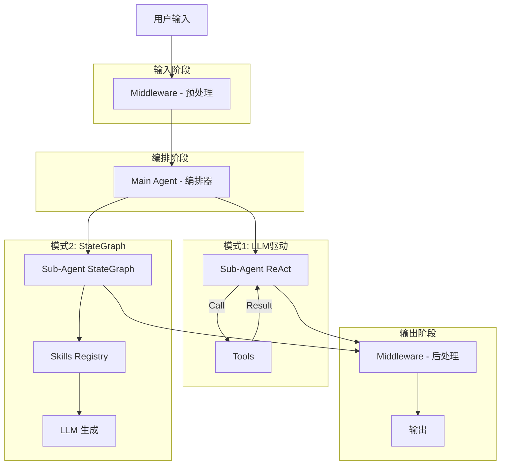

# LangChain DeepAgent 最佳实践速查

## 1. 架构模式
- **Main Agent + Sub-Agents**: Main 负责编排，Sub-Agent 专注特定任务（SQL/Python/Visualizer/Report）
- **StateGraph + Command 固化流**: 对数据处理流程（先看数据再写代码）使用 `StateGraph` 而非 LLM 自行决定
- **两种 Sub-Agent 模式**:
  - `CompiledSubAgent`: 任务灵活，LLM 驱动（如 planner、researcher）
  - `StateGraph + Command`: 步骤固定，代码驱动（如 sql_agent、python_agent、visualizer_agent、report_agent）

## 2. 状态与上下文传递

### Config Propagation
- `user_id`、`analysis_id` 通过 `config.configurable` 传递，无需污染 Prompt
- **前端**: `config: { configurable: { user_id: "...", analysis_id: "..." } }`
- **Tool/Node**: `config.get("configurable", {}).get("key")`
- **Middleware**: `runtime.context.get("key")` 或 `runtime.config.get("configurable", {}).get("key")`

### Shared Store
- 使用 `runtime.store`（异步 API: `aput`/`aget`）在 Middleware 间共享数据
- **注意**: `ContextVar` 在异步环境中不可靠

## 3. 提示词工程

### 严格流程控制
- 在 `MAIN_AGENT_PROMPT` 中明确定义标准工作流（SOP）
- 使用 **"严禁..."**, **"必须..."** 等强硬措辞约束行为
- 明确"完成条件"，例如"只有收到 `report_agent` 的输出才算结束"

### response_format 与终止条件
```python
from langchain.agents.structured_output import ToolStrategy

class MainAgentOutput(BaseModel):
    summary: str = Field(description="任务完成后的简短总结")
    confidence: str = Field(description="low/medium/high")

response_format = ToolStrategy(MainAgentOutput)
```
- 有 `response_format`: LLM 必须调用"响应工具"才终止
- 无 `response_format`: 可能过早结束或死循环

## 4. 工具设计

- **原子化**: 工具功能单一（如 `db_run_sql` 只跑 SQL）
- **上下文感知**: Tool 签名加 `config: RunnableConfig` 自动获取上下文
- **强制调用**: 
  ```python
  llm.bind_tools([tool], tool_choice={"type": "function", "function": {"name": "..."}})
  ```

## 5. 多模态文件流处理

### Payload Offloading（负载卸载）
1. **拦截**: 检查 `message.content` 是否包含 File Block
2. **落盘**: 解码 Base64 并写入 `/data/workspace/uploads/`
3. **引用**: 将 File Block 替换为 Text Block（仅保留路径）

**转换示例**:
```
# 输入 (前端)
[{"type": "file", "data": "JVBERi0xLjQK...", "name": "report.pdf"}]

# 输出 (LLM 看到)
[System: 用户上传了文件: /data/workspace/uploads/report.pdf]
```
**优势**: LLM 仅看到路径，零 Token 消耗

## 6. Middleware 模式

### Subgraph Streaming（推荐）
Sub-Agent 直接在输出消息中包含结构化数据，前端从 stream 中解析：
```python
# visualizer_agent 的 format_output 节点
def viz_format_final_output(state, config):
    chart_message = json.dumps({"type": "chart", "data": chart_data}, ensure_ascii=False)
    return {"messages": [AIMessage(content=f"VISUALIZER_AGENT_COMPLETE: {chart_message}")]}
```

```javascript
// 前端解析
if (content.startsWith('VISUALIZER_AGENT_COMPLETE:')) {
    const jsonStr = content.substring('VISUALIZER_AGENT_COMPLETE:'.length).trim()
    const parsed = JSON.parse(jsonStr)
    chartConfig.value = parsed.data.option || parsed.data
}
```

### 常用 Middleware
- **ThinkingLoggerMiddleware**: 记录思维链和工具调用
- **SubAgentHITLMiddleware**: 在 Sub-Agent 完成后触发中断，等待用户审核

## 7. Command 模式 (动态路由)

将状态更新和流程跳转合并到节点函数内部：
```python
from langgraph.types import Command
from typing import Literal

def step_execute(state: State) -> Command[Literal["generate", "output"]]:
    result = execute(state["code"])
    
    if not result.success and state.get("retry_count", 0) < 3:
        return Command(
            update={"error_feedback": result.error, "retry_count": state["retry_count"] + 1},
            goto="generate"  # 重试
        )
    return Command(update={"result": result.output}, goto="output")
```

**最佳实践**:
- 用 `Literal` 类型注解明确可跳转节点
- 无需 `add_conditional_edges`，逻辑更内聚
- 熔断机制: `retry_count < 3` 时重试，超过强制结束

## 8. Human-in-the-Loop (HITL)

### 后端: SubAgentHITLMiddleware
```python
from langgraph.types import interrupt

class SubAgentHITLMiddleware(AgentMiddleware):
    async def awrap_tool_call(self, request, handler):
        if tool_name == 'task' and subagent_type in ["visualizer_agent", "report_agent"]:
            # 1. 先执行 subagent
            response = await handler(request)
            
            # 2. 触发中断，等待用户审核
            interrupt_res = interrupt({"action_requests": [...], "review_configs": [...]})
            
            # 3. 处理用户决策
            if decision.get("type") == "reject":
                return f"USER_INTERRUPT: 用户反馈: {feedback}。请根据反馈修改。"
            
            # 4. 批准时返回明确消息，防止重复调用
            return "USER_APPROVED: 用户已批准。请继续下一步，不要再次调用。"
        return await handler(request)
```

### 前端: 处理中断与恢复
```javascript
// 检测 interrupt
if (data.__interrupt__) {
    hitlState.value = { isInterrupted: true, threadId, interruptData: data.__interrupt__[0].value }
    return
}

// resume 时发送 decisions
await fetch(`/api/agents/data/threads/${threadId}/runs/stream`, {
    method: 'POST',
    body: JSON.stringify({
        command: { resume: { decisions: [{ type: decision, message: feedbackMessage }] } },
        stream_subgraphs: true
    })
})
```

### Main Agent 反馈透传
Middleware 返回 `USER_INTERRUPT` 消息，Main Agent 自动将反馈包含在下次调用中：
```
USER_INTERRUPT: 用户反馈: 去掉标签。请根据反馈修改。
→ task(description='用户反馈：去掉标签。请根据此反馈修改图表。')
```

## 9. 防错与自愈

### 节点内重试机制
```python
def step_execute(state) -> Command[Literal["generate", "output"]]:
    retry_count = state.get("retry_count", 0)
    
    try:
        result = execute(state["code"])
        if not result.success:
            raise ExecutionError(result.error)
        return Command(update={"result": result}, goto="output")
    except Exception as e:
        if retry_count < 3:
            return Command(
                update={"retry_count": retry_count + 1, "error_feedback": str(e)},
                goto="generate"
            )
        else:
            return Command(update={"result": f"失败: {e}"}, goto="output")
```

### 其他模式
- **Error-as-Input**: 将 stderr 返回给 Agent，让 LLM 自修正
- **Reviewer Loop**: 在 Generate 和 End 之间插入 Review 节点
- **System Hints**: 在 Tool 输出中注入 `[SYSTEM HINT: DO NOT FINISH, Call report_agent next]`

## 10. Python 沙箱执行

```python
# ❌ 错误：使用单独的 locals
safe_globals = {"load_dataframe": load_dataframe}
safe_locals = {}
exec(code, safe_globals, safe_locals)  # 列表推导式无法访问 df!

# ✅ 正确：只用 globals
safe_globals = {"load_dataframe": load_dataframe}
exec(code, safe_globals)  # 所有变量存入 globals
```

**原因**: Python 3 中列表推导式有独立作用域，只能访问 globals。

## 11. Skills 模式

用标签路由到不同技能 Prompt：
```python
SKILLS_REGISTRY = {
    "general": "通用数据处理指令...",
    "statistics": "统计分析指令（scipy/statsmodels）...",
    "ml": "机器学习指令（sklearn pipeline）...",
}

# Main Agent 调用
task(description='[skill=statistics] 对销售额进行回归分析')
```

**优势**: 比多个独立 Agent 更简洁，共享 Python 环境和 DataFrame。

## 12. 总结架构图



## 13. 全栈数据流

### 后端序列化
在 Pydantic 模型中重写 `__str__` 返回标准 JSON：
```python
class MainAgentOutput(BaseModel):
    def __str__(self):
        return self.model_dump_json(exclude_none=True)
```

### 前端 SSE 解析
使用 Buffer 拼接跨 Chunk 数据：
```javascript
let buffer = ''
while (reader) {
    const { value } = await reader.read()
    buffer += decoder.decode(value, { stream: true })
    const lines = buffer.split('\n')
    buffer = lines.pop() || ''  // 保留半截数据
    for (const line of lines) {
        if (line.startsWith('data: ')) process(line)
    }
}
```

## 14. Content Block 处理

### 访问消息内容
```python
# ✅ 使用 .content_blocks 始终返回 List
def extract_text_from_message(message: BaseMessage) -> str:
    blocks = message.content_blocks
    return "".join(
        block.get("text", "") 
        for block in blocks 
        if isinstance(block, dict) and block.get("type") == "text"
    )
```

### 提取思维链（兼容多厂商）
```python
def extract_reasoning(message: BaseMessage) -> str:
    # 1. 从标准 Block 提取
    blocks = message.content_blocks
    from_blocks = "".join(
        block.get("reasoning", "") 
        for block in blocks 
        if block.get("type") == "reasoning"
    )
    if from_blocks: return from_blocks
    
    # 2. 回退到 additional_kwargs
    return message.additional_kwargs.get("reasoning_content", "")
```

更多详细信息请使用angchain-docs mcp 工具