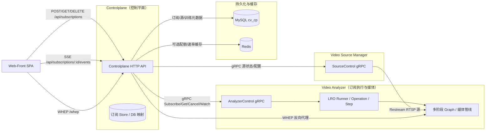

# CONTEXT（2025-11-15，全局架构与文档重构）

本文件汇总当前对话中围绕“整体架构设计、订阅/LRO 管线、推理与多阶段 Graph、协议与存储设计、设计文档重构”的关键结论，作为理解本仓库及后续路线图的统一上下文。

---

## 一、系统与仓库概览

- **业务目标**：接入多路 RTSP 视频源，执行可配置的多阶段视觉分析（检测/跟踪/ReID 等），以 WebRTC/WHEP 向浏览器实时回传叠加画面，并提供训练与模型上线能力。
- **主要子项目与职责**：
  - `video-analyzer`（VA）：RTSP 解码（NVDEC/FFmpeg）、多阶段 Graph 执行、GPU 零拷贝推理（TensorRT/Triton In-Process）、后处理与叠加、H.264/NVENC 编码、WHEP 输出，对内暴露 `AnalyzerControl` gRPC 与少量调试 HTTP。
  - `controlplane`（CP）：唯一对外 HTTP 入口，负责 `/api/*` 与 `/whep`，对接 VA/VSM/Trainer，管理订阅 LRO、训练与模型仓库、控制与观测接口。
  - `video-source-manager`（VSM）：管理 RTSP 源配置，通过 gRPC `SourceControl` 与 CP 协作，并以 Restream 方式发布稳定 RTSP 端点，暴露 REST/SSE 供观测。
  - `web-front`：Vue+TS 前端，提供 Sources/Pipelines/AnalysisPanel/Training 等页面，仅访问 CP HTTP 与 `/whep`。
  - `model-trainer`：训练服务（FastAPI+PyTorch+MLflow），产出 ONNX/TensorRT plan 与 manifest，结合 MinIO/MySQL/MLflow 构成训练与部署闭环。
- **基础设施**：MySQL（`cv_cp`）、Redis（可选）、MinIO、MLflow、Prometheus/Grafana、GPU（推理+NVENC/NVDEC）。

---

## 二、控制平面与订阅/LRO 总体设计

订阅与播放从“控制平面与订阅”视角的整体结构如下：

- **CP HTTP API**：
  - 订阅：`POST/GET/DELETE /api/subscriptions`，`GET /api/subscriptions/{id}/events`（SSE）。
  - 控制：`/api/control/apply_pipeline`、`/api/control/hotswap`、`/api/control/pipeline_mode` 等，经 CP 转发至 VA gRPC。
  - 训练与模型：`/api/train/*`、`/api/repo/*`。
  - 媒体：`POST/PATCH/DELETE /whep`，作为 VA WHEP 的反向代理与编排入口。
- **LRO 订阅执行（VA 内部）**：
  - `Runner/Operation/Step/IStateStore/AdmissionPolicy` 组成通用 LRO 框架；
  - 订阅由一系列步骤构成（打开 RTSP → 加载模型 → 构建/启动 pipeline → 准备 WHEP 输出），每个步骤有明确的 phase 与错误原因；
  - CP 通过 `AnalyzerControl` gRPC 触发订阅、查询 phase 与 timeline，并在 MySQL 中维护映射。
- **VSM 与源管理**：
  - VSM 通过 gRPC `SourceControl` 接收 CP 的源启停与配置变更；
  - 向 VA 提供 Restream RTSP 端点，避免 VA 直接依赖上游摄像头稳定性；
  - 详细协议见 `docs/design/protocol/VSM_REST_SSE与指标配置.md` 与 `控制平面HTTP与gRPC接口说明.md`。

---

## 三、推理、多阶段 Graph 与 GPU 零拷贝

- **多阶段 Graph 框架**（`multistage_graph_详细设计.md`）：
  - 核心抽象：`Packet/NodeContext/INode/Graph/NodeRegistry/AnalyzerMultistageAdapter`；
  - 支持条件边、join、ReID 平滑等高级节点，通过 YAML 描述 pipeline；
  - 新节点扩展需实现 `INode` 接口，并在 `NodeRegistry` 中注册。
- **推理引擎与集成**：
  - `tensorrt_engine.md`：介绍 VA 内部 TensorRT/ONNX Runtime session 管理与引擎抽象；
  - `triton_inprocess_integration.md`：以 In-Process 作为主路径，附录涵盖 gRPC 集成方案；
  - 配合 LRO 与 Graph，实现从 decode→预处理→推理→后处理→叠加的可配置管线。
- **GPU 零拷贝路径**（`zero_copy_execution_详细设计.md`）：
  - 解码：NVDEC 将帧解码到 GPU；
  - 预处理：CUDA kernel 完成 letterbox/resize，生成 NCHW FP32/FP16 tensor；
  - 推理：通过 IOBinding 将显存 buffer 直接绑定到 TensorRT/Triton；
  - 后处理：GPU decode + NMS，行为与 CPU 基线对齐，必要时可回退到 CPU NMS；
  - 提供 compare/suggest 脚本，用于校准 CPU/GPU 检测框差异与 conf/iou。

---

## 四、存储、协议与可观测性

- **存储设计**（`storage_详细设计.md`）：
  - 聚合原 `数据库设计.md` 内容，统一描述 MySQL `cv_cp` 的实体（sources/pipelines/graphs/models/sessions/events/logs/training_records 等）和 ER 图；
  - 说明 VA/CP 访问数据库的 `DbPool` 与各 `Repo` 模块职责，以及迁移策略与索引约定。
- **协议与错误码**（`protocol` 目录）：
  - `控制平面HTTP与gRPC接口说明.md`：系统性描述 CP HTTP API、CP↔VA `AnalyzerControl` gRPC、CP↔VSM `SourceControl` gRPC；
  - `webrtc-protocol.md`：描述 WHEP/WHEP 相关交互与实现注意事项；
  - `控制面错误码与语义.md`：统一 HTTP/gRPC/LRO 的错误码与 reason 语义。
- **可观测性**（`observability` 目录）：
  - `observability_详细设计.md` 作为日志与指标设计的单一权威文档，已整合原 LOGGING/METRICS/path 标签/PromQL/节流配置等内容；
  - Prometheus + Grafana 用于监控订阅链路、推理性能、训练与 DB 相关指标。

---

## 五、设计文档重构与约定

围绕 `docs/design` 目录，本次对话完成了系统性重构与整合：

- **子目录结构**：
  - `architecture/`：系统概要设计与各子系统详细设计（VA、CP、VSM、Web-Front）；
  - `subscription_pipeline/`：订阅流水线与 LRO 专题设计（`subscription_pipeline_详细设计.md`、`lro_subscription_design.md`）以及多阶段 Graph、推理引擎与 GPU 零拷贝；
  - `protocol/`：CP HTTP/gRPC、VSM REST/SSE、WebRTC/WHEP 等协议与错误码；
  - `storage/`：数据库与存储详细设计；
  - `observability/`：日志与指标设计（集中在 `observability_详细设计.md`）；
  - `training/`：训练流水线与模型仓库设计。
- **文档整合与删除**：
  - 将 `subscription_lro` 目录下的历史文档整合为 `subscription_pipeline/lro_subscription_design.md`，附录中保留早期异步订阅方案；
  - 将 `engine_multistage` 重命名并归档为 `subscription_pipeline`，统一承载多阶段 Graph 与引擎设计；
  - 将 `cp_vsm_protocol` 重命名并归档为 `protocol`，统一管理协议相关文档；
  - 将观测层散列文档（LOGGING/METRICS/path 标签/PromQL/节流配置等）整合进 `observability_详细设计.md` 并删除原文件；
  - 删除多份已过时或被合并的文档（如 `perf_guards.md`、早期前端设计稿等），以及废弃的 `subscription_lro/` 目录；
  - 删除废弃的 `web-frontend-old/` 工程，只保留 `web-front/` 作为唯一前端实现。
- **工作流与约束（摘录）**：
  - 修改代码与文档需使用 `apply_patch`；完成后在 `docs/memo` 追加当日记录；
  - 构建成功后必须进行测试；新增设计图统一使用 Mermaid；
  - 提交信息使用中文祈使句，保持变更聚焦与与 Issue 关联；沟通与文档语言统一为中文。

本 CONTEXT.md 与 `docs/design/architecture/整体架构设计.md`、`docs/context/ROADMAP.md` 共同构成后续演进与决策的全局参照。***
# CONTEXT（2025-11-15，多阶段 OCSORT 与 GPU 零拷贝追踪）

本文件在原有 CONTEXT 的基础上，聚焦本次对话新增的「OCSORT 目标追踪、多阶段 Graph 表达、GPU 零拷贝实现路径以及 trainer/模型集成」相关决策与现状，用于指导后续实现与代码评审。

---

## 一、系统与仓库概览（简要回顾）

- **业务目标**：接入多路 RTSP 视频流，执行可配置的多阶段视觉分析（检测/跟踪/ReID 等），以 WebRTC/WHEP 实时回传叠加画面，并支持训练与模型上线。
- **主要子项目**：
  - `video-analyzer`（VA）：GPU 解码/预处理/推理/后处理/叠加，WHEP 输出，多阶段 Graph 执行。
  - `controlplane`（CP）：唯一 HTTP 入口，负责订阅 LRO、训练与模型管理、WHEP 反向代理等。
  - `video-source-manager`（VSM）：RTSP 源管理与 Restream。
  - `web-front`：前端 SPA。
  - `model-trainer`：训练服务，负责模型训练、导出 ONNX/plan 与 manifest。
- **基础设施**：MySQL `cv_cp`、Redis（可选）、MinIO、MLflow、Prometheus/Grafana、GPU（NVDEC/NVENC+TensorRT/Triton）。

更多架构细节请参考：`docs/design/architecture/整体架构设计.md` 与 `docs/context/ROADMAP.md`。

---

## 二、OCSORT 目标追踪与模型集成

### 2.1 模型来源与格式

- 本次对话中，我们确定了基于 **ModelScope `limengying/ocsort`** 的检测/追踪方案：
  - 通过 `modelscope download` 在 `trainer` 容器内下载完整 OCSORT 工程与权重；
  - 使用官方 `0_oc_track/deploy/scripts/export_onnx.py` + YOLOX 代码，将 `ocsort_x` 检测部分导出为 ONNX；
  - 生成的 ONNX 模型保存为：`docker/model/ocsort_x.onnx`。
- 检查 ModelScope 下发的 checkpoint 结构：
  - `ocsort_x.pth.tar`：`{'meta': {...}, 'state_dict': OrderedDict(...)}`；
  - `meta.config` 中包含 YOLOX + OCSORT 的完整配置（CSPDarknet backbone、YOLOXPAFPN、num_classes=1 等）。

### 2.2 trainer 容器与 CUDA 依赖

- 新增 `docker/trainer-service/Dockerfile.gpu`：
  - 基础镜像：`nvcr.io/nvidia/tensorrt:25.08-py3`；
  - 安装 `build-essential`、`cmake`、`protobuf-compiler` 等构建依赖；
  - 通过 `https://download.pytorch.org/whl/cu124` 安装 PyTorch GPU 版本；
  - 保持入口为 `uvicorn trainer_service.server:app`。
- 在 `docker/compose/docker-compose.gpu.override.yml` 中，为 `trainer` 添加 GPU 覆盖：
  - 使用 GPU Dockerfile 构建 `cv/trainer-service:latest-gpu`；
  - 声明 `gpus: all`、`NVIDIA_VISIBLE_DEVICES`/`NVIDIA_DRIVER_CAPABILITIES`。

这一条路径主要用于离线导出 ONNX 与调试 OCSORT 模型，对 VA 在线推理路径只影响模型文件与配置。

---

## 三、多阶段 Graph 中的 OCSORT 检测与追踪

### 3.1 analyzer_multistage_ocsort 图

在 `docker/config/va/graphs/` 下新增 `analyzer_multistage_ocsort.yaml`，用于专门承载 OCSORT 场景的多阶段流水线，其结构大致为：

- 节点：
  - `pre`（`preproc.letterbox`）：与 OCSORT YOLOX 配置对齐的输入尺寸（如 1440×800，GPU 路径）。
  - `det`（`model`）：使用 `models/ocsort_x.onnx` 作为检测模型。
  - `nms`（`post.yolo.nms`）：支持 CUDA NMS，可配置 `emit_gpu_rois`。
  - `roi`（`roi.batch.cuda`）：基于 `rois:det` 的 ROI 裁剪，输出 `tensor:roi_batch`。
  - `reid`（`model`）：ReID 特征提取（占位模型 `models/reid_x.onnx`），输出 `tensor:reid`。
  - `track`（`track.ocsort`）：多目标追踪节点，基于 IoU+ReID 的匹配与轨迹维护。
  - `ovl`（`overlay.cuda`）：叠加轨迹框，显示 `track_id`。
- 边：
  - `pre → det → nms → roi → reid → track → ovl`（ReID 特征流）；
  - `nms → track`（检测框元数据）；
  - `track → ovl`（轨迹 ROI）。

该 Graph 是后续“全 GPU 零拷贝追踪”方案的载体，当前版本仍允许 CPU 路径存在（特别是 ReID 特征与匹配）。

### 3.2 NodeTrackOcsort 节点

在 `video-analyzer/src/analyzer/multistage/` 下新增：

- `node_track_ocsort.hpp/.cpp`：
  - 输入：`rois[in_rois]`（默认 `det`）与 `tensor[feat_key]`（默认 `tensor:reid`，CPU F32 `[N,D]`）；
  - 输出：`rois[out_rois]`（默认 `track`），其中 `Box.cls` 字段被复用为 `track_id`；
  - 内部维护：
    - 每条轨迹的 `id/box/missed/feat/has_feat`；
    - 使用 IoU + ReID 余弦相似度 + EMA 平滑的简化 OCSORT 匹配逻辑。

当前实现仍为 CPU 版本，但接口与配置已经为后续迁移到 GPU 内核预留了 `feat_key/feat_alpha/w_iou/w_reid/max_missed` 等参数。

---

## 四、GPU 零拷贝追踪规划与当前进度

### 4.1 Packet 与 NMS 的 GPU ROI 支持

- 在 `Packet` 中新增：
  - `GpuRoiBuffer` 与 `GpuRoiDict gpu_rois`，用于表示 GPU 上的 ROI 视图。
- 在 `NodeNmsYolo` 中新增参数：
  - `emit_gpu_rois`（默认关），仅在 CUDA NMS + 存在 `ctx.gpu_pool` 时生效；
  - 启用后，NMS 结果除写入 `p.rois["det"]` 外，还会构造 `p.gpu_rois["det"]`（目前先通过一次 H2D 拷贝实现基础版本）。

这一步是为后续完全 GPU OCSORT 提供入口，不改变任何现有检测行为。

### 4.2 GPU OCSORT 内核与 overlay 计划

规划文档已写入：

- `docs/references/GPU_zero_copy_ocsort_multistage_plan.md`
- `docs/plans/GPU_zero_copy_ocsort_multistage_tasks.md`

核心方向：

- 在 `analyzer/cuda` 下新增 `track_ocsort_kernels`，负责在 GPU 上执行 IoU + ReID 匹配与特征 EMA，并维护 GPU 轨迹状态；
- 扩展 `NodeTrackOcsort` 在检测与 ReID 都在 GPU 时走纯 GPU 路径，仅在必要时才将少量轨迹元数据暴露给 CPU；
- 扩展 `OverlayRendererCUDA` 与 `NodeOverlay`，支持以 `gpu_rois["track"]` 为输入渲染轨迹，而非依赖 CPU `ModelOutput::boxes`。

当前进度：

- 文档与任务拆解已完成；
- Packet 扩展与 NodeNmsYolo 的 GPU ROI 初步支持已合并；
- GPU OCSORT 内核与 overlay GPU ROI 消费尚未实现，仍处于规划阶段。

---

## 五、与 ROADMAP 的关系

- 本 CONTEXT 与 `docs/context/ROADMAP.md` 中的 M0/M1/M2 对应关系：
  - M0：架构与文档基线 —— 已覆盖多阶段 Graph / 订阅 LRO / 存储 / 协议等；
  - M1：订阅流水线与协议打通 —— OCSORT Graph 将作为订阅链路中的一种分析配置；
  - M2：GPU 零拷贝与训练闭环 —— 本次 OCSORT GPU 方案是 M2 阶段中“多阶段 Graph + zero-copy execution”的重要一环。

后续请统一参考：

- 设计方案：`docs/references/GPU_zero_copy_ocsort_multistage_plan.md`
- 实施任务：`docs/plans/GPU_zero_copy_ocsort_multistage_tasks.md`
- 全局路线图：`docs/context/ROADMAP.md`
