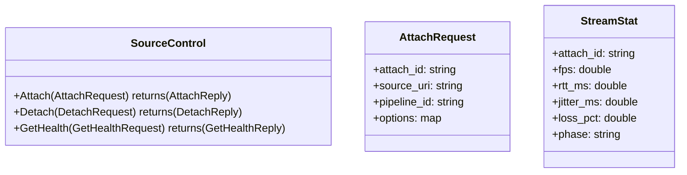
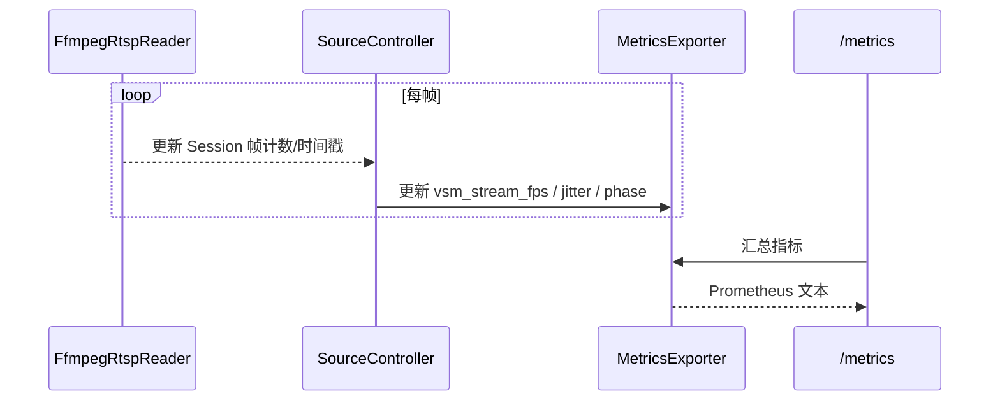

# Video Source Manager（VSM）详细设计说明书（2025-11-14）

## 1 概述

### 1.1 目标

本说明书描述 `video-source-manager/` 子项目的详细设计，包括模块划分、核心类与数据结构、REST/SSE 与 gRPC 接口、与 VA/Controlplane 的协作关系，为后续 VSM 功能的实现与扩展提供设计基线。

### 1.2 范围

- 覆盖 `video-source-manager/` 目录中规划的结构：
  - gRPC：`proto/source_control.proto` 与 `src/app/rpc/grpc_server.*`
  - 控制层：`src/app/controller/source_controller.*`
  - 输入适配器：`adapters/inputs/*`（例如 `ffmpeg_rtsp_reader`）
  - 输出适配器：`adapters/outputs/to_analyzer_link.*`
  - REST/SSE 与 metrics：参考 `docs/design/cp_vsm_protocol/VSM_REST_SSE与指标配置.md`
- 不涉及 Controlplane 和 VA 的内部实现，仅在需要时说明接口契约。

### 1.3 相关文档

- 概要设计：`docs/design/architecture/整体架构设计.md`
- VSM REST/SSE 与指标：`docs/design/cp_vsm_protocol/VSM_REST_SSE与指标配置.md`
- 参考设计：`docs/references/video-source-manager设计文档.md`
- Controlplane 设计：`docs/design/architecture/controlplane_design.md`

## 2 模块与目录结构

当前 `video-source-manager/` 目录中已规划的主要结构（参见 README 与参考设计）：

- `proto/source_control.proto`：
  - 定义对外 gRPC 服务 `SourceControl`，供 Controlplane 或 VA 调用。
- `src/main.cpp`：
  - 进程入口，负责装配 SourceAgent，启动 gRPC server、REST/SSE 与 /metrics。
- `src/app/`：
  - `source_agent`：应用生命周期、配置加载、组件启动/停止。
  - `controller/source_controller`：核心业务控制器，管理源会话表与 attach/detach/update。
  - `health/health_monitor`：健康度估算（fps/jitter/backoff/phase 等）。
  - `metrics/metrics_exporter`：Prometheus `/metrics` 导出。
  - `rpc/grpc_server`：实现 SourceControl gRPC 服务。
- `adapters/`：
  - `inputs/ffmpeg_rtsp_reader`：RTSP 读取适配器。
  - `outputs/to_analyzer_link`：向 analyzer/下游发送帧（当前可实现为本机环形队列，未来可替换为共享内存或 gRPC 流）。
- `config/`：
  - 配置解析与内存表示，预留 `IConfigStore` 以支持后续接入 DB/Nacos 等。
- `util/`：
  - logging/thread_pool/ring_buffer 等通用设施。

## 3 核心接口与数据结构

### 3.1 gRPC SourceControl 服务

proto 概要（详见 `proto/source_control.proto`）：

语义：

- `Attach`：
  - 根据 `attach_id` 幂等创建/更新源会话，启动 RTSP 拉流与下游输出。
  - 如会话已存在，可视配置更新为幂等操作。
- `Detach`：
  - 停止并移除会话，释放资源。
- `GetHealth`：
  - 返回当前所有会话的健康度快照，供 Controlplane 聚合 `/api/sources`。

### 3.2 SourceController

接口（参考设计）：

- `bool Attach(const AttachRequest& req, std::string* err)`：
  - 若 `sessions_` 中不存在对应 `attach_id`，创建新 Session：
    - 创建 `FfmpegRtspReader` 并启动拉流线程；
    - 创建 `ToAnalyzerLink` 作为下游 sink；
    - 将数据流动关系注册到 `HealthMonitor` 与 `MetricsExporter`。
  - 若已存在，则根据需要更新配置（例如切换 profile/model_id）。
- `bool Detach(const std::string& attach_id, std::string* err)`：
  - 停止对应 Session 的读取线程与 sink，移除会话。
- `std::vector<StreamStat> Collect()`：
  - 汇总当前会话状态（fps/jitter/backoff/phase），供 gRPC `GetHealth` 或 REST `describe/list` 使用。

内部 `Session` 结构：

- `std::unique_ptr<FfmpegRtspReader> reader`：负责从 RTSP 拉流。
- `std::shared_ptr<ToAnalyzerLink> sink`：负责将帧推送到下游（本机环形队列、共享内存或 gRPC 流）。
- `std::atomic<bool> running`：表示会话是否处于运行状态。

### 3.3 输入/输出适配器

#### 3.3.1 FfmpegRtspReader

- 负责根据 `source_uri` 建立 RTSP 连接并持续拉帧。
- 支持抖动缓冲与重连策略：
  - 当网络抖动或短暂中断时，Reader 可按 backoff 策略重试；
  - HEALTH/metrics 中的 `phase` 字段反映当前状态（Ready/Connecting/Backoff/Failed）。

#### 3.3.2 ToAnalyzerLink

- 当前实现可以是本机内存队列（环形队列），便于 VA 从本进程或共享内存中消费帧。
- 未来可替换为：
  - 共享内存 + 信号量（同机低延迟传输）；
  - gRPC 流（跨机分布式部署）。

## 4 REST/SSE 与指标设计（与 VSM_REST_SSE 文档对齐）

REST/SSE 设计在 `docs/design/cp_vsm_protocol/VSM_REST_SSE与指标配置.md` 中已有完整说明，本节仅从详细设计视角补充结构与时序。

### 4.1 REST API 结构

主要端点：

- `POST /api/source/add|update|delete`：
  - 通过 `SourceController` 调用 `Attach/Detach`；
  - 支持 query 和 JSON body 传参，以 JSON 为主。
- `GET /api/source/list/describe/health`：
  - 从当前 Session/Health 状态中构造会话列表与健康信息。
- `GET /api/source/watch`：
  - 采用长轮询方式，在 revision 变更时返回完整快照。
- `GET /api/source/watch_sse`：
  - SSE 通道，流式推送会话变化与 keepalive。

### 4.2 SSE 并发控制

- 环境变量：
  - `VSM_SSE_MAX_CONN`：SSE 并发上限；
  - `VSM_SSE_KEEPALIVE_MS`：心跳与轮询间隔。
- 超限时：
  - 返回 HTTP 429 与 JSON payload（code=UNAVAILABLE/too many connections）；
  - 增加 `vsm_sse_rejects_total` 指标计数。

### 4.3 指标时序

指标列表见 `VSM_REST_SSE与指标配置.md`，这里给出简化时序：

## 5 与 VA / Controlplane 的协作

### 5.1 与 Controlplane

- Controlplane 通过 gRPC `SourceControl` 与 VSM 通信：
  - `Attach/Detach`：管理 Restream 源；
  - `GetHealth/WatchState`：获取源列表与健康度；
- CP 将 `GetHealth/WatchState` 汇聚为 `/api/sources`，供前端使用。

### 5.2 与 Video Analyzer

- 在 Restream 模式下：
  - VSM 将上游 RTSP 源拉流并以 `rtsp://127.0.0.1:8554/{source_id}` 形式再发布；
  - VA 只订阅该稳定端点，不再直接依赖上游地址；
  - Controlplane 通过 `restream_rtsp_base + source_id` 将前端选择映射为 VA 可用的源 URI。
- 若使用 `ToAnalyzerLink` 直连 VA：
  - 可在同机场景下由 VSM 直接向 VA 送帧，实现更紧耦合的“推模式”；该模式需要 VA 侧提供对应的输入适配器，此处作为扩展点预留。

## 6 非功能性设计

### 6.1 可扩展性

- 输入协议扩展：
  - 在 `adapters/inputs/` 下新增 RTMP/WHIP/文件等 Reader，`SourceController` 接口保持不变。
- 输出路径扩展：
  - `ToAnalyzerLink` 可替换为共享内存/gRPC 流等，业务代码只依赖其 Push 接口。
- 配置扩展：
  - 通过 `config/` 中的 `IConfigStore` 引入 DB/Nacos 等配置中心，而不改动核心控制逻辑。

### 6.2 可用性与观测

- 利用 REST/SSE + Prometheus 指标监控源的状态与健康度；
- 控制平面与前端可基于这些信息实现告警与自动恢复策略。

本详细设计文档与 `VSM_REST_SSE与指标配置.md`、`video-source-manager设计文档.md` 一起构成 VSM 子项目的设计基线，后续在实现或调整 VSM 行为时应同步更新对应章节。 
