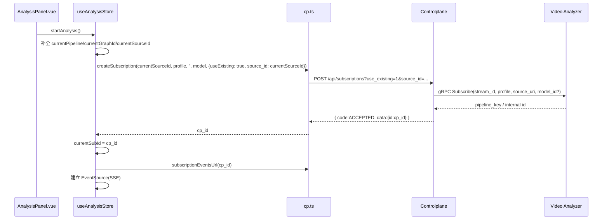

# Web-Front 分析面板详细设计说明书（2025-11-14）

## 1 概述

### 1.1 目标

本说明书描述 `web-front` 项目中“分析面板”（Analysis Panel）相关的详细设计，包括状态管理、与 Controlplane/VA 的交互流程以及 WHEP 播放链路，支撑前端对订阅生命周期与媒体播放的实现与优化。

### 1.2 范围

- 覆盖以下前端模块：
  - `src/stores/analysis.ts`（Pinia store）
  - `src/views/Pipelines/AnalysisPanel.vue`（分析面板页面）
  - `src/views/Sources/*.vue` 与 `src/views/Pipelines.vue` 中对分析 store 的调用
  - `src/api/cp.ts` 中与订阅和 Pipeline 相关的封装
- 不涉及其它后台页面（训练、模型管理等）的详细设计。

### 1.3 相关文档

- 概要设计：`docs/design/architecture/整体架构设计.md`
- Controlplane 设计：`docs/design/architecture/controlplane_design.md`
- Video Analyzer 详细设计：`docs/design/architecture/video_analyzer_详细设计.md`
- Web-Front 对接设计（整体）：`docs/design/architecture/web_front_integration_design.md`
- WebRTC/WHEP 协议：`docs/design/cp_vsm_protocol/webrtc-protocol.md`

## 2 模块关系

### 2.1 组件关系图

```mermaid
flowchart LR
  subgraph Frontend
    AP[AnalysisPanel.vue]
    SRCV[Sources.vue]
    PIPV[Pipelines.vue]
    STORE[useAnalysisStore (analysis.ts)]
    API[cp.ts + dataProvider]
    PLAYER[WhepPlayer.vue]
  end

  AP --> STORE
  SRCV --> STORE
  PIPV --> STORE
  STORE --> API
  AP --> PLAYER
  STORE --> PLAYER

  subgraph Backend
    CP[Controlplane /api/* + /whep]
    VA[Video Analyzer]
    VSM[Video Source Manager]
  end

  API --> CP
  CP --> VA
  CP --> VSM
  PLAYER --> CP
```

### 2.2 角色说明

- `useAnalysisStore`：
  - 持有当前源/模型/graph/pipeline 的选择状态；
  - 管理订阅 ID、phase、进度、timeline 与错误信息；
  - 负责调用 CP API 创建/取消订阅，并根据 SSE/轮询更新状态；
  - 管理 WHEP URL、自动播放、暂停策略、统计指标等。
- `AnalysisPanel.vue`：
  - 作为主界面，展示选择器、订阅进度条、阶段 timeline、WHEP 播放器与统计信息；
  - 通过双向绑定与事件调用 store 的 actions。
- `cp.ts`：
  - 封装 CP 的 HTTP API（`createSubscription/getSubscription/cancelSubscription/subscriptionEventsUrl`、`setPipelineMode` 等），隐藏后端 URL 与参数拼装。
- `WhepPlayer.vue`：
  - 接受 `whep-url` 与 `autoplay` 属性，内部完成 WHEP 会话建立与 HTMLVideoElement 播放。

## 3 状态设计

### 3.1 Analysis Store 关键状态

`src/stores/analysis.ts` 中的 `state` 关键字段：

- 源与配置：
  - `sources: SourceItem[]`：可用源列表（id/name/uri/status/caps）。
  - `models: ModelItem[]`：模型列表（id/task/family/variant/path）。
  - `graphs: GraphItem[]`：graph 列表（graph_id/name/requires）。
  - `pipelines: PipelineItem[]`：Pipeline 列表（name/status/fps/input_fps/alerts）。
  - `currentSourceId` / `currentModelUri` / `currentPipeline` / `currentGraphId`：当前选择。
- 播放与分析状态：
  - `autoPlay`：是否自动播放（带 localStorage 记忆）。
  - `analyzing`：当前是否处于分析状态（pipeline overlay 开启）。
  - `pausedVariant`：在暂停策略下的模式标记（如 raw/overlay）。
  - `whepUrl` / `whepBase`：当前 WHEP 播放 URL 与 base（从 CP system.info 获取）。
  - `pausePolicy`：CP 决定的暂停策略（`pass_through`/`stop`）。
- 订阅与进度：
  - `currentSubId`：当前异步订阅对应的 `cp_id`。
  - `subPhase`：订阅阶段（pending/preparing/opening_rtsp/loading_model/starting_pipeline/ready/failed/cancelled）。
  - `subProgress`：基于 phase 映射的整体进度百分比。
  - `timeline`：从 CP `GET /api/subscriptions/{id}?include=timeline` 获取的简化 timeline 信息。
  - `_subSSE` / `_subRetries`：内部管理 SSE 连接与重试次数。
- 统计与错误：
  - `stats: { fps: string; p95: string; alerts: number }`：展示在播放器 overlay 上的统计信息。
  - `errMsg`：最近一次错误信息（用于错误提示条）。

### 3.2 getters

- `currentSource/currentModel/currentGraph`：
  - 基于当前 id 从对应列表中查找实体，供界面展示。

## 4 核心流程

### 4.1 启动与预检（bootstrap）

1. 页面加载时，调用 `store.bootstrap()`：
   - 并行请求：
     - `getSystemInfo`（CP `/api/system/info`）：获取 `whep_base` 与 `pause_policy`。
     - `dataProvider.listSources/models/pipelines/graphs`：获取初始数据。
   - 解析源、模型、graph、pipeline 列表，并填充 store 对应字段。
   - 若未能获取源或 graph，则设置 `errMsg` 以提示用户。
2. `AnalysisPanel.vue` 根据 `store` 中的源/graph/pipeline 初始值进行表单绑定。

### 4.2 创建订阅与构建进度

`startAnalysis` 是订阅创建的核心入口（`analysis.ts` 中的 action）：



在 SSE 事件处理器中：

- 监听 `phase` 事件：
  - 更新 `subPhase` 和 `subProgress`（根据 phase 映射为 0–100%）。
  - 每次 phase 变化时，通过 `getSubscriptionWithTimeline` 拉取一次 timeline，并写入 `timeline`。
  - 当 phase 变为 `ready`：
    - 优先使用事件 payload 中的 `whep_url` 更新 `store.whepUrl`；若不存在，则调用 `updateWhepUrl()` 以推导。
    - 调用 `setPipelineMode(stream_id, profile, false)` 将 pipeline 置于 raw 模式（仅输出画面、不叠加 overlay），用于“默认暂停”策略。
    - 关闭 SSE 连接（当前订阅完成构建）。

若 SSE 不可用或返回错误，store 会在下次 `startAnalysis` 时重置状态，并重新发起订阅。

### 4.3 取消订阅与停止分析

`stopAnalysis` 负责取消当前订阅与停止分析：

1. 如果存在 `currentSubId`：
   - 调用 `cancelSubscription(id)`（CP `DELETE /api/subscriptions/{id}`），最佳努力取消 VA pipeline；
   - 重置 `currentSubId/subPhase/subProgress/timeline` 等字段。
2. 将 `analyzing` 标志置为 `false`，并清空或保留 `whepUrl`（具体行为由策略决定）。
3. 在界面上，`AnalysisPanel.vue` 的“取消”按钮会调用 `onCancel`，内部委托给 `stopAnalysis`。

### 4.4 播放与模式切换

- 播放：
  - `AnalysisPanel.vue` 将 `store.whepUrl` 作为 `WhepPlayer` 的 `whep-url` 属性；
  - 当 `autoPlay` 为 true 且 `whepUrl` 更新时，播放器自动拉起 WHEP 会话。
- 分析模式切换：
  - 通过 `setPipelineMode(stream_id, profile, analysis_enabled)` 控制 VA pipeline 是否叠加 overlay；
  - 当前策略是：订阅 `ready` 后默认设为 raw 模式，只有用户显式开启实时分析时才开启 overlay。

## 5 界面与交互设计（简要）

### 5.1 AnalysisPanel 布局

- 顶部 Toolbar：
  - Pipeline/视频源/graph/模型选择器（`el-select`），双向绑定 store 对应字段。
  - 自动播放开关（autoPlay）、实时分析开关（analyzing）、取消按钮与刷新按钮。
- 中间播放器区域：
  - `WhepPlayer` 播放区。
  - 右上角 overlay 显示 FPS/P95/告警计数。
  - 底部进度条与阶段 timeline（在 `!analyzing && subProgress > 0` 时展示）。
- 下方面板：
  - 当前 pipeline 配置、当前 source/caps、graph 信息等元数据。

### 5.2 来源列表与 Pipelines 列表

- `Sources.vue`/`Pipelines.vue` 中的操作统一通过 `useAnalysisStore` 调用 `startAnalysis/stopAnalysis`，避免在多个页面中重复订阅逻辑。

## 6 非功能性设计

### 6.1 可靠性与重试

- SSE 连接失败时，store 使用 `_subRetries` 记录重试次数，可根据需要实现指数退避与回退到轮询。
- 前端对 CP 错误码（INVALID_ARG/UNAVAILABLE 等）进行基本提示，必要时引导用户重试或检查配置。

### 6.2 性能

- 页面尽量使用惰性加载和按需请求：
  - `bootstrap` 中的列表只在首次访问分析功能时加载；
  - SSE 仅在必要时建立，订阅完成后关闭。
- 分析面板展示统计信息而不渲染大量表格，保持渲染开销可控。

### 6.3 可扩展性

- 若 CP 后续增加更多订阅阶段或 timeline 字段，可在 `phaseToProgress` 和 timeline 渲染逻辑中扩展映射规则。
- 若需要支持多画面或多订阅并发显示，可在 store 中引入“会话”概念（每个 `cp_id` 对应独立子状态），AnalysisPanel 则绑定特定会话。

本说明书与 `web_front_integration_design.md` 共同构成前端部分的设计基线：前者聚焦分析功能与订阅/WHEP 链路的详细设计，后者聚合整个 Web-Front 的信息架构与控制面对接方案。
