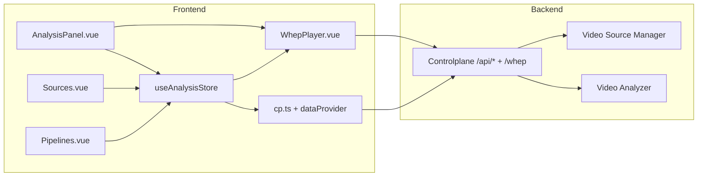
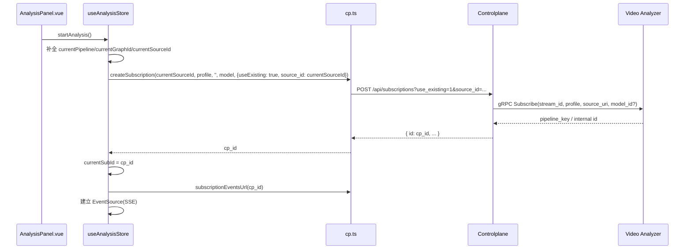

# Web-Front 前端项目详细设计说明书

> 本文面向 `web-front/` 前端项目，补充整体架构、模块划分、关键数据流与与 Controlplane 的交互细节。视觉与交互规范参见《前端设计.md》，订阅与播放链路详见本说明书第 3.2 节与《controlplane_design.md》。本说明不覆盖已废弃的 `web-frontend-old/` 目录。

## 1 概述

### 1.1 技术栈与目标

- 技术栈：
  - Vue 3（Composition API + `<script setup>`）。
  - TypeScript 全面启用。
  - Pinia 作为状态管理。
  - Vue Router 作为路由与布局。
  - Element Plus 作为 UI 组件库，配合自定义主题（深色工业风）。
  - Vite 作为构建与开发服务器。
- 目标：
  - 为控制平面（CP）提供统一 Web 控制台：源管理、订阅分析、Pipeline 编排、模型/引擎配置、训练与观测。
  - 前端只访问 CP 暴露的 HTTP/SSE/WHEP 接口，完全解耦 VA/VSM 内部实现。
  - 支持分析面板异步订阅（LRO）可视化、WHEP 播放以及关键指标/日志观测。

### 1.2 目录结构总览

`web-front/` 核心目录如下：

- `src/main.ts`：应用入口，挂载 App、注册路由与 Pinia，加载全局样式与 UI 主题。
- `src/router/`：路由定义与布局。
- `src/stores/`：Pinia 状态模块（`analysis.ts`、`app.ts` 等）。
- `src/api/`：面向控制平面的 API 封装（`cp.ts` 等），通过 axios/fetch 访问 CP HTTP。
- `src/views/`：页面级组件（Dashboard/Sources/Pipelines/Observability/Training/...）。
- `src/components/`：通用 UI 组件（表格、图表、表单片段等）。
- `src/widgets/`：复杂功能组件（如 `WhepPlayer`、多阶段图编辑器）。
- `src/styles/`：全局主题与布局样式，包含深色主题变量。
- `src/utils/`：工具函数（HTTP 封装、日期/数字格式化等）。

## 2 模块划分

### 2.1 路由与布局模块

- 路由文件：`src/router/index.ts`
  - 顶层布局：`App.vue` + 主布局组件（含顶栏、侧边导航、内容区域）。
  - 主要路由：
    - `/` → Dashboard 总览（系统健康、快速入口）。
    - `/sources` → 源列表与状态视图。
    - `/pipelines` → Pipeline 列表与分析面板入口。
    - `/observability` → 日志/事件/指标页面。
    - `/models` → 模型与引擎配置页面。
    - `/training` → 训练任务列表与详情页面。
    - `/settings` `/admin` `/release` 等辅助页面。
  - 路由元信息（meta）：用于配置标题、权限要求与面包屑。

### 2.2 状态管理（Pinia Stores）

#### 2.2.1 `analysis` Store

文件：`src/stores/analysis.ts`  
职责：承载“分析面板”相关状态与行为，是前端对订阅 LRO 与 WHEP 播放的主要抽象。

- 状态字段（节选）：
  - `sources: SourceItem[]`：当前可选的视频源列表（从 `/api/sources` 聚合而来）。
  - `models: ModelItem[]`：可用模型列表（从控制面或模型仓库 API 拉取）。
  - `pipelines: PipelineItem[]`：当前已部署的 Pipeline 列表。
  - `graphs: GraphItem[]`：多阶段 Graph 列表，用于 UI 选择与 Pipeline 关联。
  - `currentSourceId` / `currentModelUri` / `currentPipeline` / `currentGraphId`：当前选择。
  - `autoPlay`：是否自动播放（持久化在 `localStorage.va_autoplay`）。
  - `analyzing`：当前是否处于“分析中”状态（前端控制开关）。
  - `pausedVariant`：暂停策略（`raw` 等，用于控制 overlay 是否绘制）。
  - `whepBase` / `whepUrl`：从 `/api/system/info` 推导出的 WHEP 基址与当前播放 URL。
  - `pausePolicy`：CP 报告的暂停策略（`pass_through` 或 `stop`），驱动前端行为。
  - `currentSubId` / `subPhase` / `subProgress` / `timeline`：订阅 LRO 相关状态（phase/timeline 可视化）。
  - `_subSSE` / `_subRetries`：内部 SSE 连接与重试计数，用于订阅事件流管理。
  - `stats`：展示在面板上的 FPS/P95 延迟/告警数量等摘要。
  - `errMsg`：面向用户展示的错误消息（如 sources/graphs 加载失败）。
- 主要 Actions：
  - `bootstrap()`：在页面初次加载时并行拉取 system info、sources、models、pipelines、graphs，初始化默认 source/model/pipeline/graph。
  - `startAnalysis()`：
    - 校验并补全 `currentPipeline/currentGraphId/currentSourceId`（必要时根据 `listSources` 填充或使用默认源 ID）；
    - 调用 CP API：
      - 使用 `createSubscription(source_id, profile, '', model, { useExisting: true, source_id })` 创建/复用订阅；
      - 监听 `/api/subscriptions/{id}/events` SSE，更新 `subPhase/subProgress`；
      - 在 ready 时从事件或补充查询中提取 `whep_url`，更新 `whepUrl`；
      - 根据 `pausePolicy` 调用 `setPipelineMode(source_id, pipeline, false)` 等控制后端 overlay 模式。
  - `cancelAnalysis()`：
    - 调用 CP `deleteSubscription(cp_id)` 取消订阅；
    - 关闭 SSE；
    - 根据需要重置 `analyzing`/`subPhase` 等状态。
  - `updateWhepUrl()`：在当前 `whepBase` + source/pipeline 上重建 WHEP URL，用于在订阅已存在时刷新播放。
  - `syncStatsFromRuntime()`（如存在）：从 `/api/va/runtime` 或 `/api/system/info` 中拉取统计信息，更新 `stats`。

该 Store 将 CP 的订阅 LRO 模型抽象为前端友好的状态机，并与 `WhepPlayer` 进行解耦（Player 只接受 URL 和 autoplay，订阅生命周期与 SSE 由 Store 管理）。

#### 2.2.2 `app` Store

文件：`src/stores/app.ts`  
职责：全局应用状态，如当前主题、侧边栏折叠、用户信息等。

- 核心字段：
  - `theme`：`dark`/`light`，映射到 `document.documentElement.dataset.theme`。
  - `sidebarCollapsed`：侧边栏收起状态。
  - `locale`：当前语言环境（未来可扩展多语言）。
- 主要 Actions：
  - `toggleTheme()`：切换主题并持久化到 localStorage。
  - `toggleSidebar()`：折叠/展开侧栏。

### 2.3 API 层

#### 2.3.1 CP API 封装

文件：`src/api/cp.ts`  
职责：封装对控制平面 HTTP API 的访问，所有 URL 以 `/api/*` 与 `/whep` 为前缀。

- 典型方法（示例）：
  - `getSystemInfo()` → `GET /api/system/info`：用于初始化 `whep_base`、`pause_policy` 等字段。
  - `listSources()` → `GET /api/sources`：返回源列表及状态，供 `analysis` 与 `sources` 页面使用。
  - `createSubscription(sourceId, profile, sourceUri?, modelId?, options?)` → `POST /api/subscriptions`：返回 `cp_id`。
  - `getSubscription(id)`、`getSubscriptionWithTimeline(id)` → `GET /api/subscriptions/{id}` （含 timeline 扩展）。
  - `deleteSubscription(id)` → `DELETE /api/subscriptions/{id}`。
  - `subscriptionEventsUrl(id)`：构造 SSE 地址 `/api/subscriptions/{id}/events`。
  - `setEngine(config)` / `setPipelineMode(...)` 等控制接口：映射到 `/api/control/set_engine` 与其它控制端点。
  - 训练相关 API：`startTrainJob()`、`listTrainJobs()`、`deployModel()` 等。

API 层负责：统一错误处理（HTTP 状态 → 业务错误码）、附加必要头部（如认证）、在必要时封装 `baseURL` 和超时配置。

#### 2.3.2 数据提供器

文件：`src/api/dataProvider.ts`（如存在）  
职责：为页面提供统一的数据访问接口，内部组合 `cp.ts` 与其它 API，输出标准 `{ items, total }` 结构，便于表格组件复用。

### 2.4 UI 组件与 Widgets

- `src/components/`：
  - 通用组件：`StatCard`、`MetricsTimeseries`、`EventsList` 等，用于 Dashboard 与 Observability 页面。
  - 领域组件：如 Pipeline 列表项、Source 状态标签等。
- `src/widgets/WhepPlayer/`：
  - `WhepPlayer.vue`：封装 `<video>` 标签及 WHEP 会话建立逻辑，通过 `<source>` 或 MediaSource 播放 H.264 RTP 流。
  - 属性：`whep-url`、`autoplay`、`muted` 等；对外暴露 `play() / pause() / reload()` 等方法供 AnalysisPanel 调用。
- `src/widgets/GraphEditor/`：
  - Graph 编辑器，用于在 Orchestration/Pipelines 页面中编辑多阶段 Graph（节点/边属性）。

视觉与交互规范（颜色、字体、间距、卡片等）详见《前端设计.md》。本详细设计更多关注模块边界与数据流。

## 3 页面级设计

### 3.1 Sources 页面

文件：`src/views/Sources/List.vue` 等  
职责：展示所有 Video Source 的状态，并提供启停/编辑入口。

- 数据来源：`GET /api/sources`（通过 `dataProvider.listSources()`）。
- UI 结构：
  - 顶部过滤器：按状态/分组筛选源。
  - 主表格：列出 `id/name/uri/profile/model_id/status/fps/last_error` 等字段。
  - 行操作：启用/禁用（调用 `/api/sources:enable/disable`），查看详情（弹出抽屉）。

### 3.2 Pipelines 页面与分析面板

文件：`src/views/Pipelines/Pipelines.vue`、`src/views/Pipelines/AnalysisPanel.vue`  
职责：Pipeline 概览与单源分析播放。

- Pipelines 列表：
  - 数据来源：`listPipelines()`（CP `GET /api/control/pipelines`）。
  - UI：表格展示 Pipeline 名称、状态、FPS、告警数等，支持按状态过滤。
- 分析面板（AnalysisPanel）：
  - 负责单源分析播放与订阅生命周期的可视化，依赖 `useAnalysisStore` 管理状态。
  - 使用 computed 绑定 `currentSource/currentModel/analyzing` 等字段，按钮事件委托给 store 的 `startAnalysis/stopAnalysis`。
  - 在 `whepUrl` 更新时，将新 URL 传给 `WhepPlayer` 播放。

#### 3.2.1 组件关系

- `useAnalysisStore`：持有源/模型/graph/pipeline 选择状态与订阅 LRO 状态（id/phase/progress/timeline），负责与 CP API 交互并驱动播放。
- `AnalysisPanel.vue`：主界面，展示选择器、订阅进度、timeline、播放器与统计信息。
- `cp.ts`：封装 `createSubscription/getSubscription/deleteSubscription/subscriptionEventsUrl/setPipelineMode` 等 CP HTTP 调用。
- `WhepPlayer.vue`：仅负责根据 `whep-url/autoplay` 建立 WHEP 会话并驱动 `<video>` 播放。

#### 3.2.2 订阅与进度流程

`startAnalysis` 是订阅创建的核心入口（定义于 `analysis.ts`）：

SSE 事件处理逻辑（`analysis.ts`）：

- 监听 `phase` 事件：
  - 更新 `subPhase` 与 `subProgress`（通过 phase→进度映射）。
  - 调用 `getSubscriptionWithTimeline(cp_id)` 拉取 timeline，并写入 `timeline`。
  - 当 phase 为 `ready` 时：
    - 优先使用事件 payload 中的 `whep_url` 更新 `whepUrl`，否则调用 `updateWhepUrl()` 推导；
    - 调用 `setPipelineMode(stream_id, profile, false)` 将 pipeline 置为 raw 模式（仅输出画面），作为“默认暂停”策略；
    - 关闭 SSE 连接（当前订阅完成构建）。
- 若 SSE 建立失败或中断，store 通过 `_subRetries` 记录重试次数，可按需实现退避与回退到轮询。

取消流程（`stopAnalysis`）：

- 若存在 `currentSubId`，调用 `cancelSubscription(id)`（`DELETE /api/subscriptions/{id}`）取消订阅；
- 重置 `currentSubId/subPhase/subProgress/timeline` 等字段；
- 将 `analyzing` 标志置为 `false`，按策略处理 `whepUrl`（保留或清空）。

#### 3.2.3 界面布局与交互

- 顶部工具栏：
  - 源/graph/pipeline/模型选择（`el-select`），双向绑定 store 对应字段；
  - 自动播放开关（autoPlay）、实时分析开关（analyzing）、“开始/取消”按钮与刷新按钮。
- 播放区域：
  - 中央为 `WhepPlayer` 播放区；
  - 右上角 overlay 显示 FPS/P95 延迟/告警数（取自 `store.stats`）；
  - 可在 `!analyzing && subProgress > 0` 时展示构建进度条与阶段标签。
- 下方信息区：
  - 展示当前 pipeline 配置、源能力（caps）、graph 元数据等。

Sources/Pipelines 页面中如需触发分析，只通过 `useAnalysisStore` 的 `startAnalysis/stopAnalysis` 接口调用，避免在多个页面复制订阅逻辑。

### 3.3 Observability 页面

文件：`src/views/Observability/*.vue`  
职责：集中展示日志、事件、指标与会话信息。

- Logs：
  - 通过 CP 提供的日志 API 或 `_debug` 接口获取近期日志；
  - 支持按模块/级别/关键字过滤。
- Metrics：
  - 嵌入 Grafana 仪表盘或基于 Prometheus API 自绘图表（`MetricsTimeseries`）。
- Events/Sessions：
  - 展示 CP/VA 记录的订阅/源相关事件时间线（可对接 LRO timeline）。

### 3.4 Training 页面

文件：`src/views/Training/TrainJobs.vue` 等  
职责：列出并管理训练任务。

- 数据来源：`/api/train/*`（通过 `cp.ts` 或 `dataProvider`）。
- UI：
  - 任务列表：`job_id/model/dataset/status/progress/metrics` 等字段。
  - 操作：查看日志、重试、触发 deploy 等。

## 4 与 Controlplane 的交互模式

### 4.1 HTTP + SSE + WHEP

- 所有业务操作（订阅、源管理、训练、配置）均通过 HTTP 调用 CP。
- 实时进度与状态更新主要通过两种模式：
  - SSE：`/api/subscriptions/{id}/events` 提供订阅阶段事件。
  - 轮询：部分列表页通过周期性调用 HTTP 刷新数据。
- 媒体播放通过 `/whep` 建立 WHEP 会话，前端不直接连接 VA 或 VSM。

### 4.2 错误处理与用户反馈

- HTTP 错误统一映射为 `code/message`，前端根据 `code` 决定提示内容与是否允许重试（参见《控制面错误码与语义.md》）。
- 对于 `UNAVAILABLE`（如队列满/资源不够），前端应使用指数退避与限次重试，同时在 UI 上展示“稍后重试”提示。

## 5 非功能性设计

### 5.1 性能

- 通过 lazy-loading 为路由页面懒加载组件，减少首屏 bundle 体积。
- 使用分页与服务器端过滤避免一次性拉取大量记录（Sources/Logs 等）。
- 对频繁调用的 API 适当加缓存与防抖（如 system info）。

### 5.2 可观测性

- 前端可选输出简单埋点（如订阅成功/取消/失败次数）到 CP 的日志或事件接口。
- 在调试模式下，可以在浏览器控制台输出关键操作的 trace（例如订阅 phase 序列）。

### 5.3 安全

- 认证授权流程由 CP 负责，前端按约定附带 Token/cookie。
- 所有跨域与 CORS 配置集中在 CP，前端保持相对简单的 same-origin 请求模型。

## 6 参考文档

- 《整体架构设计.md》：系统整体视图与 Web-Front 职责定位。
- 《controlplane_design.md》：控制平面内部设计与 API 说明。
- 《web_front_integration_design.md》：前端与 CP/VA/VSM 的集成视图与时序图。
- 《前端设计.md》：主题与交互风格指南。
