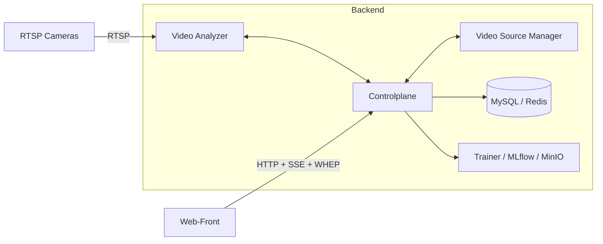

# 计算机视觉视频分析系统概要设计说明书（2025-11-14）

## 1 引言

### 1.1 编写目的

本概要设计说明书用于从系统整体视角描述本仓库承载的“计算机视觉视频分析系统”的架构方案、模块划分、关键业务流程及外围依赖，为后续详细设计、编码与运维提供统一依据。

### 1.2 适用范围

- 研发人员：理解各子系统职责边界与接口约定，开展模块级设计与实现。
- 测试与运维人员：把握部署拓扑、关键流程与观测点，设计测试与监控方案。
- 相关干系人：快速了解系统整体能力与演进方向。

### 1.3 术语与缩写

- VA：Video Analyzer，视频分析后端（C++）。
- CP：Controlplane，控制平面 HTTP/gRPC 网关。
- VSM：Video Source Manager，视频源管理服务。
- Web-Front：前端单页应用（Vue + TS）。
- WHEP：WebRTC-HTTP Egress Protocol，下行 WebRTC 媒体协议。
- LRO：Long-Running Operation，长耗时任务抽象（订阅等）。

### 1.4 参考资料

- 项目总体说明：`README.md`
- 上下文与路线图：`docs/context/CONTEXT.md`、`docs/context/ROADMAP.md`
- 控制平面设计：`docs/design/architecture/controlplane_design.md`
- 订阅与 LRO 设计：`docs/design/subscription_lro/lro_subscription_design.md`
- 数据库设计：`docs/design/storage/数据库设计.md`
- 日志与指标：`docs/design/observability/LOGGING.md`、`docs/design/observability/METRICS.md`
- WebRTC / WHEP 协议：`docs/design/cp_vsm_protocol/webrtc-protocol.md`

## 2 系统概述

### 2.1 业务背景

系统面向多路实时视频（RTSP 流）进行检测、分割等视觉分析，并以叠加渲染后的画面通过 WebRTC/WHEP 等协议回传给浏览器端。整体设计遵循“解耦、可替换、可观测”的原则，支持从单机 PoC 演进到生产级部署。

### 2.2 系统目标

- 支持多路视频源的统一接入、管理与健康监控。
- 提供可配置的分析管线（多阶段 Graph），支持模型/引擎热切换。
- 以统一控制平面提供订阅生命周期管理（创建、监控、取消）。
- 提供完善的日志、指标与数据库持久化能力，便于排障与运营分析。

### 2.3 典型使用场景

- 实时监控场景：对多个摄像头进行目标检测与告警。
- 训练与评估场景：通过训练流水线产出模型，在生产 VA 节点加载与 A/B 对比。
- 运维场景：基于 Grafana 仪表盘监控处理 FPS、延迟、掉帧与告警情况。

## 3 总体架构设计

### 3.1 架构风格

系统采用分层、微服务化的整体架构：

- 媒体与推理由 VA 负责，尽量保持无状态或轻状态。
- 控制平面（CP）统一对外暴露 HTTP 接口，与 VA/VSM 通过 gRPC 通信。
- Web-Front 只与 CP 交互，不直接访问 VA/VSM。
- 数据库与对象存储（MySQL、MinIO、MLflow）承载控制面与训练数据。

### 3.2 逻辑组件视图

### 3.3 部署视图（概览）

- 单机 PoC：VA、CP、VSM、Web-Front、数据库/Prometheus/Grafana 以 Docker Compose/本地进程方式部署在同一主机。
- 生产环境（推荐）：
  - 多个 VA 实例按 GPU 节点横向扩展。
  - CP、VSM、Trainer、数据库、MinIO/MLflow 分别以容器或独立服务形式部署。
  - 前端通过反向代理（Nginx 等）统一接入 CP HTTP。

## 4 模块划分与职责

### 4.1 Video Analyzer（VA）

- 目录：`video-analyzer/`
- 核心职责：
  - 接入 RTSP 流（NVDEC/FFmpeg），管理多路 pipeline。
  - 执行多阶段 Graph：预处理 → 推理（ONNX/TensorRT/Triton）→ 后处理（YOLO/NMS/ReID 等）→ 叠加。
  - 将编码后的视频流推送至 WHEP/内置 WebRTC DataChannel（DataChannel 默认关闭，仅保留 WHEP 路径）。
  - 暴露 gRPC 服务（`AnalyzerControl`）供 CP 调用，执行 Subscribe/Get/Cancel/Watch/QueryRuntime 等操作。
  - 暴露最小 HTTP 接口 `/api/*` 和 `/metrics`，供本地调试或由 CP 代理。
- 关键实现与设计文档：
  - 推理与引擎：`tensorrt_engine.md`、`triton_integration_design.md`、`triton_inprocess_integration.md`
  - 多阶段 Graph：`多阶段Graph条件边与join使用指南.md`、`多阶段ReID平滑节点.md`
  - LRO 订阅执行：`lro_subscription_design.md`
  - 媒体传输：`webrtc-protocol.md`
  - 日志与指标：`LOGGING.md`、`METRICS.md`

### 4.2 Controlplane（CP）

- 目录：`controlplane/`
- 核心职责：
  - 作为全局 HTTP API 入口，向前端暴露 `/api/*` 与 `/whep`。
  - 通过 gRPC 访问 VA 与 VSM，执行订阅、引擎切换、源状态查询等操作。
  - 管理订阅 LRO 的 HTTP 封装：`POST/GET/DELETE /api/subscriptions`，生成 `cp_id` 并维护 phase/timeline。
  - 提供 WHEP 反向代理：将 `/whep` 请求转发至 VA，并处理 CORS 与 Location 重写。
  - 提供训练相关 API（`/api/train/*`），可代理到外部 Trainer 服务。
  - 访问 MySQL（通过 X DevAPI 或 ODBC）读取/更新训练与模型元数据。
- 主要外部接口（概要，详情见代码与相关文档）：
  - 订阅：`POST/GET/DELETE /api/subscriptions`，`GET /api/subscriptions/{id}/events`（SSE 预留）。
  - 控制与观测：`GET /api/system/info`、`GET /api/_metrics/summary`、`GET /api/va/runtime`。
  - 引擎与 Pipeline：`POST /api/control/apply_pipeline`、`/api/control/hotswap`、`/api/control/drain`、`/api/ui/schema/engine`。
  - 训练与模型：`/api/train/*`、`/api/repo/*`（部分由 CP 代理至外部服务）。
- 设计文档：`controlplane_design.md`、`控制平面与VSM集成说明.md`、`控制面错误码与语义.md`

### 4.3 Video Source Manager（VSM）

- 目录：`video-source-manager/`
- 核心职责：
  - 管理 RTSP 源配置（源 URI、启停状态、分组等）。
  - 主动拉取上游并以 Restream 方式发布稳定端点（默认 `rtsp://127.0.0.1:8554/{source_id}`）。
  - 通过 gRPC `SourceControl` 向 CP 暴露源状态（`WatchState`、`GetHealth`）与启停能力（`Update`）。
  - 暴露 REST/SSE 以支持观测与调试（具体协议见 `VSM_REST_SSE与指标配置.md`）。

### 4.4 Web-Front

- 目录：`web-front/`
- 核心职责：
  - 提供统一 Web 控制台：Dashboard、Pipelines 列表、AnalysisPanel、Models、Engine 配置、Metrics 等。
  - 只访问 CP 暴露的接口：`/api/subscriptions`、`/api/control/*`、`/api/va/runtime`、`/whep` 等。
  - 在 AnalysisPanel 页面中：
    - 使用 `/api/subscriptions` 管理订阅生命周期（创建/轮询 phase/取消）。
    - 通过 `/whep` 建立 WHEP 会话，将 H.264 RTP 轨接入 `<video>` 播放。
    - 提供分析开关、引擎/模型切换等操作按钮。
- 设计文档：`web_front_integration_design.md`、`前端设计.md`、`grafana-integration-for-web-frontend.md`

### 4.5 训练流水线与模型仓库

- 目录：`model-trainer/` 与外部服务（MLflow/MinIO/MySQL）。
- 核心职责：
  - 提供模型训练 API（如 `POST /api/train/start`），执行数据准备、训练与评估。
  - 将训练输出（ONNX/TensorRT plan、配置文件等）登记到 MLflow/MinIO 与数据库。
  - 提供训练任务查询与工件下载接口，供 CP/VA 在上线流程中使用。
- 设计文档：`cv_训练流水线（training_pipeline）详细设计_v_1.md`、`mlflow-training-pipeline.md`、`minio_s3_model_repository.md`

### 4.6 数据库与缓存

- MySQL：
  - 数据库 `cv_cp` 保存源、会话、图、模型、事件、日志及训练记录等实体。
  - 表结构概览与关系见 `数据库设计.md`。
  - VA 通过 `DbPool` 与多个 `Repo` 访问数据库（Session/Event/Log/Source/Graph）。
  - CP 通过 `controlplane::db` 访问数据库，用于训练与模型相关查询。
- Redis（可选）：用于缓存和部分分布式协调场景，具体使用点可按需求扩展。

## 5 关键业务流程（概要）

### 5.1 订阅与播放流程（前端视角）

1. 用户在前端选择某个源（源列表由 CP `/api/sources` 聚合 VSM 状态）与 profile。
2. 前端调用 CP：`POST /api/subscriptions?use_existing=1`，附带 `stream_id`、`profile`、`source_id` 或 `source_uri`、可选 `model_id`。
3. CP 将 `source_id` 翻译为 Restream URL（`restream_rtsp_base + source_id`），通过 gRPC 调 VA 执行订阅：
   - VA 内部由 LRO Runner 完成 RTSP 打开、模型加载、Pipeline 启动等步骤。
4. CP 返回 `202 Accepted` 与 `Location: /api/subscriptions/{cp_id}`，并在本地 Store 中记录 `cp_id` 与 VA pipeline key。
5. 前端轮询或通过 SSE（规划中）监听 `GET /api/subscriptions/{cp_id}`，根据 `phase` 与 `reason` 更新 UI。
6. 当 phase 达到 `ready` 时，前端使用 CP 提供的 `/whep` 端点建立 WHEP 会话，在 `<video>` 组件中播放 H.264 RTP 流。
7. 用户停止分析时，前端调用 `DELETE /api/subscriptions/{cp_id}`，CP 通过 gRPC 通知 VA 取消订阅，并将状态标记为 `cancelled`。

### 5.2 模型训练与上线流程（概览）

1. 训练发起：通过 CP 或直接访问 Trainer API `POST /api/train/start`，指定数据集、模型族与超参数。
2. 训练执行：Trainer 调用 MLflow/MinIO 等完成训练与工件登记；训练进度和结果持久化到数据库。
3. 训练结果查看：通过 CP 或 Trainer 提供的查询接口获取训练精度、延迟与模型工件信息。
4. 上线与热切换：
   - CP 根据部署门禁配置调用 `POST /api/train/deploy` 或 `POST /api/control/release`。
   - VA 根据 CP 指令调整引擎（如切换到 Triton 模型），并在指定 pipeline/node 上完成热切换（HotSwap）。
5. 验证与回滚：通过前端观察指标与画面质量，必要时使用 CP 的回滚能力恢复到上一版本。

### 5.3 引擎与模式切换

系统支持通过 CP/VA 端点调整执行引擎选项（CPU/GPU/TensorRT/Triton、IOBinding、零拷贝等），典型流程：

1. 前端从 CP 获取引擎 Schema：`GET /api/ui/schema/engine`，动态渲染表单；
2. 用户在界面修改配置并提交：`POST /api/control/set_engine`（或直接调用 VA `/api/engine/set` 用于调试）；
3. VA 调整内部 EngineDescriptor，并在新配置下执行后续推理。

## 6 数据设计（概要）

详细表结构与索引策略见 `docs/design/storage/数据库设计.md`，本节仅给出关键实体的抽象：

- `sources`：视频源（id、uri、status、caps、fps 等）。
- `pipelines`：逻辑管线（name、graph_id、默认模型、编码配置）。
- `graphs`：多阶段图定义（id、name、requires、文件路径）。
- `models`：模型元数据（id、task、family、variant、path、默认 conf/iou）。
- `sessions`：订阅会话，记录每次订阅的生命周期及错误信息。
- `events` / `logs`：事件与日志表，为观测与排障服务。

## 7 外部接口设计（概要）

本小节按“对前端/第三方可见”的接口归类，具体字段与错误码以相应设计文档和实现为准。

- CP HTTP：
  - 订阅：`POST/GET/DELETE /api/subscriptions`、`GET /api/subscriptions/{id}/events`。
  - 系统信息：`GET /api/system/info`、`GET /api/va/runtime`、`GET /api/_metrics/summary`。
  - 控制：`POST /api/control/apply_pipeline`、`/api/control/hotswap`、`/api/control/drain`、`/api/control/pipeline_mode`（代理到 VA）。
  - 训练与模型仓库：`/api/train/*`、`/api/repo/*`。
  - 媒体：`POST/PATCH/DELETE /whep`。
- VA HTTP（调试/内部）：
  - 订阅（旧接口）：`POST /api/subscribe`、`POST /api/unsubscribe`。
  - 状态与配置：`/api/pipelines`、`/api/models`、`/api/profiles`、`/api/system/info`、`/api/system/stats`、`/api/engine/set`、`/api/logging*`。
  - 指标：`GET /metrics`。
- gRPC：
  - `AnalyzerControl`（VA）：Subscribe/Get/Cancel/Watch/QueryRuntime/SetEngine 等。
  - `SourceControl`（VSM）：WatchState/GetHealth/Update/Attach/Detach 等。

## 8 非功能性设计（概要）

### 8.1 性能

- VA 以 GPU 零拷贝链路为首选（NVDEC → CUDA 预处理 → TensorRT/Triton → GPU overlay → NVENC），在保证画质的前提下最大化单机吞吐。
- 通过多阶段 Graph、Batch/IOBinding、Triton In-Process 等手段降低 CPU/GPU 开销，详见 `perf_guards.md`。
- CP 与 VSM 采用轻量 HTTP/gRPC 实现，支持通过配置调整各类超时与重试策略。

### 8.2 可用性与容错

- 订阅链路采用 LRO 模式，支持阶段化错误归因与重试策略（开放 RTSP、加载模型、启动 pipeline 等）。
- 对关键路径提供回退机制（如 Triton 不可用时回退到本地 TensorRT/ONNX Runtime）。
- 通过日志与指标监控各阶段异常（RTSP 丢包、模型加载失败、编码器 EAGAIN 等）。

### 8.3 安全

- CP 支持配置 CORS、Bearer Token 认证与基础限流策略（详见 `controlplane/config.hpp`）。
- 部分部署模式支持 TLS/mTLS，与外部 Trainer/数据库通信也可按需要开启 TLS。

## 9 监控与运维

- VA：
  - 日志：通过 `observability` 配置段控制日志等级/格式/输出，并提供 `/api/logging` 运行时调整接口。
  - 指标：`/metrics` 暴露 Prometheus 指标，Grafana 面板可基于 `METRICS.md` 与 `promql_examples.md` 构建。
- CP：
  - 内部 metrics 汇总接口：`GET /api/_metrics/summary`。
  - 数据库连通性与错误快照：`GET /api/_debug/db`。
- 数据库与训练：
  - 按 `数据库设计.md` 中的索引与归档策略规划容量与备份。
  - 通过训练相关指标与日志监控训练任务的失败率与资源消耗。

## 10 详细设计文档索引

为避免重复内容，本概要设计仅给出整体结构与流程。各子系统与专题的详细设计请参考：

- 控制平面与订阅：
  - `docs/design/architecture/controlplane_design.md`
  - `docs/design/architecture/video_analyzer_详细设计.md`
  - `docs/design/subscription_lro/lro_subscription_design.md`
  - `docs/design/subscription_lro/async_subscription_hardening.md`（历史补强设计，仍具参考价值）
  - `docs/design/cp_vsm_protocol/控制面错误码与语义.md`
- 推理与多阶段图：
  - `docs/design/engine_multistage/tensorrt_engine.md`
  - `docs/design/engine_multistage/triton_integration_design.md`
  - `docs/design/engine_multistage/triton_inprocess_integration.md`
  - `docs/design/engine_multistage/multistage_graph_详细设计.md`
  - `docs/design/engine_multistage/zero_copy_execution_详细设计.md`
  - `docs/design/engine_multistage/多阶段Graph条件边与join使用指南.md`
  - `docs/design/engine_multistage/多阶段ReID平滑节点.md`
- 媒体与前端集成：
  - `docs/design/cp_vsm_protocol/webrtc-protocol.md`
  - `docs/design/architecture/web_front_integration_design.md`
  - `docs/design/architecture/web_front_analysis_panel_详细设计.md`
  - `docs/design/architecture/前端设计.md`
  - `docs/design/cp_vsm_protocol/VSM_REST_SSE与指标配置.md`
  - `docs/design/architecture/video_source_manager_详细设计.md`
- 日志、指标与数据库：
  - `docs/design/observability/LOGGING.md`
  - `docs/design/observability/METRICS.md`
  - `docs/design/observability/metrics_path_labels.md`
  - `docs/design/observability/promql_examples.md`
  - `docs/design/storage/数据库设计.md`
  - `docs/design/storage/storage_详细设计.md`
  - `docs/design/observability/observability_详细设计.md`
- 训练与模型管理：
  - `docs/design/training/cv_训练流水线（training_pipeline）详细设计_v_1.md`
  - `docs/design/training/mlflow-training-pipeline.md`
  - `docs/design/training/minio_s3_model_repository.md`

后续新增子系统或对现有组件进行重构时，应优先更新本概要设计说明书中的相关章节，再在对应专题文档中展开详细设计，以保持架构文档的一致性与可导航性。
