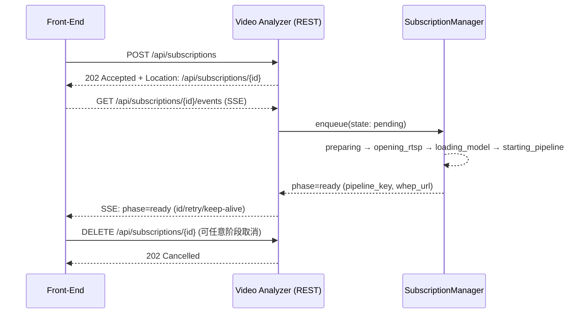

# 异步订阅补强设计（Async Subscription Hardening）

## 背景与目标

异步订阅（POST/GET/DELETE /api/subscriptions + SSE 事件流）已上线，可稳定创建/查询/取消，并输出基础指标。随着并发提升与长稳运行，需要在排队/限流、可取消性、缓存/预热、可观测、安全与 API 细节方面做“硬化”。目标：在高并发、抖动与重启等场景下，订阅链路保持可预期、可控与可观测。

## 范围

- 服务端：SubscriptionManager、REST/SSE（/api/subscriptions*/events）、System Info、/metrics。 
- 前端：AnalysisPanel 进度与时间线展示、SSE 断线重连/回退、取消按钮行为。 
- 运维：配置（YAML+env）、指标/告警、必要的持久化（轻 WAL/Redis 可选）。

## 现状基线（已具备）

- 异步任务分阶段：pending→preparing→opening_rtsp→loading_model→starting_pipeline→ready/failed/cancelled。
- SSE 事件流（keep-alive），支持 Last-Event-ID/retry；时间线 include=timeline；终态入库（sessions）。
- 分阶段信号量（model_slots/rtsp_slots）+ 简单队列上限（max_queue）；幂等 key 复用（use_existing）。
- Prometheus 指标：队列/在途/状态、完成计数、总时长直方图、失败原因计数；新增 per‑phase 直方图（opening/loading/starting）。

## 设计增量

### 1) 排队与限流

- 队列上限：`subscriptions.max_queue`（默认 1024），满载返回 `429 Too Many Requests`，附 `Retry-After: <sec>`。
- 分阶段限流：`subscriptions.{open_rtsp_slots, load_model_slots, start_pipeline_slots}`（向后兼容 model_slots/rtsp_slots）。
- HTTP 工作线程不参与重资源阶段：确保 IO/解析快速返回，重任务全部在内部 executor/队列上执行。

### 2) 取消与可中断性

- 在 `opening_rtsp/load_model/start_pipeline` 关键路径埋设取消点：检测 `state->cancel` 并做 RAII 清理（decoder/ORT/TensorRT/管线）。
- 取消响应：DELETE 任意阶段均可；若已有 pipeline_key 则先 `unsubscribeStream`，再终态 `Cancelled` 并持久化。

### 3) 模型/编解码缓存与预热

- ModelRegistry（key: model_hash+EP_opts） + LRU（上限/idle TTL）；CodecRegistry（可选）；Ready/Failed/Cancelled 后放回 idle；减少重复 LoadingModel。
- 预热名单：在启动或低峰时拉起常用模型/编解码器，隐藏冷启动。

### 4) 状态持久化与恢复（可选）

- 轻量持久化：WAL/Redis 记录 `subscription_id/baseKey/phase/reason_code/timestamps`；重启时把“进行中”标记为 `failed(restart)` 并告警。

### 5) API 细节

- POST /api/subscriptions：202 + `Location: /api/subscriptions/{id}`；若队列满：`429 + Retry-After`；标准化 `reason_code`。
- GET /api/subscriptions/{id}：支持 `ETag/If-None-Match`（建议基于 `phase + updated_at_ms` 生成）。

### 6) 安全与配额

- per-user/per-key 限额（源/模型/并发订阅数/GPU 资源上限）；拒绝时返回清晰错误码与用户提示。

### 7) 可观测与告警

- 指标：
  - `va_subscriptions_queue_length/in_progress/states{phase}`、`va_subscriptions_completed_total{result}`。
  - `va_subscription_duration_seconds_*`、`va_subscription_phase_seconds_*{phase}`。
  - `va_subscriptions_failed_by_reason_total{reason_code}`。
- 告警：队列过长、失败率升高、阶段耗时 P95/99 超阈值、restart 失败数异常等。

### 8) 前端 UX 补强

- AnalysisPanel：
  - 构建阶段显示“阶段耗时”微条（RTSP/模型/启动），ready 后保留“上次构建用时”。
  - 取消按钮在拿到 `subId` 即可用（不必等待 ready）。
- SSE 策略：断线重连 + 短期轮询兜底（已实现）。

## 协议与结构（Mermaid）

## 配置

- app.yaml：
  - `subscriptions: { max_queue, ttl_seconds, model_slots, rtsp_slots, open_rtsp_slots, load_model_slots, start_pipeline_slots }`
  - env 覆盖：`VA_SUBSCRIPTION_*`，`/api/system/info` 回显来源（env/config/defaults）。

## 兼容与回滚

- 旧接口 `/api/subscribe|/api/unsubscribe` 以开关保护（默认 410），阶段性保留。
- 回滚方案：关闭新限流/队列策略；禁用 ModelRegistry；恢复仅总时长指标。

## 风险与缓解

- 取消过程中资源泄漏 → 全路径 RAII + finally；关键句柄置空；GPU/ORT/TRT 关闭顺序校验。
- 并发热点导致排队堆积 → per‑phase 限流 + 429/Retry-After；幂等复用 use_existing。
- 重启丢状态 → 轻 WAL/Redis 记录，重启标注 failed(restart) 并告警。
- Windows 套接字类型不一致（SOCKET→int）→ 统一 `sock_t` 别名，消除崩溃源。

## 里程碑与验收

- M0（P0）：限流/队列/取消清理/Location&ETag/reason_code；基准压测与指标齐全；前端“阶段耗时”与“开始即取消”。
- M1（P1）：ModelRegistry/LRU+预热；WAL/Redis 恢复；SSE 健壮性验证与回归用例。
- M2（P2）：配额/ACL、Grafana 面板与告警、Trace 可选。

