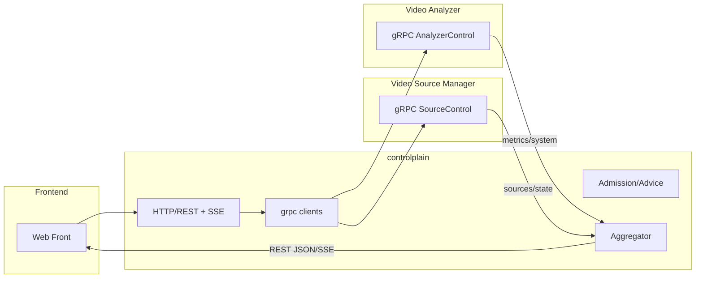

# controlplain 设计方案（独立控制平面）

## 背景与目标
- 将嵌入于 VA 的控制平面从 `video-analyzer/src/control_plane_embedded` 独立为新项目 `controlplain`。
- 前端只与 `controlplain` 交互；`controlplain`、VA、VSM 三者之间仅采用 gRPC 通信。
- 保持对外 REST/SSE 语义不变（POST 202+Location、GET ETag/304、SSE 事件负载）。

## 非目标
- 不改变 VA/VSM 的核心业务实现与内部资源模型。
- 不一次性重写前端或替换所有配置体系；先兼容迁移，再逐步演进。

## 总体架构


## 模块划分
- `server.http`：最小 REST 路由、SSE 输出（phase 事件、keepalive）。
- `clients.grpc`：VA/VSM gRPC 客户端封装，统一超时/重试/熔断/错误分类。
- `core.adapter`：请求/响应映射、ETag 生成、Location 暴露、SSE 桥接。
- `core.aggregator`：聚合 `/api/system/info`、只读缓存（可选）。
- `core.admission`：观察与建议（X-Quota-* 建议头），不侵入业务判定。
- `obs`：指标暴露（cp_request_total、cp_latency_seconds、cp_backend_failure_total{target,reason}）。
- `config`：YAML 解析、热加载（可选）。

## 对外 REST/SSE（与现有前端兼容）
- POST `/api/subscriptions` → 返回 `202` 与 `Location`（`/api/subscriptions/{id}`）。
- GET `/api/subscriptions/{id}` → `200` 或 `304`（弱 ETag 基于 phase+ts）。
- DELETE `/api/subscriptions/{id}` → `202`（幂等）。
- GET `/api/subscriptions/{id}/events` → SSE：`event: phase`，data 含 `{ id, phase, reason?, pipeline_key }`。
- GET `/api/system/info` → 聚合 VA 的 `engine/options/subscriptions`、VSM 的 `sources` 等。

## 内部 gRPC（proto 片段）
```proto
// analyzer_control.proto
service AnalyzerControl {
  rpc Subscribe(SubscribeRequest) returns (SubscribeReply);
  rpc Get(GetRequest) returns (GetReply);
  rpc Cancel(CancelRequest) returns (CancelReply);
  rpc SystemInfo(Empty) returns (SystemInfoReply);
}

// source_control.proto
service SourceControl {
  rpc ListSources(Empty) returns (ListSourcesReply);
  rpc Attach(AttachReq) returns (Reply);
  rpc Detach(DetachReq) returns (Reply);
}
```

## 配置与运行
- `controlplain/config/app.yaml`
  - `server: { http_listen: 0.0.0.0:8080 }`
  - `va: { grpc_addr: 127.0.0.1:50051, timeout_ms: 8000, retries: 1 }`
  - `vsm: { grpc_addr: 127.0.0.1:7070, timeout_ms: 8000 }`
  - `observability: { metrics_registry_enabled: true }`
- Windows：`tools/build_controlplain_with_vcvars.cmd` → 产物 `controlplain/build/bin/controlplain.exe config/`

## 错误码与原因映射
- 规范化原因：`acl_scheme`、`acl_profile`、`open_rtsp_failed`、`load_model_failed`、`start_pipeline_failed`、`subscribe_failed`、`cancelled`。
- HTTP 映射：ACL/参数错误→4xx；容量/背压→429；后端不可用→503；未知→500。
- 建议头：`X-Quota-Reason`、`X-Quota-Advice`（observe_only 时仅建议，不拒绝）。

## 观测与指标
- `cp_request_total{route,code}`、`cp_latency_seconds{route,quantile}`。
- `cp_backend_failure_total{target,reason}`（va|vsm）。
- `cp_feature_enabled{feature}`：切换开关可观测。

## 安全
- 前端鉴权（JWT/OIDC 可选）：路由鉴权、透传主体信息到后端（如需要）。
- 与 VA/VSM 通信：mTLS/Token 可配；最小版本支持明文内网。

## 版本与兼容
- `proto` 采用向后兼容演进；新增字段不破坏旧客户端。
- controlplain 对前端的 JSON 响应保持字段稳定；新增字段以可选方式呈现。

## 性能与容量
- 无状态：可水平扩展；前置负载均衡。
- 只读接口（system.info/sources）可做短缓存（1–2s）。

## 迁移与回滚
- 迁移：部署 controlplain → 前端 baseURL 指向 controlplain → VA 关闭内嵌 CP 编译开关。
- 回滚：前端切回 VA（或重开内嵌 CP 开关）；DNS/Config 回退即可。

## 风险与缓解
- 后端不可用/超时：重试+熔断，区分目标（va|vsm），暴露失败指标。
- 延迟放大：采用连接池与客户端重用；只读缓存降低后端压力。
- 版本漂移：在 `/api/system/info` 返回后端版本与能力集，动态降级。

## 验收标准
- 最小 API（POST/GET/DELETE+SSE）通过；/system/info 聚合一致。
- 指标/日志完备；故障注入（va|vsm down）能可观测与优雅失败。
- 烟囱脚本全绿；回滚脚本可用。
