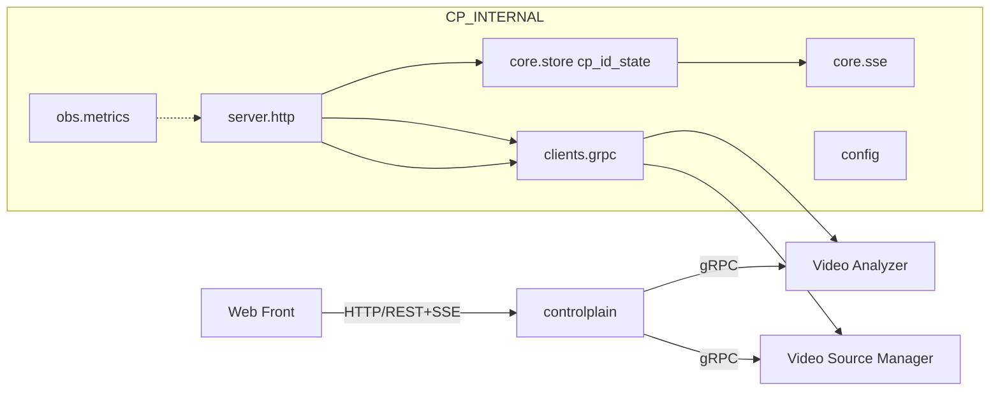

# controlplain 设计（无桥接 + Restream 订阅）

## 目标与边界
- 独立控制平面 `controlplain`：前端仅与 CP 通信；CP ↔ VA/VSM 通过 gRPC。
- 无桥接：CP 不做 REST 透传或短轮询；CP 生成 `cp_id` 并维护 timeline/ETag/SSE，作为唯一事实来源（SSOT）。
- 订阅改造为 Restream：VSM 启动即自拉上游并“再发布”为稳定端点；VA 订阅只拉取该端点进行分析。

## 架构


## 订阅流程（Restream 模式）
- VSM 启动：从数据库读取“已启用”源，attach 并以 Restream 方式对每个源发布稳定端点（默认 `rtsp://127.0.0.1:8554/{source_id}`），维护 Ready/Backoff/Failed 与 FPS/err 指标，流式输出 WatchState。
- 前端分析页：列出所有源与状态，仅允许对“开启且 Ready”的源发起订阅。
- CP 订阅：POST `/api/subscriptions` 支持 `source_id`；如未显式提供 `source_uri`，由 CP 转译为 `restream.rtsp_base + source_id`，调用 VA SubscribePipeline；返回 `202+Location`，GET 支持 ETag/304；SSE 待接 VA Watch 对接。
- 订阅链路不再调用 VSM；VSM 仅负责“拉取上游 + 再发布 + 健康可视化 + 启停”。

## CP API 契约
- POST `/api/subscriptions`：接受 `source_id|source_uri, stream_id, profile, model_id?`；生成 `cp_id`，调用 VA 订阅；`202+Location`；`Access-Control-Expose-Headers: Location,ETag`。
- GET `/api/subscriptions/{id}`：`200` 或 `304`（ETag 基于 timeline 版本）；data `{ id, phase, reason?, pipeline_key }`。
- DELETE `/api/subscriptions/{id}`：幂等 `202`，最佳努力 VA 取消。
- GET `/api/subscriptions/{id}/events`：SSE（由 VA Watch 推动，待对接）。
- GET `/api/system/info`：聚合 VA QueryRuntime 与 VSM 健康/源状态（可 1–2s 只读缓存），标注 `source=config|env|va|vsm`。
- 源管理：
  - GET `/api/sources`：优先 VSM `WatchState` 首帧，失败回退 `GetHealth`；返回 attach_id/source_uri/phase/fps 等。
  - POST `/api/sources:enable|disable`：调用 VSM `Update(options.enabled)` 启停源，返回 `202`。

## gRPC 合同
- VA（需具备 Watch）
```
service AnalyzerControl {
  rpc Subscribe(SubscribeRequest) returns (SubscribeReply);
  rpc Get(GetRequest) returns (GetReply);
  rpc Cancel(CancelRequest) returns (CancelReply);
  rpc Watch(WatchRequest) returns (stream PhaseEvent);
  rpc QueryRuntime(Empty) returns (QueryRuntimeReply);
}
```
- VSM（启停/状态 + Restream 前提）
```
service SourceControl {
  rpc WatchState(WatchStateRequest) returns (stream WatchStateReply);
  rpc GetHealth(GetHealthRequest) returns (GetHealthReply);
  rpc Update(UpdateRequest) returns (UpdateReply); // options["enabled"]
  // 过渡：Attach/Detach 可保留一段时间以兼容旧流
  rpc Attach(AttachRequest) returns (AttachReply);
  rpc Detach(DetachRequest) returns (DetachReply);
}
```

## 配置与错误映射
- `restream.rtsp_base`：默认 `rtsp://127.0.0.1:8554/`，CP 将 `source_id` 映射为稳定端点。
- 错误与背压：ACL/参数错误→4xx；背压→429（含 Retry-After）；上游不可用→503；未知→500。

## 迁移与回滚
- 前端 baseURL 切至 CP；订阅切换为 `source_id`（CP 转译）；旧 attach 流保留灰度期后移除。
- VA Watch 可用后接入 SSE；若 Watch 未就绪，先提供 REST 最小闭环与 system.info/源管理。

## 验收
- 最小 API：POST 202+Location、GET ETag/304、DELETE 202。
- 源管理：/api/sources 列表与 enable/disable 生效；状态与指标可见。
- SSE：对接 VA Watch 后，phase 流事件稳定；整体无桥接、低耦合。
