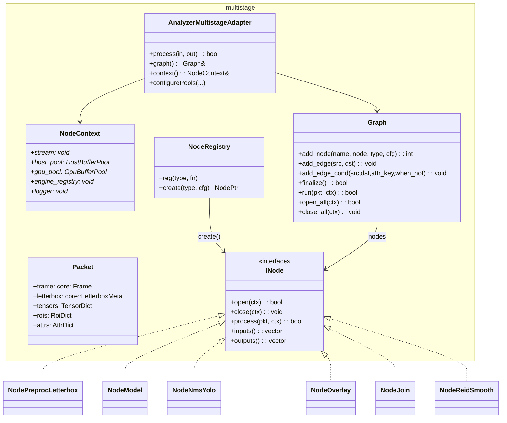
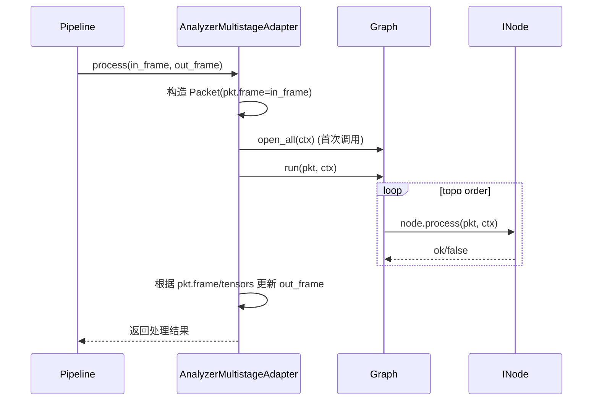

# 多阶段 Graph 详细设计说明书（2025-11-14）

## 1 概述

### 1.1 目标

本说明书在已有多阶段 Graph 条件边/join 与 ReID 平滑节点设计的基础上，系统梳理 Video Analyzer 多阶段 Graph 的内部设计：包括核心数据结构、节点与边模型、YAML 构建流程和执行时序，为添加新节点类型或调试多阶段 pipeline 提供统一参考。

### 1.2 范围

- 覆盖 `video-analyzer/src/analyzer/multistage/*` 相关实现：
  - `Graph` 与 `Packet/NodeContext/INode` 等抽象；
  - `NodeRegistry` 与 YAML builder；
  - 多阶段 `AnalyzerMultistageAdapter` 与管线集成。
- 条件边与特殊节点（`join`、`reid.smooth`）的行为细节在本说明书的第 3.2 和第 6.1/6.2 节中给出。

### 1.3 相关文档

- 概要设计：`docs/design/architecture/整体架构设计.md`
- VA 详细设计：`docs/design/architecture/video_analyzer_详细设计.md`
- 条件边与 join：见本说明书第 3.2 节与第 6.1 节
- ReID 平滑节点：见本说明书第 6.2 节

## 2 核心抽象与类图

### 2.1 类图

### 2.2 Packet 与 NodeContext

- `Packet`：
  - 表示单帧在图中的携带数据，包含：
    - `frame`：输入/输出视频帧（可叠加绘制）；
    - `letterbox`：预处理阶段的缩放与填充信息；
    - `tensors`：命名 tensor 视图（如 `tensor:img`、`tensor:det_raw` 等）；
    - `rois`：命名 ROI 列表（如 `roi:tracks`）；
    - `attrs`：任意键值属性（用于条件边、ReID ID 等）。
- `NodeContext`：
  - 执行过程中向节点提供共享资源：
    - `stream`：CUDA 流指针（以 `void*` 持有）；
    - `host_pool/gpu_pool`：Host/GPU 缓冲池，用于零拷贝与内存复用；
    - `engine_registry`：模型会话工厂/注册表；
    - `logger`：可选日志接口。

## 3 Graph 结构与条件边

### 3.1 Graph 内部结构

`Graph` 使用 ID 化节点与边来管理拓扑：

- `nodes_`：`NodeEntry` 数组：
  - `node: NodePtr`
  - `name: string`
  - `type: string`
  - `cfg: unordered_map<string,string>`
- `edges_`：`Edge` 数组：
  - `from/to: int`：源/目的节点索引；
  - `attr_key: string`：条件边使用的属性键（形如 `attr:flag`）；
  - `when_not: bool`：是否为 `when_not` 条件；
  - `has_cond: bool`：是否为条件边。
- `topo_`：拓扑排序后的节点索引列表。
- `name2id_`：节点名到索引的映射。

### 3.2 条件边语义与配置

- 添加边：
  - `add_edge(src, dst)`：普通边；
  - `add_edge_cond(src, dst, attr_key, when_not)`：条件边（`when` 或 `when_not`）。
- 执行时约定：
  - 对某个目标节点，如果存在条件边，则只有在至少一条条件边满足时才会执行该节点；没有条件边则按普通拓扑执行该节点。
  - 条件通过 `Packet.attrs` 查找布尔值：
    - `attr:<key>` 从 `Packet.attrs[key]` 读取值；
    - 字符串 `"1/true/yes/on"` 视为真，`"0/false/no/off"` 视为假，其它字符串按非空处理；
    - 数值类型非零视为真，零视为假。
  - 若同一条边同时配置 `when` 与 `when_not`，初始化时记录告警并优先使用 `when`。
  - `Graph::finalize` 会执行基本的 I/O 校验：未被消费的输出、重复输出键等问题会在启动阶段暴露。

## 4 构建流程（YAML → Graph）

### 4.1 NodeRegistry 与 YAML Builder

YAML 构建入口：`analyzer/multistage/builder_yaml.*` 与 `controlplane/adapters/graph_adapter_yaml.cpp`。

- `NodeRegistry`：
  - 单例，维护 `type -> NodeCreateFn(cfg)` 映射；
  - 使用 `MS_REGISTER_NODE(TYPE, CLASS)` 宏注册节点类型（如 `preproc.letterbox`、`model.ort`、`post.yolo.nms`、`join`、`reid.smooth` 等）。
- YAML builder：
  - 解析 `graphs/*.yaml` 中的 `nodes` 与 `edges`；
  - 对每个节点：
    - 读取 `name/type/params`；
    - 调用 `NodeRegistry::create(type, cfg)` 构建 `NodePtr`；
    - 调用 `graph.add_node(...)` 注册。
  - 对每条边：
    - 解析 `edges: [src,dst]` 或 `[src,dst,{when/...}]`；
    - 调用 `add_edge` 或 `add_edge_cond`。
  - 最后调用 `graph.finalize()` 完成拓扑检查与排序。

### 4.2 GraphAdapter 与 Engine 集成

在 `controlplane/adapters/graph_adapter_yaml.cpp` 中：

- `GraphAdapterYaml` 负责：
  - 根据配置加载 YAML 并使用 builder 构建 `Graph`；
  - 在 `open` 时调用 `graph.open_all(ctx)`，配置 `NodeContext` 的 buffer pool 与 engine registry；
  - 在 `close` 时调用 `graph.close_all(ctx)` 释放节点资源；
  - 在控制平面 API 中，将 Graph 绑定到对应 pipeline。

## 5 执行时序

### 5.1 单帧执行流程

- `Graph::run`：
  - 按 `topo_` 顺序遍历节点：
    - 检查条件边（如有），根据 `Packet.attrs` 决定是否执行；
    - 调用节点的 `process(pkt, ctx)`，节点内部可以读写 `frame/tensors/rois/attrs`。
  - 任一节点返回 `false` 可视情况终止后续执行（由上层策略决定）。

### 5.2 节点生命周期

- `open_all(ctx)`：
  - 对所有节点调用 `open(ctx)`，初始化资源（模型加载、内存分配等）；
  - 只在首次或发生拓扑变更时调用。
- `close_all(ctx)`：
  - 对所有节点调用 `close(ctx)`，释放资源；
  - 在 pipeline 停止或图变更时调用。

## 6 特殊节点与扩展点

### 6.1 join 节点

- 类型：`type: join`；
- 作用：将多个形状兼容的张量在指定 `axis` 维度上拼接（concatenate）。
- 关键参数：
  - `ins`：输入键列表（字符串或列表），如 `["tensor:feat_a", "tensor:feat_b"]`。
  - `out`：输出键名，如 `tensor:feat_joined`。
  - `axis`：拼接维度（默认 1；可为负数，表示从尾部数）。
  - `prefer_gpu`：是否优先走 GPU 拼接（默认 1），要求所有输入张量在 GPU 且 `ctx.gpu_pool` 有效。
- 兼容性约束：
  - 所有输入张量 rank 必须一致；
  - 除 `axis` 外的各维度必须相同；
  - 当前默认数据类型为 `float32`，应与 pipeline 约定保持一致。
- 性能注意：
  - GPU 路径在设备侧完成内存拼接，并复用 `GpuBufferPool` 分配；
  - 若 `NodeContext.stream` 提供 `cudaStream_t`，则内部使用异步拷贝，否则回退到同步实现。

### 6.2 ReID 平滑节点

- 类型：`type: reid.smooth`；
- 作用：对 ReID 特征向量进行跨帧平滑，降低抖动，按 `id_attr`（通常是 track_id）维护内部状态。
- 关键参数：
  - `in`：输入张量键（F32，形状 `[D]` 或 `[1,D]`）。
  - `out`：输出张量键（默认 `tensor:reid_smooth`）。
  - `id_attr`：从 `Packet.attrs` 读取的 ID 键（默认 `track_id`），支持多种基础类型，将统一转为字符串作为缓存 Key。
  - `method`：平滑方法，`ema`（默认）或 `mean`。
  - `window`：`mean` 方法使用的窗口大小（默认 10）。
  - `decay`：`ema` 衰减系数（默认 0.9）。
  - `l2norm`：输出是否做 L2 归一化（默认 true）。
  - `passthrough_if_missing`：缺少 `id_attr` 时是否透传输入（默认 true）。
- 行为：
  - `ema`：`y_t = decay * y_{t-1} + (1 - decay) * x_t`，首次初始化为当前值；
  - `mean`：维护长度不超过 `window` 的滑窗，输出窗口内向量的均值。
- 运行时约束与故障排查：
  - 当前实现仅支持 CPU 张量输入；如上游为 GPU 输出，应在引擎选项开启 `stage_device_outputs=1` 或在该节点之前显式搬到 CPU；
  - 若日志提示 `missing id_attr`，需检查上游是否正确写入 `Packet.attrs[track_id]`。

### 6.3 新增节点类型

- 步骤：
  1. 定义新节点类 `class NodeFoo : public INode`，实现 `process/open/close/inputs/outputs`；
  2. 在对应 `node_foo.cpp` 中调用 `MS_REGISTER_NODE("foo.type", NodeFoo)` 注册；
  3. 在 YAML graph 中使用 `type: foo.type` 进行配置。

## 7 非功能性设计

### 7.1 性能

- 通过 buffer pool 复用 Host/GPU 内存，避免频繁分配；
- 使用 CUDA stream 与异步 kernel，减少同步点；
- 在 `Graph.finalize` 阶段做静态检查，尽量在启动时发现配置问题，避免运行时频繁报错。

### 7.2 可调试性

- 条件边、节点执行结果与异常通过日志记录（可按模块调节日志级别）；
- Graph 提供 `for_each_node/with_node` 接口，方便调试工具遍历与修改节点配置（如动态切换模型）。

本详细设计文档作为多阶段 Graph 框架的结构说明，应与节点级别的专题文档（条件边/join/ReID 等）和 `video_analyzer_详细设计.md` 一起维护。新增节点类型或调整 Graph 执行行为时，应同步更新本说明书中相关章节。 
