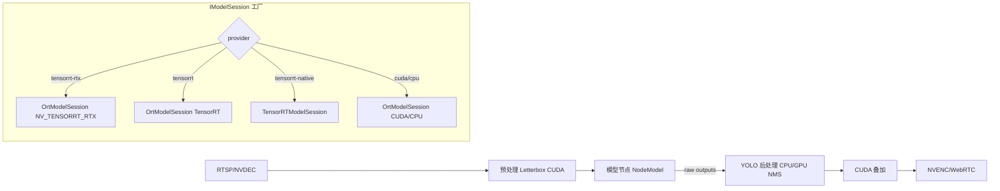

# VA TensorRT 推理引擎设计（5090D / SM_120）

本文给出在 VA 中接入原生 TensorRT 推理引擎与 ORT TensorRT/RTX EP 的完整方案，满足零拷贝链路、统一 CUDA 流与 SOLID 原则，并兼容现有多阶段图和控制面。

## 1. 背景与目标

- 现状：模型节点固定使用 `OrtModelSession`（CUDA EP/I/O Binding），未提供“原生 TensorRT”实现；存在 ORT TensorRT EP 路径但未完善选择与回退。
- 目标：
  - 优先支持 NV TensorRT RTX EP（tensorrt-rtx）→ TensorRT EP（tensorrt）→ CUDA EP（cuda）有序回退。
  - 引入原生 `TensorRTModelSession`（阶段二），统一 CUDA 流与设备侧输出视图（零拷贝）。
  - 不改 YAML 图与节点类型；通过 EngineManager.provider 与 options 切换 Provider。

## 2. 架构与数据流



## 3. 设计与 SOLID 原则

- 单一职责：
  - `IModelSession` 仅定义 `loadModel/run`；`OrtModelSession`/`TensorRTModelSession` 各自封装 Provider 细节。
  - `model_session_factory` 仅决策“创建哪种会话”，不处理推理。
  - NodeModel 只负责把输入喂给会话并输出给下游。
- 开闭原则：
  - 新增 Provider 通过“新类 + 工厂映射”扩展，不修改 Node/图/控制面。
- 里氏替换：
  - `TensorRTModelSession` 完全符合 `IModelSession` 语义，能被 NodeModel 无感替换。
- 接口隔离：
  - 最小接口 `IModelSession`；Provider 特定选项通过 `Options` 承载，不污染接口。
- 依赖倒置：
  - NodeModel 依赖 `IModelSession` 抽象与工厂；EngineManager 提供 `EngineDescriptor{provider, options}` 注入。

## 4. 模块与改动清单

- 新增
  - `src/analyzer/model_session_factory.hpp/.cpp`
    - `createSession(const EngineDescriptor&, const NodeHints&)`：`tensorrt-rtx`→Ort+RTX EP；`tensorrt`→Ort+TRT EP；`tensorrt-native`→`TensorRTModelSession`；else→Ort CUDA/CPU。
  - `src/analyzer/trt_session.hpp/.cpp`（阶段二）
    - 解析 ONNX → 构建 `nvinfer1::ICudaEngine`、`IExecutionContext`；绑定统一 CUDA 流（`user_stream`）；输出以设备视图暴露（可选 Host stage）。
- 修改
  - `src/analyzer/multistage/node_model.cpp`：由工厂创建 `IModelSession`，注入 `Options`（`provider/device_id/user_stream/fp16/workspace_mb/device_output_views/stage_device_outputs`）。
  - `CMakeLists.txt`：检测 TRT（`NvInfer.h`、`nvinfer`、`nvonnxparser`），存在则 `-DUSE_TENSORRT` 并链接；缺失则编译通过但工厂回退。
  - `docker/va/Dockerfile.gpu`：
    - build 基镜像使用 `cudnn-devel`；尝试安装 TRT dev（失败不阻塞）。
    - 编译 ONNX Runtime v1.23.2 启用 CUDA；如检测到 TRT，则编译出 `providers_tensorrt`/`providers_nv_tensorrt_rtx`。

## 5. Provider 选择与配置

- EngineDescriptor.provider → 工厂映射：
  - `tensorrt-rtx|nv_tensorrt_rtx|rtx` → Ort NV TensorRT RTX EP（优先）
  - `tensorrt|ort-trt` → Ort TensorRT EP
  - `tensorrt-native` → `TensorRTModelSession`（阶段二）
  - 其他：`cuda|gpu|cpu|ort-xxx` → Ort CUDA/CPU EP
- Options 示例（app.yaml）：
```yaml
engine:
  provider: tensorrt-rtx
  device: 0
  options:
    trt_fp16: true
    trt_workspace_mb: 2048
    device_output_views: true
    stage_device_outputs: false
```

## 6. 运行时行为与日志

- 加载日志：
  - `analyzer.ort load` 或 `analyzer.trt load`：`provider_req/ resolved`、`inputs/outputs`、`in0_dtype/shape`、EP 选项（fp16/workspace）。
- 运行日志：
  - `ort.run` 或 `trt.run`：`outputs=N out0..2_shapes=... provider=... dev_bind=...`
- `/api/system/info`：
  - `engine_runtime`: `{ provider: tensorrt-rtx|tensorrt|cuda, gpu_active: true, device_binding: true, io_binding: (ORT时可能为true) }`

## 7. 零拷贝与统一 CUDA 流

- 统一流：`Options.user_stream`（来自 TLS 流或外部传入）→ ORT CUDA V2 设置 `user_compute_stream`；TRT `enqueueV3(stream)`。
- 输出策略：
  - `device_output_views=true` → 直接暴露 Device 指针（NMS GPU 直接消费）。
  - 否则 `stage_device_outputs=true` → D2H 拷贝。

## 8. 构建与 Docker

- CMake：
  - `find_path(TENSORRT_INCLUDE_DIR NvInfer.h)`、`find_library(NVINFER_LIB nvinfer)`、`find_library(NVONNXPARSER_LIB nvonnxparser)`；存在→`add_definitions(-DUSE_TENSORRT)` 并 `target_link_libraries(... nvinfer nvonnxparser)`。
- Docker：
  - build 阶段镜像：`nvidia/cuda:<ver>-cudnn-devel-ubuntu22.04`；安装 `python3-pip` 用于 ORT build.py；尝试安装 TRT dev（可选）。
  - 构建 ORT：`-DCMAKE_CUDA_ARCHITECTURES="90;120"`、禁用 Flash-Attention、并行 24；复制到 `/opt/onnxruntime`；补全 `libonnxruntime.so.1` 链接；运行时镜像 `cudnn-runtime`。

## 9. 测试与验证

- 快速校验：容器内 `python3 /app/tools/check_onnx.py --model /app/models/xxx.onnx`（确认有 Graph 输出）。
- 端到端：
  1) `/api/engine/set` → provider=`tensorrt-rtx`
  2) `/api/subscriptions` 创建订阅；`/api/control/pipeline_mode` 开启实时分析
  3) 日志期望：`load/ run` 显示 outputs>0；`engine_runtime` 显示 provider=tensorrt-rtx
- 压测：720p/1080p YOLO，记录 FPS 与 P95；比较 CUDA EP / TensorRT EP / TensorRT-RTX EP。

## 10. 风险与缓解

- TRT 版本/驱动不匹配：编译期检测 + 运行期回退到 CUDA EP，并记录告警。
- 动态形状与 Profile：阶段二先支持静态 1x3x640x640；动参/批次后续迭代。
- 显存水位：提供阈值与泄漏检测日志（首次可通过 `nvidia-smi dmon` 与 Prom 侧指标观测）。
- 引擎冷启动耗时：后续加入引擎序列化（plan 缓存）与预热。

## 11. 里程碑（M0→M2）

- M0（1–2天）：工厂 + NodeModel 解耦；完善 ORT EP 选择（tensorrt-rtx→tensorrt→cuda）并验证输出>0。
- M1（2–4天）：原生 `TensorRTModelSession`（FP16/静态输入）；统一流与设备视图；端到端通过。
- M2（3–5天）：动态 profile/批量、引擎序列化；性能调优与回归测试；文档固化与 CI 钩子。

