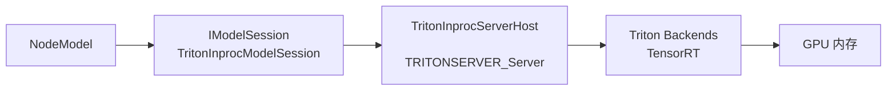
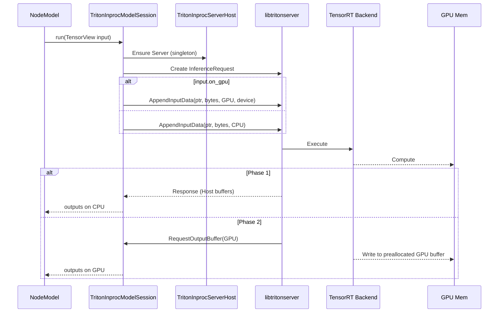
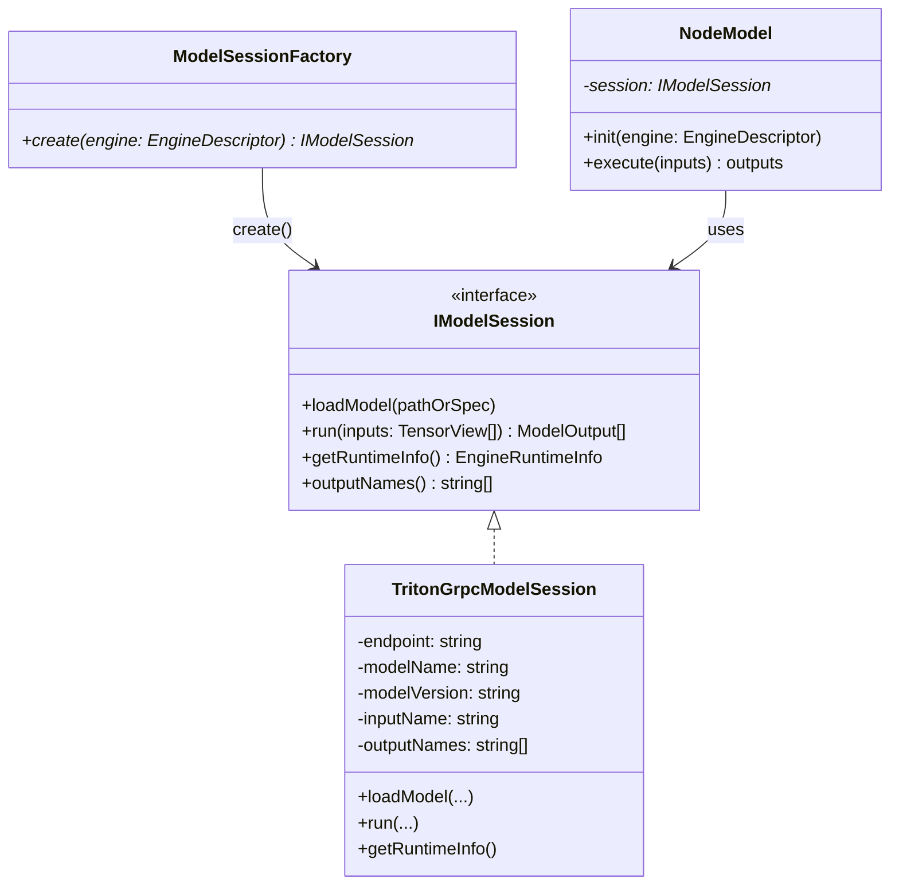
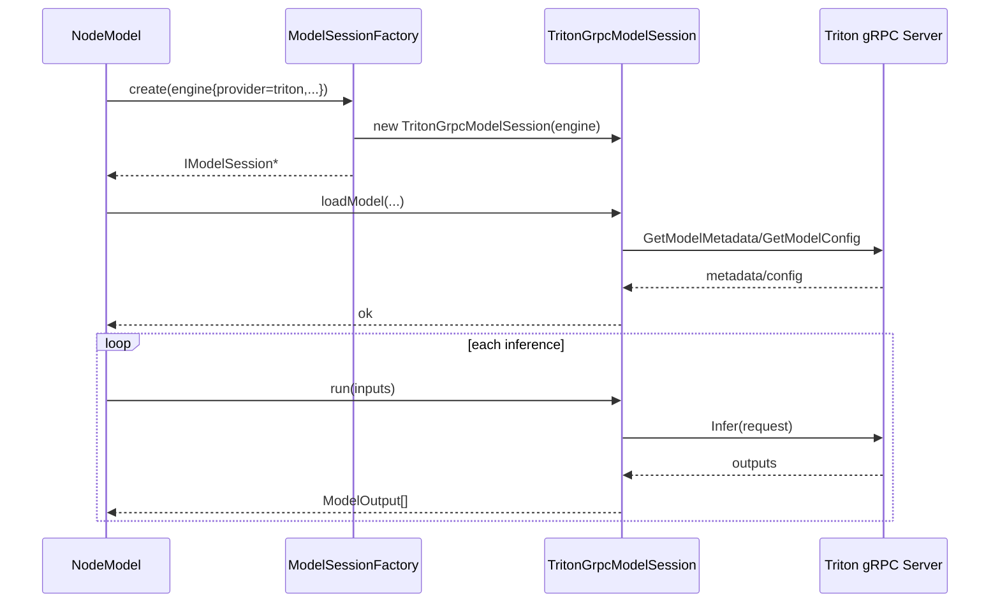

# Triton In‑Process 集成设计（CUDA 13.0）

本文提出在 Video Analyzer（VA）进程内嵌 Triton Inference Server（libtritonserver.so）以替代跨进程 gRPC 路径的方案，目标是彻底消除 CUDA IPC/SHM 相关不稳定因素，降低端到端时延，并统一资源与调度。

## 1. 背景与问题

- 现状使用 Triton gRPC + CUDA Shared Memory（IPC）传递显存数据，存在以下问题：
  - 设备映射不一致（CUDA_VISIBLE_DEVICES、NVIDIA_VISIBLE_DEVICES 等）导致 RegisterCudaSharedMemory 失败（invalid resource handle/args）。
  - CUDA 主版本不一致（如 VA=CUDA 13.0，Triton=CUDA 12.x）时，IPC 句柄在服务端无法打开。
  - IPC 命名空间/容器设置（ipc: host）缺失、MIG 环境限制等，带来部署复杂度与运行时不确定性。
  - gRPC 编解码与网络栈带来额外延迟；注册/反注册共享内存也有开销。

## 2. 目标

- 消除跨进程不确定性：进程内直接调用 Triton C API，去除 CUDA IPC/SHM 与 gRPC 依赖。
- 降低时延：避开网络栈与 SHM 注册/校验开销，缩短推理链路。
- 统一资源治理：Triton Server、后端与模型加载在 VA 进程内托管，日志/指标/调度一体化。
- 兼容回退：保留 gRPC provider，运行时/构建时可开关并回退。

## 3. 总体方案

- 新增 `TritonInprocModelSession`（实现 `IModelSession`），由工厂以 `provider: "triton-inproc"` 选择。
- 新增 `TritonInprocServerHost`：封装 libtritonserver 的 ServerOptions/Server 生命周期（单例/引用计数），统一 Model Repository、日志、设备等配置。
- 数据路径：
  - 输入：若 `TensorView.on_gpu=true`，通过 `TRITONSERVER_InferenceRequestAppendInputData(ptr, bytes, TRITONSERVER_MEMORY_GPU, device_id)` 直接传显存指针；CPU 同理。
  - 输出（Phase 1）：先读取 Host buffer（确保功能稳定）。
  - 输出（Phase 2）：通过 `TRITONSERVER_InferenceResponseOutputBuffer` 预分配 GPU 输出缓冲，实现“GPU→GPU”路径。
- 可选启用 Triton 的 HTTP/GRPC（调试），默认关闭，保持纯 In‑Proc。

## 4. 接口与配置

- Engine.provider：`triton-inproc`（新增）/ `triton`（现有 gRPC）。
- Engine.options（新增/复用）：
  - `triton_repo`：模型仓库路径（默认 `/models`）。
  - `triton_model`、`triton_model_version`、`triton_input`、`triton_outputs`、`triton_timeout_ms`：沿用现有键。
  - `triton_strict_config`：是否要求严格模型配置（0/1）。
  - `triton_model_control`：模型控制模式（`none`/`explicit`）。
  - `triton_enable_http`、`triton_http_port`（默认关闭/8000，仅调试）。
  - `triton_enable_grpc`、`triton_grpc_port`（默认关闭/8001，仅调试）。
  - `inproc_outputs_gpu`：是否启用 GPU 输出缓冲（Phase 2）。
  - `device`：GPU 设备索引（与 VA 现有字段一致）。

## 5. 组件设计

### 5.1 TritonInprocServerHost
- 职责：
  - `Create/Init`：构造 `TRITONSERVER_ServerOptions`（仓库路径、日志级别、是否启用 HTTP/GRPC、内存/线程相关参数），创建 `TRITONSERVER_Server*`。
  - `Load/Unload`：按需加载/卸载模型（若采用 explicit 模式）。
  - 生命周期：全局单例 + 引用计数；所有 `TritonInprocModelSession` 共享同一 Server。
  - 关闭：等待活动请求完成后析构。

### 5.2 TritonInprocModelSession
- 职责：
  - `loadModel()`：校验模型可用，探测 IO 名称（必要时读取配置/metadata）。
  - `run()`：
    - 构造 `TRITONSERVER_InferenceRequest`。
    - 追加输入（GPU/CPU），设置超时与必要的请求参数。
    - 发起推理并同步等待响应（Phase 1）。
    - 解析输出：Phase 1 返回 Host `TensorView`；Phase 2 返回 GPU `TensorView`（由我们提供的输出缓冲）。
  - `getRuntimeInfo()`：记录 provider、gpu_active、device_binding 等状态。

## 6. 生命周期与并发

- ServerHost：进程范围内唯一；首次使用时初始化，进程退出/引用归零时关闭。
- ModelSession：按多路流独立实例化；共享 Server 但不共享请求对象。
- 并发：每次推理创建 `InferenceRequest`；Server/Backend 内部线程由 Triton 管理。

## 7. 数据路径（细化）

## 8. 构建与镜像

- 运行镜像基于 `nvcr.io/nvidia/tritonserver:<CUDA13 tag>`；保证：
  - `libtritonserver.so` 与 `/opt/tritonserver/backends` 存在；
  - TensorRT 与 CUDA（13.0）与 VA 构建版本一致；
  - `LD_LIBRARY_PATH` 覆盖 Triton/ORT/系统库路径；
  - 不再拉起外部 tritonserver（entrypoint 依据开关跳过）。
- CMake：
  - `USE_TRITON_INPROCESS=ON` 时，定位 `tritonserver.h` 与 `libtritonserver.so`，并链接所需依赖（grpc/protobuf 等）。

## 9. 指标与日志

- 日志：`analyzer.triton_inproc` 记录初始化、模型加载、推理耗时、错误等；按模块节流。
- 指标（建议）：
  - `va_triton_inproc_infer_seconds`（histogram）
  - `va_triton_inproc_infer_failed_total`（counter）
  - `va_triton_inproc_gpu_outputs_ratio`（gauge）

## 10. 风险与规避

- 版本/符号冲突：确保 Triton/TensorRT/CUDA 与 ORT/自带 TRT 版本兼容；必要时仅保留一份 TensorRT。
- 资源占用：进程内内存上升；通过选项控制并发与内存池。
- 稳定性：同进程崩溃面扩大；通过 watchdog/回退 provider（gRPC/ORT）降低影响面。
- MIG/设备隔离：与 gRPC 路径相比，In‑Proc 不依赖 CUDA IPC，天然绕开 IPC 限制；但仍需正确选择 device。

## 11. 落地计划

- Phase 1（功能优先）
  - [ ] 引入 `TritonInprocServerHost` 与 `TritonInprocModelSession`；
  - [ ] 工厂识别 `provider: triton-inproc`；
  - [ ] 输入支持 CPU/GPU；输出先走 Host；
  - [ ] 指标/日志与错误回退（失败→gRPC 或 ORT）；
  - [ ] 最小端到端验证：单流/多流、热切换、异常（模型缺失）。
- Phase 2（性能完善）
  - [ ] 输出 GPU 预分配与缓冲池；
  - [ ] 零拷贝链路（GPU→GPU）；
  - [ ] 压测与对比：时延/吞吐/占用。

## 12. 回退方案

- 配置切回 `provider: triton`（gRPC）或 `cuda/tensorrt/cpu`（ORT/原生 TRT）。
- 构建时关闭 `USE_TRITON_INPROCESS`。

## 13. 验收标准

- 可靠性：不再出现 CUDA IPC 相关错误；在设备/版本一致条件下稳定运行。
- 性能：相对 gRPC 路径显著降低单帧时延（去除网络栈与 SHM 注册开销）。
- 可运维：日志/指标完善；配置可开关，回退可用。

## 14. SOLID 原则落实

为确保实现具备可维护性与可演进性，本方案在设计与编码阶段遵循并落地 SOLID 原则：

### 14.1 单一职责（S）
- `TritonInprocServerHost`：仅负责 Triton Server 的生命周期管理与全局配置（创建/关闭、模型加载/卸载、日志级别、可选 HTTP/GRPC 开关）。不承载推理请求的构造与解析。
- `TritonInprocModelSession`：仅负责“该模型会话”的 IO 绑定与推理调用（构造请求、追加输入、获取输出、错误映射）。不直接操纵 Server 选项与模型仓库。
- `InferRequestBuilder`（内部小类/函数对象）：聚焦请求构建细节（形状、数据类型、动态维处理、超时），可单元测试。
- `OutputBufferAllocator`（策略接口）：负责输出缓冲的提供（Host/GPU）。会话仅依赖接口，不关心具体分配策略与池化。

### 14.2 开闭原则（O）
- 对扩展开放：
  - 新的缓冲分配策略（如固定显存池、按需增长池）→ 新实现 `OutputBufferAllocator` 即可。
  - 新的日志/追踪（如接入外部 tracer）→ 通过注入 `ITracer`（可选）实现，不修改会话主体。
  - 新的 provider → 继续通过 `IModelSession` 新实现接入工厂。
- 对修改关闭：
  - 不修改 `IModelSession` 既有接口；`ModelSessionFactory` 通过分支接入 `triton-inproc`，其它调用方零感知。

### 14.3 里氏替换（L）
- `TritonInprocModelSession` 满足 `IModelSession` 的行为契约：
  - 与 gRPC 版在输入/输出的形状、dtype（默认 FP32）、batch 维自动适配等语义保持一致。
  - 错误返回值与日志语义一致（不在调用者预期路径抛出异常）。
  - `getRuntimeInfo()` 字段与含义与其它实现对齐。

### 14.4 接口隔离（I）
- 小而专的接口：
  - `IModelSession`：最小化推理抽象（load/run/info）。
  - `IServerHost`（内聚到 inproc 子模块的公共最小接口）：仅暴露“取 Server 指针/加载模型”等必要能力。
  - `IOutputBufferAllocator`：仅暴露“为某输出提供缓冲（Host/GPU）”的接口。
- 约束：不在公共头对外暴露 Triton 具体类型；对 Triton C API 使用 Pimpl/私有 .cpp 隔离。

### 14.5 依赖倒置（D）
- 高层（会话逻辑）依赖抽象：
  - 通过 `IServerHost` 获取 Server 访问，不依赖具体 Triton 构造细节；
  - 通过 `IOutputBufferAllocator` 获取输出缓冲；
  - 通过工厂注入依赖，实现可替换/可测试。
- 细节（Triton C API、cudaMalloc 等）集中于实现层（.cpp），不泄漏到头文件。

### 14.6 依赖与边界
- 仅 `triton_inproc_session.cpp/.cc` 等少量实现文件包含 `triton/core/tritonserver.h`；公共头仅做前置声明/接口暴露。
- 链接顺序遵循：`libtritonserver` → `grpc` → `protobuf` → 系统库，避免符号漂移；TensorRT/ORT 版本在镜像侧对齐（CUDA 13.0）。

### 14.7 可测试性
- `IServerHost` 与 `IOutputBufferAllocator` 可注入 Mock，以单元测试会话在正常/异常路径的行为（超时、无输出、形状不符、GPU/CPU 切换等）。
- `InferRequestBuilder` 作为可测试单元验证维度/批次自适配逻辑。

### 14.8 实施检查清单
- 不修改公共接口（`IModelSession`）；
- 公共头不引入 Triton/CUDA 具体头文件；
- ServerHost 不包含请求构建/解析逻辑；会话不包含 Server 生命周期管理；
- 输出缓冲策略通过接口注入；默认 Host，Phase 2 增加 GPU 策略；
- 错误通过返回值与日志处理；避免未捕获异常越层；
- 工厂仅新增分支，不破坏既有 provider 选择链；
- 单测覆盖至少：请求构建、错误映射、Host/GPU 输出切换、回退链路。

## 附录 A：Triton gRPC 集成设计概要（回退与对照）

> 本附录基于历史文档 `triton_integration_design.md`，总结 `provider: triton`（外部 Triton gRPC 模式）的设计要点。当前 In‑Process 模式是推荐路径，gRPC 模式主要作为回退与对照方案存在。

### A.1 整体目标与范围

- 目标：
  - 以最小侵入方式在 VA 内接入 Triton Inference Server（gRPC 客户端），对接现有 `IModelSession/ModelSessionFactory/NodeModel` 抽象。
  - 保持多阶段 Graph 与上下游节点不变，仅新增 `IModelSession` 实现与工厂映射。
  - M0 优先保证功能正确与可观测；M1 引入 CUDA Shared Memory 降低拷贝；M2 视需要演进到 Triton Ensemble。
- 范围：
  - `provider: triton`（或 `triton-grpc`）对应的 `TritonGrpcModelSession`。
  - 外部 `tritonserver` 服务的部署、配置与回退链路。

### A.2 抽象对齐与类图

- 核心抽象：
  - `IModelSession`：统一 `loadModel/run/getRuntimeInfo/outputNames`；
  - `ModelSessionFactory`：根据 `EngineDescriptor` 决定具体 provider；
  - `NodeModel`：多阶段 Graph 中的模型节点，只依赖 `IModelSession`；
  - `TensorView/ModelOutput`： VA 内部张量抽象与结果类型。
- gRPC 实现：
  - `TritonGrpcModelSession`：`IModelSession` 的一类实现，封装 Triton C++ gRPC Client（`grpc_client.h`）。
  - 通过 `ModelSessionFactory` 的 provider 字段（`triton`/`triton-grpc`）创建。

### A.3 调用时序与数据流（gRPC）

- 加载阶段：
  - `NodeModel` 通过 `ModelSessionFactory` 创建 `TritonGrpcModelSession`，调用 `loadModel()`。
  - 会话连接外部 Triton Server，调用 `GetModelMetadata/GetModelConfig` 并缓存输入/输出名与 dtype/shape。
- 推理阶段：
  - 每次推理 `NodeModel.run()` 调用会话 `run(inputs)`；
  - 会话构造 `InferInput/InferRequestedOutput`，使用 Host 内存或 CUDA SHM 作为载体；
  - 通过 gRPC `Infer` 发起请求，得到 `InferResult`，再映射为 `ModelOutput[]`/`TensorView`。

### A.4 配置与运行选项

- provider 选择：
  - `engine.provider: triton`（或 `triton-grpc`）。
- 关键选项（`engine.options`）：
  - `triton_url: triton:8001`               # gRPC 端点
  - `triton_model: yolov12x`                # 模型名
  - `triton_model_version: ""`              # 空=latest
  - `triton_input: images`                  # 输入名称
  - `triton_outputs: dets,proto`            # 输出名称（逗号分隔）
  - `triton_timeout_ms: 2000`               # RPC 超时
  - `triton_no_batch: false`                # 是否保留 batch 维
  - `triton_shm_cuda: false`                # 是否启用 CUDA Shared Memory
  - `triton_cuda_shm_bytes: 0`              # 预留容量（0=按首次输入推断）
  - `triton_shm_server_device_id`           # 服务器侧设备 ID 覆盖（解决 GPU 映射不一致）
  - `triton_shm_fail_threshold`             # 连续失败阈值，超过后自动禁用 SHM
- NodeModel YAML：仍使用 `model` 节点；在 Triton 模式下路径字段可忽略，由 Engine.options 描述模型信息。

### A.5 指标、日志与部署

- 指标（Prometheus）：
  - `va_triton_rpc_seconds`：推理请求耗时直方图（可按 model/op 分桶）；
  - `va_triton_rpc_failed_total{reason=...}`：失败计数（create/invalid_input/mk_input/mk_output/infer/no_output/timeout/unavailable/other）。
- 日志：
  - `[triton] call model=<name> bytes_in=<n> bytes_out=<m> ms=<x>`，失败时输出指纹与建议（例如检查 CUDA_VISIBLE_DEVICES 或 SHM 配置）。
- Compose 与部署（示意）：
  - 在 docker-compose 中增加 `triton` 服务，挂载模型仓库 `/models`，暴露 8001（gRPC）与 8000（HTTP，可选）。
  - VA 容器通过同一网络访问 `triton:8001`，并在 `engine.options` 中设置 `triton_url`。
  - GPU 资源通过 `gpus: all` 或设备映射注入；必要时设置 `ipc: host` 以启用 CUDA IPC。

### A.6 分阶段推进与风险

- 推进阶段（示意）：
  - M0：gRPC + Host 内存路径，先保证功能与回退链；确保 `FPS`、`va_frame_latency_ms` 与 CPU/原生 TRT 路径基础对齐；
  - M1：启用 CUDA SHM 输入/输出，在固定输入尺寸下验证时延与吞吐收益，并处理 SHM 生命周期与重注册问题；
  - M2：支持动态形状/批量、可选 Ensemble、熔断与健康探测，并形成基准报告。
- 典型风险与缓解：
  - Triton Client 依赖与打包复杂 → 使用统一基镜像或 third_party 子模块管理；
  - CUDA SHM 生命周期与资源泄漏 → 通过容量复用与严格的注册/注销流程管理，在异常时回退到 Host 路径；
  - dtype/布局错误 → 依赖 ModelMetadata/Config，统一 FP16/FP32 映射与输出顺序校验。

### A.7 基准与验收参考

- 指标：
  - `FPS`、`va_frame_latency_ms` P50/P95；
  - `va_triton_rpc_seconds`、`va_triton_rpc_failed_total`；
  - 冷启加载时长纳入 `va_model_session_load_seconds`。
- 验收：
  - 推理链路稳定（boxes>0，无 NVENC/NVDEC 相关异常）；
  - Triton 不可用时回退链生效（自动切换到本地 TensorRT/ORT provider）；
  - 在目标场景下，相对纯 ORT/本地 TRT 路径有明确的资源/可运维收益评估。
