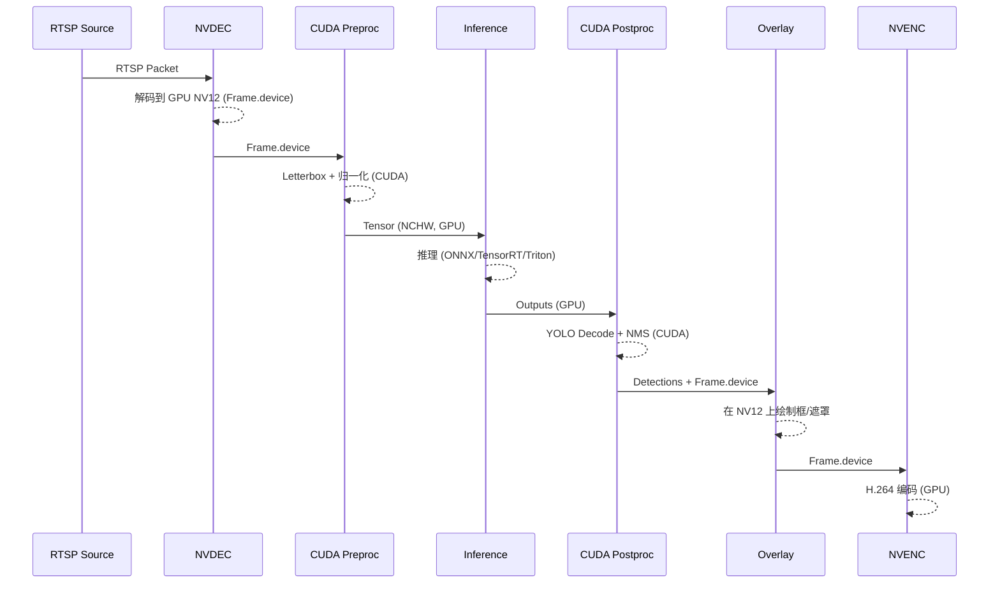

# VA GPU 零拷贝执行路径详细设计（2025-11-14）

## 1 概述

### 1.1 目标

本说明书详细描述 Video Analyzer 在 GPU 零拷贝模式下的执行路径，包括从 RTSP 解码到推理、后处理、叠加与编码的关键步骤、数据流与回退策略，作为性能调优与问题排查的技术依据。

### 1.2 范围

- 涵盖 VA 内部媒体与推理路径：
  - NVDEC 解码 → CUDA 预处理 → 推理引擎（ONNX Runtime/TensorRT/Triton）→ CUDA 后处理（YOLO decode/NMS）→ GPU 叠加 → NVENC 编码。
- 不覆盖 Controlplane/前端，仅在需要时说明交互约束（如分辨率、编码格式等）。

### 1.3 相关文档

- 概要设计：`docs/design/architecture/整体架构设计.md`
- VA 详细设计：`docs/design/architecture/video_analyzer_详细设计.md`
- 推理与引擎：`docs/design/engine_multistage/tensorrt_engine.md`、`docs/design/engine_multistage/triton_integration_design.md`、`docs/design/engine_multistage/triton_inprocess_integration.md`
- 性能与保护：见本说明书第 6 章“非功能性与调试建议”
- YOLO/NMS 与多阶段图：`docs/design/engine_multistage/multistage_graph_详细设计.md`

## 2 总体数据流

### 2.1 零拷贝主链路

```mermaid
flowchart LR
  RTSP[RTSP Source] --> DEC[NVDEC 解码]
  DEC --> F_GPU[Frame on GPU (NV12)]
  F_GPU --> PRE[CUDA 预处理/Letterbox]
  PRE --> TENSOR[NCHW Tensor (FP32/FP16)]
  TENSOR --> INF[推理引擎<br/>ONNX/TensorRT/Triton]
  INF --> POST[CUDA 后处理<br/>YOLO Decode + NMS]
  POST --> OVR[GPU 叠加 (NV12)]
  OVR --> ENC[NVENC H.264 编码]
  ENC --> OUT[WHEP / WebRTC DataChannel]
```

### 2.2 关键组件

- `media::source_nvdec_cuda`：NVDEC 解码器，输出位于 GPU 的 NV12 帧（`Frame.device`，`on_gpu=true`）。
- `analyzer::LetterboxPreprocessorCUDA`：CUDA 预处理/letterbox，将 NV12/BGR 转换为 NCHW tensor。
- `analyzer::IModelSession` 及实现：
  - ONNX Runtime（cuda）
  - TensorRT
  - Triton In-Process / Triton gRPC
- `analyzer::YoloDetectionPostprocessorCUDA`：GPU YOLO decode + NMS。
- `media::overlay_cuda`：GPU 叠加核，在 NV12 帧上绘制框与遮罩。
- `media::encoder_h264_nvenc`：NVENC 编码器。
- `media::transport_webrtc_datachannel` / `media::whep_session`：WebRTC DataChannel 与 WHEP 输出。

## 3 模块与类设计

### 3.1 媒体与帧结构

核心帧结构（简化）：

- `core::Frame`：
  - `on_gpu: bool`：标识当前帧是否位于 GPU。
  - `device: DeviceFrame`：GPU Frame（NV12），包含指向 Y/UV 平面的设备指针与 pitch。
  - `host: HostFrame`：CPU 帧（BGR 等），仅在需要回退或调试时填充。
  - `width/height/pix_fmt`：分辨率与像素格式。

零拷贝模式下，主流程仅在 `device` 上操作，尽量避免填充 `host`。

### 3.2 CUDA 预处理

CUDA 预处理（NV12→NCHW tensor）主要由以下组件完成：

- `analyzer/cuda/preproc_letterbox_kernels.cu`：
  - 提供 `letterbox_nv12_to_nchw_fp32` 等内核，对 NV12 帧执行缩放、letterbox 与归一化。
  - UV 分量使用独立的双线性权重计算（`fx_c/fy_c`），避免 Y/UV 插值错位。
- `LetterboxPreprocessorCUDA` 包装上述 kernel：
  - 接收 `Frame.device` 和目标尺寸（如 640x640），输出 NCHW tensor（FP32/FP16）。
  - 支持批量处理与多流，复用 CUDA stream 与工作区缓冲。

### 3.3 推理引擎与 IoBinding

- ONNX Runtime CUDA：
  - 通过 IoBinding 将预处理输出的 GPU tensor 直接绑定为输入，避免 D2H/H2D 往返。
  - 输出 tensor 可保持在 GPU（`device_output_views=true`），供后续 CUDA 后处理使用。
- TensorRT / Triton In-Process：
  - 在 In-Process 模式下可直接共享 CUDA stream 和设备缓冲（详见 `triton_inprocess_integration.md`）。
  - 推理输出可放入预先分配好的设备缓冲池。

### 3.4 CUDA YOLO Decode + NMS

CUDA 后处理的主要职责：

- `yolo_decode_to_yxyx` / `_fp16`：
  - 将模型输出的 `(cx, cy, w, h, score, cls)` 格式的 logits/概率转换为 `y1,x1,y2,x2`；
  - `need_sigmoid` 控制是否在 GPU 上对类别分数执行 sigmoid（避免对已带 Sigmoid 的模型二次处理）。
- `YoloDetectionPostprocessorCUDA`：
  - 在 GPU 上进行 decode 与 NMS，保证在阈值、IoU 比较与排序策略上与 CPU NMS 尽可能对齐；
  - 支持 F16/F32 输出统一处理。

### 3.5 GPU 叠加与 NVENC 编码

- GPU 叠加：
  - 对每帧执行 draw box/label/mask 操作，直接在 NV12 帧上操作，避免额外颜色空间转换。
- NVENC 编码：
  - 默认使用 `h264_nvenc`，码控策略为 `cbr_hq` + 空间/时间 AQ 打开；
  - 支持通过配置或环境变量调整码率、GOP、AQ 强度等参数；
  - 每个关键帧前注入 SPS/PPS，保证浏览器 H.264 解码在 WHEP/WebRTC 下的稳定性。

## 4 时序与执行流程

### 4.1 单帧处理时序（零拷贝）



### 4.2 CPU 回退路径

在以下情况会触发 CPU 回退：

- NVDEC 不可用或设备错误：回退到 CPU 解码（FFmpeg）。
- 预处理 CUDA kernel 失败或不支持当前格式：回退到 CPU 预处理（OpenCV）。
- GPU NMS 出现数值异常或配置禁用：回退到 CPU NMS。
- NVENC 不可用：回退到 CPU 编码（如 libx264）。

回退路径在 `EngineDescriptor` 与 pipeline 构建时决定，并通过指标（如 `va_d2d_nv12_frames_total/va_cpu_fallback_skips_total`）记录。

## 5 配置与开关

零拷贝相关配置主要集中在 `app.yaml` 与 engine 选项中：

- `engine.provider`：`cuda/tensorrt/triton` 时启用 GPU 推理路径。
- `engine.options`：
  - `use_cuda_preproc`：是否使用 CUDA 预处理。
  - `use_cuda_nms`：是否使用 CUDA NMS。
  - `yolo_decode_fp16`：是否走 FP16 decode 核。
  - `device_output_views` / `stage_device_outputs`：控制推理输出是否保留在 GPU 或回传到 CPU。
- 媒体相关配置：
  - profiles.yaml 中的编码器与分辨率配置（H.264/NVENC、码率、GOP 等）。

## 6 非功能性与调试建议

### 6.1 性能与资源防护

- 订阅路径资源防护：
  - 使用 `open_rtsp/load_model/start_pipeline` 等 bucket 控制重资源阶段并发度，避免 GPU/解码拥塞；
  - 为队列设置上限（默认 1024，后续可通过配置或环境变量调整），超限直接返回 429（queue_full），防止无限堆积；
  - 通过幂等 key 重用 in-flight 或 ready 的订阅任务（`use_existing`），减少重复构建。
- Backpressure 与 Retry-After：
  - 根据队列长度与各阶段槽位估算推荐重试时间（1–60s），映射为 HTTP `Retry-After` 头；
  - 结合 `va_backpressure_retry_after_seconds` 等指标监控队列健康度。
- TTL 与清理：
  - 为终态订阅保留一定 TTL（默认 900s），后台清理线程周期性回收过期记录；
  - 失败原因归一化为有限集合（如 open_rtsp_/load_model_/subscribe_failed/cancelled/unknown），便于指标聚合。

- 利用 CUDA stream 与异步 kernel 调用，提高 pipeline 并行度；
- 合理设置 batch 大小与模型输入尺寸，在精度与吞吐之间平衡；
- 通过 `perf_guards.md` 中建议的 guard 与指标监控，避免单路源或单节点成为瓶颈。

### 6.2 观测与排障

- 日志：
  - 在预处理、推理、后处理、叠加与编码节点打印关键路径日志（可控的 debug 级别），包含耗时与输入输出规格；
  - 对 GPU/CPU 路径的分支与回退打点。
- 指标：
  - 结合 `METRICS.md` 监控 per-source FPS、延迟、掉帧、零拷贝命中率等；
  - 针对 NVENC/NVDEC 事件（等待 IDR、设备恢复等）设置告警阈值。

### 6.3 行为一致性

- 对新增或调整的 CUDA kernel，建议通过对比 CPU 参考实现的方式进行行为校准（如使用 `compare_cpu_gpu_boxes_detail.py`）；
- 在模型导出（是否带 sigmoid）与 YOLO decode/NMS 逻辑上保持显式配置与日志标注，避免因导出习惯差异引入隐蔽误差。

本详细设计文档应与 `video_analyzer_详细设计.md`、`tensorrt_engine.md` 与 GPU 相关的参考文档同步维护，任何对零拷贝路径（预处理、推理、后处理、叠加、编码）的行为变更，都应在此处更新相应章节。
