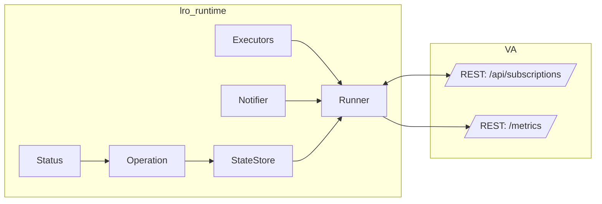

# LRO 运行时（编译库方案）设计

本文定义一个与业务无关的 Long‑Running Operation（LRO）通用运行时，作为可编译的 C++17 静态库目标供各子项目（VA、VSM 或其它服务）复用。方案严格对齐《docs/references/lro代码示例.md》的结构与职责划分。

## 目标与约束
- 通用：库内不出现任何 VA 业务相位/名词；对宿主仅暴露中立接口。
- 可复用：提供清晰的 API/ABI 边界与最小依赖；支持单测与独立发布。
- 语义保持：不改变现有 REST/SSE 行为（202+Location、ETag/304、事件流字段）。
- 可迁移：允许 VA 渐进切换（先引库、后替换 SubscriptionManager，最后删除）。

## 目录与构建（严格按示例）
- include/lro/
  - status.h：通用状态枚举（Pending/Running/Ready/Failed/Cancelled）。
  - operation.h：操作对象（id、idempotency_key、status/phase/progress、spec/result、创建时间）。
  - state_store.h：状态存储 SPI（put/get/getByKey/update）+ MemoryStore 实现与工厂。
  - executors.h：有界线程池 BoundedExecutor + Executors 单例（io/heavy/start）。
  - notifier.h：通知 SPI（on_status/on_keepalive），用于对接 SSE/WS/Webhook/MQ。
  - runner.h：Runner 与 Step 定义（名称/执行体/类别 IO|Heavy|Start/进度提示），封装 admission、幂等等。
- src/lro/
  - executors.cpp、state_store_mem.cpp、runner.cpp：实现文件。
- adapters/（可选）
  - rest_simplehttpserver/*：最小 REST 适配示例；
  - grpc/*：gRPC 适配（按是否找到 Protobuf/gRPC 选择编译）。
- CMake
  - 目标：`add_library(lro_runtime ...)`（编译库）；
  - 例子：`example_rest`、`example_grpc`（按依赖可选）。

说明：仓库保留 `lro` 子目录为独立组件，VA 通过 CMake `add_subdirectory(../lro)` 或已安装包方式 `find_package(lro_runtime)` 引入并链接。

## 核心 API（摘录）
- Status：`Pending | Running | Ready | Failed | Cancelled`（文本化 via to_string）。
- Operation：`id`、`idempotency_key`、`status`（原子）与 `phase`（纯文本，供宿主自定义）、`progress`（0‑100）、`reason`、`spec_json/result_json`、`created_at`。
- IStateStore：`put/get/getByKey/update`；MemoryStore 以内存 map/索引实现幂等键。
- BoundedExecutor：带最大队列与阻塞提交的轻量线程池；Executors 暴露 io/heavy/start 三类执行器。
- INotifier：`on_status(op)`、`on_keepalive(op_id)`。
- RunnerConfig：`store/notifier`、（可选）`admission`、`retry_estimator`、`merge策略（idempotency_key 生成/复用策略）`。
- Runner：
  - `create(spec_json, idempotency_key)`：使用幂等键复用/返回现有 op；新建时入队并置 `Pending`。
  - `get(id)`：返回只读快照。
  - `cancel(id)`：置 `Cancelled` 并通知。
  - `watch(id, cb)`：注册观察者并立即回放当前快照。
  - `addStep(step)`：声明执行步骤；按 `Class` 选择执行器提交并推进 `phase/progress` 与 `Running/Ready/Failed`。

注：Runner 内仅维护通用状态与自由文本 `phase`；具体“业务相位字符串”完全由宿主在 Step 中设置（例如 "preparing/opening_rtsp/loading_model/..."），库不内置任何 VA 名称。

## 指标与可观测性
- 库侧仅提供快照数据：
  - 队列长度、进行中计数；
  - 状态分布：`unordered_map<string,uint64_t> states`（key 为 phase 文本）；
  - 可选：失败原因聚合（低基数）；阶段直方图（边界由宿主注入）。
- 暴露方式由宿主决定：VA 的 `/metrics` 与 `/system/info` 从 Runner 快照读取并映射为 Prometheus 文本或 JSON 字段。

## 与 VA 的集成计划
1) 引入库并链接：
   - 在 `video-analyzer/CMakeLists.txt` 引入 `add_subdirectory(../lro)` 并 `target_link_libraries(VideoAnalyzer PRIVATE lro_runtime)`。
2) 接线 REST：
   - `rest_subscriptions.cpp`：`POST/GET/DELETE/SSE` 统一调用 Runner；保留 202+Location、ETag/304、事件名、时间线字段。
3) 指标/系统信息：
   - `rest_metrics.cpp` 与 `rest_system.cpp` 使用 `metricsSnapshot()` 与 `states` 映射输出；不再读取任何库内私有结构。
4) 渐进迁移：
   - 初期可桥接到 Application 原有订阅实现（Provider/Step 内部调用），验证通过后删除 `SubscriptionManager` 与旧路径。

## 回滚方案
- VA 仍保留原有实现分支；失败时仅切回旧路径，不影响其它模块。
- 编译库完全独立，回滚仅移除 `target_link_libraries(VideoAnalyzer lro_runtime)` 与路由调用改回旧实现。

## 风险与缓解
- 指标变更风险：通过 `states` 兼容输出（缺失 phase 计 0），阶段直方图先占位。
- 链接依赖：统一使用静态库（.lib）以简化部署；若切 DLL，需加导出宏与运行时一致性检查。
- 线程/资源：Executors 的容量与工作线程数暴露配置，默认 conservative；压测后再调优。

## 里程碑
- M0：落地 lro_runtime 目标与头文件/实现拆分，VA 完成链接与最小路由切换（功能等价）。
- M1：补充合并策略（use_existing/idempotency）、失败原因聚合、重试估算、可选直方图；完善文档与示例。
- M2：去除 SubscriptionManager，扩展 gRPC 适配与更丰富的 Step 编排（预热/编解码/推流等）。

## Mermaid 概览

