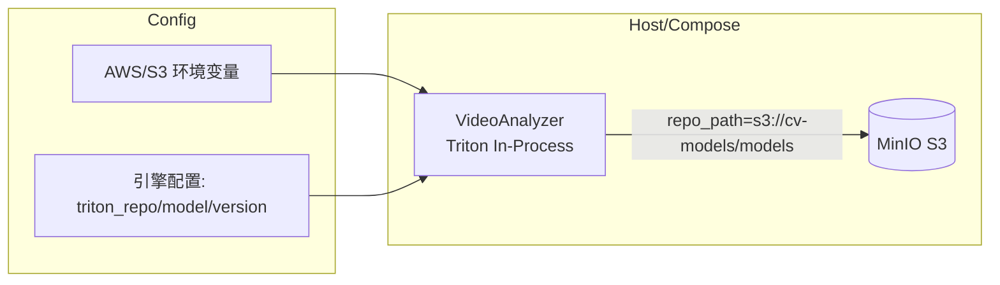

# 使用 MinIO（原生 S3）托管 Triton 模型仓库

本文档给出将 Triton 模型仓库迁移至 MinIO（S3 兼容）并通过 Docker Compose 编排的方案，适用于 VideoAnalyzer 以内嵌（in‑process）方式使用 Triton Server 的场景。

## 目标与原则

- 使用 Triton 原生 S3 仓库能力：`repo_path = s3://<bucket>/<prefix>`。
- 不修改业务代码：仅通过配置与环境变量实现模型仓库切换。
- 兼容现有构建与运行方式：VA 仍以 in‑process 启动 Triton；控制平面按需传递模型名称/版本。

## 架构概览



## 必要环境变量（Triton S3 接入）

将以下变量注入 VideoAnalyzer 容器环境（MinIO 无 TLS 的开发环境示例）：

- `AWS_ACCESS_KEY_ID=<minio_ak>` / `S3_ACCESS_KEY_ID=<minio_ak>`
- `AWS_SECRET_ACCESS_KEY=<minio_sk>` / `S3_SECRET_ACCESS_KEY=<minio_sk>`
- `AWS_REGION=us-east-1` / `S3_REGION=us-east-1`（任意非空）
- `AWS_EC2_METADATA_DISABLED=true`（避免凭据元数据探测）
- `S3_ENDPOINT=http://minio:9000`
- `S3_USE_HTTPS=0`
- `S3_VERIFY_SSL=0`
- `S3_ADDRESSING_STYLE=path`

生产环境建议：

- `S3_USE_HTTPS=1`、`S3_VERIFY_SSL=1`，并提供受信任 CA（例如挂载到容器 `/etc/ssl/certs`）。

## 引擎配置项（控制平面传递）

- `triton_repo = s3://cv-models/models`
- `triton_model = <你的模型名>`（例如 `yolov8`）
- `triton_model_version = <版本号>`（留空=latest；建议固定版本以便回滚）
- 可选：`triton_model_control=explicit`（按需加载/切换时由 CP 控制）

> 说明：本仓库的 in‑process Host 已将 `repo_path` 透传给 Triton Server，S3 模式仅需上述 repo 与环境变量即可生效，无需改代码。

## Docker Compose 示例

以下示例在 Compose 中加入 MinIO 与初始化（创建桶）步骤，并为 VideoAnalyzer 注入 S3 相关环境变量。根据你的实际镜像与网络调整。

```yaml
version: "3.8"
services:
  minio:
    image: minio/minio:RELEASE.2024-09-29T22-22-51Z
    command: server --console-address ":9001" /data
    ports:
      - "9000:9000"   # S3 API
      - "9001:9001"   # Web 控制台
    environment:
      MINIO_ROOT_USER: "minioadmin"
      MINIO_ROOT_PASSWORD: "minioadmin123"
    volumes:
      - minio-data:/data

  minio-mc:
    image: minio/mc:RELEASE.2024-09-20T01-06-25Z
    depends_on:
      - minio
    entrypoint: ["/bin/sh","-c"]
    environment:
      MINIO_ROOT_USER: "minioadmin"
      MINIO_ROOT_PASSWORD: "minioadmin123"
    command: |
      set -eux;
      mc alias set local http://minio:9000 "$MINIO_ROOT_USER" "$MINIO_ROOT_PASSWORD";
      mc mb -p local/cv-models || true;
      echo "MinIO bucket 'cv-models' ready";

  video-analyzer:
    image: your-registry/video-analyzer:latest  # 或使用 build 指令
    depends_on:
      - minio
      - minio-mc
    environment:
      # S3 接入（MinIO）
      AWS_ACCESS_KEY_ID: "minioadmin"
      AWS_SECRET_ACCESS_KEY: "minioadmin123"
      AWS_DEFAULT_REGION: "us-east-1"
      S3_ENDPOINT: "http://minio:9000"
      S3_USE_HTTPS: "0"
      S3_VERIFY_SSL: "0"
      S3_ADDRESSING_STYLE: "path"

      # 由控制平面/配置传入的 Triton 参数（示例）
      VA_TRITON_REPO: "s3://cv-models/models"
      VA_TRITON_MODEL: "yolov8"
      VA_TRITON_MODEL_VERSION: "1"
    # networks/volumes 等根据需要添加

volumes:
  minio-data:
```

> 注：上例中 `VA_TRITON_*` 仅示意环境注入，实际以控制平面下发的引擎配置（`triton_repo/triton_model/triton_model_version`）为准。

## 模型目录结构与上传

MinIO 桶（示例：`cv-models`）建议采用 Triton 规范：

```
cv-models/
  models/
    <model_name>/
      <version>/
        model.onnx | model.plan | model.pt
        config.pbtxt   # 可选，未提供时可设 strict_config=false
```

模型上传方式：

- 通过 MinIO 控制台 `http://localhost:9001` 上传。
- 使用 `mc` 客户端（容器或本机）：`mc cp -r ./models/yolov8 local/cv-models/models/`。

## 版本切换与回滚

- 新版本直接上传到新版本号目录（不可覆盖旧版本）。
- 使用 `explicit` 模式时，可通过控制平面调用 “Unload/Load” 进行无停机切换；否则启用仓库轮询让 Triton 自动发现（可后续在 Host 增加 `repository_poll_secs`）。
- 回滚直接切回旧版本号，或在 `config.pbtxt` 中设定 `version_policy`。

## 故障排查

- 403/授权失败：检查 AK/SK 与桶策略；MinIO 默认 root 用户对所有桶有权限。
- 301/重定向或找不到：确认 `S3_ADDRESSING_STYLE=path`，MinIO 常需 path‑style。
- TLS 相关错误：启用 `S3_USE_HTTPS=1` 与 `S3_VERIFY_SSL=1` 并提供 CA 证书。
- 启动慢或超时：首次从 S3 加载较大模型会耗时，建议固定版本并缓存引擎文件（如 TensorRT plan）。

## 变更范围与影响

- 代码：无需修改业务逻辑；仅依赖环境变量与引擎配置。
- 部署：为 Compose 增加 MinIO 与初始化服务；VideoAnalyzer 注入 S3 环境变量。
- 运行：Triton 以 S3 为模型仓库来源，加载/切换由控制平面驱动。
