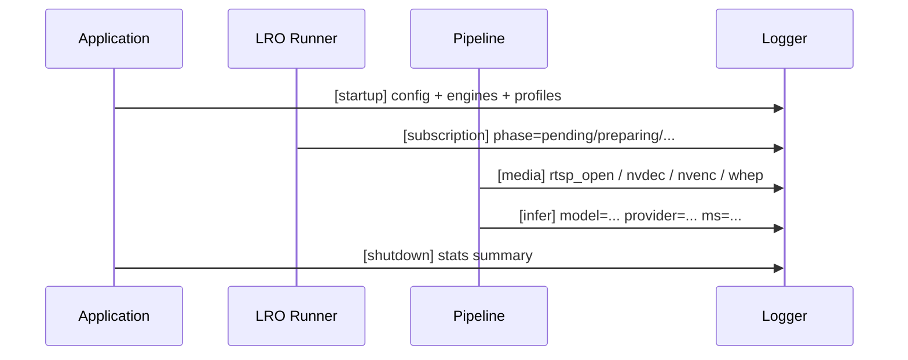
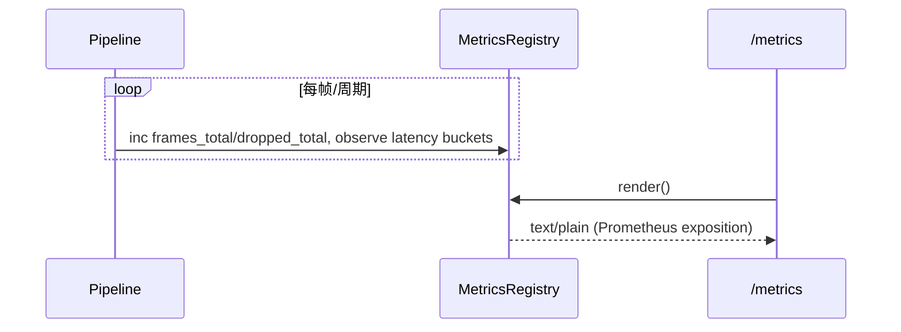

# 日志与指标（Observability）详细设计说明书（2025-11-14）

## 1 概述

### 1.1 目标

本说明书在 `LOGGING.md`、`METRICS.md` 等文档的基础上，集中描述本项目在“日志 + 指标”层面的整体设计：包括配置项、核心模块、关键数据结构、时序与非功能性要求，为调试、运维与性能调优提供统一视图。

### 1.2 范围

- Video Analyzer（VA）进程的日志与 Prometheus 指标导出；
- Controlplane（CP）在观测层的补充（如 `_metrics/summary`）；
- 不覆盖外部 Grafana/Prometheus 部署，仅说明接口与指标结构。

### 1.3 相关文档

- 概要设计：`docs/design/architecture/整体架构设计.md`
- VA 日志说明：`docs/design/observability/LOGGING.md`
- VA 指标说明：`docs/design/observability/METRICS.md`
- Path 标签与 PromQL 示例：`docs/design/observability/metrics_path_labels.md`、`docs/design/observability/promql_examples.md`
- 观测配置示例：`docs/design/observability/app_observability_snippet.yaml`

## 2 配置与总体设计

### 2.1 VA 观测配置（app.yaml）

在 `video-analyzer/config/app.yaml` 中，通过 `observability` 段集中配置日志与指标：

- 日志相关：
  - `log_level`：全局等级（trace/debug/info/warn/error）。
  - `log_format`：输出格式（text/json，可被 `VA_LOG_FORMAT` 环境变量覆盖）。
  - `console`：是否输出到标准输出。
  - `file.path/max_size_kb/max_files`：文件路径与滚动策略。
  - `module_levels` / `modules`：模块级别覆盖（如 `transport.webrtc:debug`）。
- 指标相关：
  - `metrics.registry_enabled`：是否启用统一 `/metrics` 导出路径。
  - `metrics.extended_labels`：是否输出 `decoder/encoder/preproc` 等扩展标签。
  - `metrics.ttl_seconds`：per-source 指标条目 TTL。
- Pipeline 统计：
  - `pipeline_metrics_enabled` / `pipeline_metrics_interval_ms`：内部周期性管线统计开关与周期。

### 2.2 CP 观测配置（AppConfig）

Controlplane 的观测相关配置主要包括：

- `AppConfig.sse`：SSE 相关参数（keepalive、最长连接时间等）；
- `AppConfig.db`：DB 配置，用于 `/api/_debug/db` 报告状态；
- 内部 metrics 通过 `metrics.cpp` 汇总，并由 `GET /api/_metrics/summary` 暴露给前端。

## 3 VA 日志设计

### 3.1 模块与类

- 日志初始化：
  - 在应用启动时读入 `observability` 配置，初始化全局 logger：
    - 设置全局等级与输出格式；
    - 配置控制台与文件输出；
    - 应用模块级别覆盖（如 `transport.webrtc`、`encoder.ffmpeg` 等）。
- 运行时调整：
  - REST 接口：
    - `GET /api/logging`：返回当前日志配置（级别/格式/模块/文件路径/滚动参数）。
    - `POST /api/logging/set`：动态调整全局与模块级别、格式与文件输出。
  - 环境变量覆盖：
    - `VA_LOG_FORMAT`：覆盖 `log_format`；
    - `VA_LOG_MODULE_LEVELS`：覆盖模块级别。

### 3.2 日志内容与粒度

- 内容原则：
  - 关键路径（订阅、模型加载、预处理/后处理、编码与传输）必须打点；
  - 大 volume 场景采用节流宏（如 `VA_LOG_THROTTLED`）防止日志风暴。
- 典型日志类别：
  - 订阅与 LRO：phase 转移、错误原因、Retry-After 等；
  - 推理与模型：模型加载成功/失败、provider/设备号、TensorRT/Triton 细节；
  - 媒体与传输：RTSP 连接状态、NVDEC/NVENC 事件、WHEP/WebRTC 协商与错误；
  - 数据库与存储：DB 连接错误、批量写失败与重试。

### 3.3 VA 日志时序（简要）

## 4 VA 指标设计

### 4.1 指标分类

详尽指标列表见 `METRICS.md`，这里按功能归类：

- 系统级：
  - 管线总数、运行中管线数、聚合 FPS、全局帧处理/丢弃数、全局零拷贝/CPU 回退相关计数等。
- 每源/每管线：
  - `va_pipeline_fps`、`va_frames_processed_total`、`va_frames_dropped_total`；
  - `va_frame_latency_ms_*{stage=preproc|infer|postproc|encode}`：延迟直方图。
- 编码器与网络：
  - 编码包数/字节数、EAGAIN 次数、回压/队列溢出等。
- 订阅与 LRO：
  - 队列长度、在途任务、phase 直方图、失败原因、背压与合并等。

### 4.2 Path 标签与扩展标签

- Path 标签：
  - `path=d2d|gpu|cpu`，描述处理路径形态；
  - 判定规则与语义见 `metrics_path_labels.md`。
- 扩展标签（可选）：
  - `decoder/encoder/preproc` 等，开启 `extended_labels=true` 后增加；
  - 默认关闭以控制标签基数。

### 4.3 TTL 与分片设计

- TTL：
  - `metrics.ttl_seconds` 控制 per-source 指标条目的生命周期；
  - `/metrics` 导出时，清除超过 TTL 未更新的条目，避免长时间运行导致内存/标签膨胀。
- 分片：
  - DropMetrics、SourceReconnects 等 per-source 指标使用 16 分片结构；
  - 增量更新时仅持分片锁，导出时逐片加锁汇总。

### 4.4 指标导出流程

## 5 Controlplane 观测补充

### 5.1 CP Metrics Summary

- `GET /api/_metrics/summary`：
  - 汇总控制平面内部的请求统计与缓存命中信息；
  - 返回结构约为：
    - `data.cp`：按路由统计请求总数、失败率等；
    - `data.cache`：`hits/misses` 等。
- 使用场景：
  - 前端 Dashboard 顶部展示 CP 运行态；
  - 诊断 CP 是否成为瓶颈或错误热点。

### 5.2 DB 调试

- `GET /api/_debug/db`：
  - 通过 `db_error_snapshot` 返回最近一次 DB 相关错误，以及当前 DB 配置信息；
  - 用于快速定位连接串错误、驱动不匹配等问题。

## 6 非功能性要求

### 6.1 性能

- 日志：
  - 默认等级为 `info` 或更高，debug/trace 仅在调试时临时打开；
  - 对高频日志使用节流宏与采样策略，避免 IO 成为瓶颈。
- 指标：
  - 避免在热点路径中做复杂字符串拼接，使用预分配/缓存的 label；
  - 通过 TTL 与分片控制内存使用与锁争用。

### 6.2 可运维性

- 日志配置通过 REST/环境变量可在运行时调整，支持线上快速打开/关闭某模块详细日志；
- 指标命名与标签保持稳定，确保 Grafana 面板与告警规则在版本升级后尽量无需改动；
- 所有新增指标在设计前应评估基数与写入频率。

本说明书与 `LOGGING.md`、`METRICS.md` 一起构成观测层的详细设计基线；任何涉及新增日志模块、指标或调整标签/TTL 策略的改动，应同步更新相应文档。 
