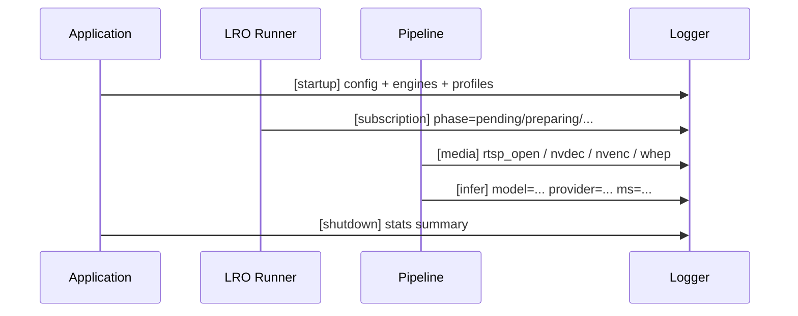
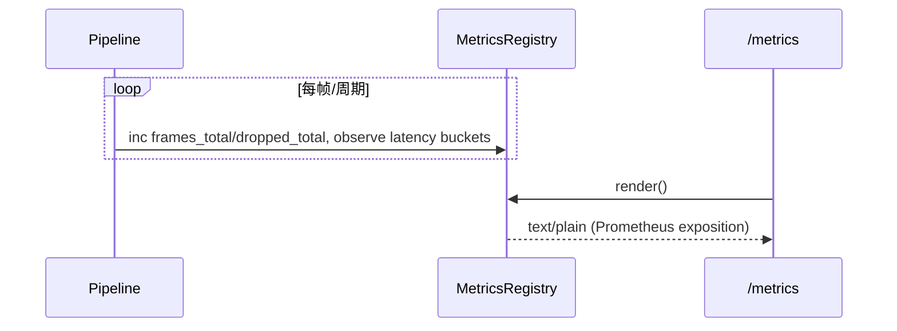

# 日志与指标（Observability）详细设计说明书（2025-11-14）

## 1 概述

### 1.1 目标

本说明书在 `LOGGING.md`、`METRICS.md` 等文档的基础上，集中描述本项目在“日志 + 指标”层面的整体设计：包括配置项、核心模块、关键数据结构、时序与非功能性要求，为调试、运维与性能调优提供统一视图。

### 1.2 范围

- Video Analyzer（VA）进程的日志与 Prometheus 指标导出；
- Controlplane（CP）在观测层的补充（如 `_metrics/summary`）；
- 不覆盖外部 Grafana/Prometheus 部署，仅说明接口与指标结构。

### 1.3 相关文档

- 概要设计：`docs/design/architecture/整体架构设计.md`
- 本文已深度整合以下文档内容，原文件仅作为历史与快速查阅参考：
  - VA 日志说明：`docs/design/observability/LOGGING.md`
  - VA 指标说明：`docs/design/observability/METRICS.md`
  - Path 标签与 PromQL 示例：`docs/design/observability/metrics_path_labels.md`、`docs/design/observability/promql_examples.md`
  - 日志节流与级别配置：`docs/design/observability/日志与节流配置.md`
  - 观测配置示例：`docs/design/observability/app_observability_snippet.yaml`

## 2 配置与总体设计

### 2.1 VA 观测配置（app.yaml）

在 `video-analyzer/config/app.yaml` 中，通过 `observability` 段集中配置日志与指标：

- 日志相关：
  - `log_level`：全局等级（trace/debug/info/warn/error）。
  - `log_format`：输出格式（text/json，可被 `VA_LOG_FORMAT` 环境变量覆盖）。
  - `console`：是否输出到标准输出。
  - `file.path/max_size_kb/max_files`：文件路径与滚动策略。
  - `module_levels` / `modules`：模块级别覆盖（如 `transport.webrtc:debug`）。
- 指标相关：
  - `metrics.registry_enabled`：是否启用统一 `/metrics` 导出路径。
  - `metrics.extended_labels`：是否输出 `decoder/encoder/preproc` 等扩展标签。
  - `metrics.ttl_seconds`：per-source 指标条目 TTL。
- Pipeline 统计：
  - `pipeline_metrics_enabled` / `pipeline_metrics_interval_ms`：内部周期性管线统计开关与周期。

#### 2.1.1 配置示例（观测段）

结合 `app_observability_snippet.yaml`，典型的 `observability` 段如下：

```yaml
observability:
  log_level: info
  log_format: text  # text|json
  pipeline_metrics_enabled: false
  pipeline_metrics_interval_ms: 5000

  # metrics exporter & labels
  metrics:
    registry_enabled: true        # use unified exporter for /metrics
    extended_labels: false        # optional labels: decoder/encoder/preproc
    ttl_seconds: 300              # per-source metrics entry TTL; <=0 disables
```

其中：

- `log_level` / `log_format` 为全局默认；可被环境变量覆盖（见 3.4）。
- `pipeline_metrics_*` 控制 VA 内部周期性统计与 `/api/system/stats` 行为。
- `metrics.*` 对应 `/metrics` 暴露路径的实现细节与基数控制策略。

### 2.2 CP 观测配置（AppConfig）

Controlplane 的观测相关配置主要包括：

- `AppConfig.sse`：SSE 相关参数（keepalive、最长连接时间等）；
- `AppConfig.db`：DB 配置，用于 `/api/_debug/db` 报告状态；
- 内部 metrics 通过 `metrics.cpp` 汇总，并由 `GET /api/_metrics/summary` 暴露给前端。

## 3 VA 日志设计

### 3.1 模块与类

- 日志初始化：
  - 在应用启动时读入 `observability` 配置，初始化全局 logger：
    - 设置全局等级与输出格式；
    - 配置控制台与文件输出；
    - 应用模块级别覆盖（如 `transport.webrtc`、`encoder.ffmpeg` 等）。
- 运行时调整：
  - REST 接口：
    - `GET /api/logging`：返回当前日志配置（级别/格式/模块/文件路径/滚动参数）。
    - `POST /api/logging/set`：动态调整全局与模块级别、格式与文件输出。
  - 环境变量覆盖：
    - `VA_LOG_FORMAT`：覆盖 `log_format`；
    - `VA_LOG_MODULE_LEVELS`：覆盖模块级别（形如 `comp:level,comp2:level2`）。

### 3.2 日志内容与粒度

- 内容原则：
  - 关键路径（订阅、模型加载、预处理/后处理、编码与传输）必须打点；
  - 大 volume 场景采用节流宏（如 `VA_LOG_THROTTLED`）防止日志风暴。
- 典型日志类别：
  - 订阅与 LRO：phase 转移、错误原因、Retry-After 等；
  - 推理与模型：模型加载成功/失败、provider/设备号、TensorRT/Triton 细节；
  - 媒体与传输：RTSP 连接状态、NVDEC/NVENC 事件、WHEP/WebRTC 协商与错误；
  - 数据库与存储：DB 连接错误、批量写失败与重试。

### 3.3 VA 日志时序（简要）



### 3.4 运行时 REST 接口与环境变量

#### 3.4.1 日志配置接口

- 查询当前日志配置：
  - `GET /api/logging`
  - 响应示例：
    ```json
    {
      "success": true,
      "data": {
        "level": "info",
        "format": "text",
        "modules": { "transport.webrtc": "debug" },
        "file_path": "logs/va.log",
        "file_max_size_kb": 10240,
        "file_max_files": 5
      }
    }
    ```
- 动态调整日志：
  - `POST /api/logging/set`
  - 请求体示例（可部分提供）：
    ```json
    {
      "level": "debug",
      "format": "json",
      "modules": { "encoder.ffmpeg": "info" },
      "module_levels": "transport.webrtc:trace,analyzer:debug"
    }
    ```
  - `modules`（对象）与 `module_levels`（字符串）均可使用，后者格式为 `模块:等级,模块:等级`。

#### 3.4.2 指标导出运行时开关

- 查询：
  - `GET /api/metrics` 返回 `registry_enabled`、`extended_labels` 等观测导出开关。
- 调整：
  - `POST /api/metrics/set`
    ```json
    { "registry_enabled": true, "extended_labels": false }
    ```

#### 3.4.3 日志相关环境变量

- `VA_LOG_FORMAT`: `json` 或 `text`，覆盖 `observability.log_format`。
- `VA_LOG_MODULE_LEVELS`: 形如 `comp:level,comp2:level2`，覆盖模块级别。

### 3.5 日志级别与节流策略（多阶段/全局）

结合《日志与节流配置指南》，多阶段路径下的日志节流由 `engine.options` 与环境变量共同控制：

#### 3.5.1 全局节流与默认等级

- 配置键（app.yaml → engine.options）：
  - `log_throttle_ms`：全局节流周期（毫秒），默认 2000；
  - `log_throttled_level`：节流日志默认级别，默认 `debug`。
- 环境变量桥接：
  - `VA_LOG_THROTTLE_MS`、`VA_LOG_THROTTLED_LEVEL`。

#### 3.5.2 多阶段与专题标签

- 多阶段默认：
  - `ms_log_throttle_ms` → `VA_MS_LOG_THROTTLE_MS`
  - `ms_log_level` → `VA_MS_LOG_LEVEL`
- 叠加（OverlayCUDA）：
  - `overlay_log_throttle_ms` → `VA_OVERLAY_LOG_THROTTLE_MS`
  - `overlay_log_level` → `VA_OVERLAY_LOG_LEVEL`
- YOLO 后处理：
  - `yolo_log_throttle_ms` → `VA_YOLO_LOG_THROTTLE_MS`
  - `yolo_log_level` → `VA_YOLO_LOG_LEVEL`

如未设置专用键，将回退到全局 `VA_LOG_THROTTLE_MS` / `VA_LOG_THROTTLED_LEVEL`。

典型配置示例（节选）：

```yaml
engine:
  type: ort-cuda
  device: 0
  options:
    use_multistage: true
    graph_id: analyzer_multistage_example
    # 全局节流 / 默认等级
    log_throttle_ms: 2000
    log_throttled_level: debug
    # 分标签覆盖
    ms_log_throttle_ms: 1000
    ms_log_level: debug
    overlay_log_throttle_ms: 2000
    overlay_log_level: debug
    yolo_log_throttle_ms: 2000
    yolo_log_level: debug
```

运行时，通过 `POST /api/engine/set` 可动态调整 `engine.options` 中相关字段，无需重启进程。

#### 3.5.3 适用范围与注意事项

- 已统一纳入节流体系的组件包括：
  - 多阶段节点：`ms.node_model`、`ms.nms`、`ms.overlay` 等；
  - 叠加实现：`overlay.cuda`；
  - YOLO 后处理：`analyzer.yolo`。
- 实现位置：
  - 全局桥接：`src/app/application.cpp`；
  - 多阶段桥接：`src/composition_root.cpp`；
  - 日志工具与节流宏：`src/analyzer/logging_util.hpp`、`src/core/logger.hpp`。

建议：

- 若需最干净日志：将 `observability.log_level` 与各 `*_log_level` 设为 `info` 或更高，并增大 `*_log_throttle_ms`。
- 若需要详细调试：为目标模块设置更低阈值与较短节流周期，并在问题定位后尽快恢复。

## 4 VA 指标设计

### 4.1 指标分类

本节对 VA 暴露的 Prometheus 指标进行归类说明，完整清单参见原 `METRICS.md`：

- 系统级：
  - `va_pipelines_total`（gauge）：总管道数；
  - `va_pipelines_running`（gauge）：运行中管道数；
  - `va_pipeline_aggregate_fps`（gauge）：汇总 FPS；
  - `va_transport_packets_total` / `va_transport_bytes_total`（counter）：聚合传输包/字节数；
  - `va_d2d_nv12_frames_total` / `va_cpu_fallback_skips_total`（counter）：全局零拷贝/CPU 回退相关计数；
  - `va_encoder_eagain_retry_total`（counter）：全局 EAGAIN drain+retry 次数；
  - `va_overlay_nv12_kernel_hits_total` / `va_overlay_nv12_passthrough_total`（counter）：叠加核统计。
- 每源/每管线：
  - 携带 `source_id`,`path` 标签；在扩展标签开启时还包含 `decoder`/`encoder`/`preproc`；
  - `va_pipeline_fps`（gauge）：管道 FPS；
  - `va_frames_processed_total` / `va_frames_dropped_total`（counter）：处理/掉帧计数；
  - `va_frame_latency_ms_*`（histogram）：分阶段时延直方图（`stage=preproc|infer|postproc|encode`），
    桶（毫秒）：1,2,5,10,20,50,100,200,500,1000，并附带 `_sum`（ms）与 `_count`。
- 编码器与网络：
  - `va_encoder_packets_total{...}`（counter）：已编码包数；
  - `va_encoder_bytes_total{...}`（counter）：已编码字节数；
  - `va_encoder_eagain_total{...}`（counter）：编码 EAGAIN 次数。
- 订阅与 LRO：
  - 队列长度、在途任务、phase 直方图、失败原因、背压与合并等。

### 4.2 Path 标签与扩展标签

#### 4.2.1 Path 标签取值与规则

`path` 标签用于标识每个源当前主要的数据处理路径形态，便于在面板或告警中区分 CPU/GPU/D2D 的性能与稳定性差异：

- 取值范围与优先级：
  - `d2d` | `gpu` | `cpu`，优先级：`d2d` > `gpu` > `cpu`。
- 运行时启发式判定：
  - `d2d`：NVDEC→NVENC 设备 NV12 零拷贝直通；当该源的 `d2d_nv12_frames` 计数大于 0 时；
  - `gpu`：使用 NVENC 等 GPU 编码，但未达到 d2d（可能存在主机↔设备拷贝）；编码器 `codec` 包含 `nvenc` 且未命中 `d2d`；
  - `cpu`：未检测到 GPU 参与或未命中以上条件时的默认值。
- 典型使用：
  - 在 Grafana 中按 `source_id`、`path` 分组查看性能；
  - 主要出现在 per-source 指标中，如：
    - `va_pipeline_fps{source_id,path}`
    - `va_frames_processed_total{source_id,path}`、`va_frames_dropped_total{source_id,path}`
    - `va_frame_latency_ms_bucket{stage,source_id,path,le}` / `_sum` / `_count`。

#### 4.2.2 扩展标签

- 扩展标签（需 `extended_labels=true`）：
  - `decoder`：`nvdec` / `ffmpeg` / `other`；
  - `encoder`：编码器名/族（如 `h264_nvenc` / `libx264` 等）；
  - `preproc`：`cuda` / `cpu`（基于引擎选项 `use_cuda_preproc` 推断）。
- 建议：
  - 默认关闭以控制标签基数；
  - 在分析具体场景时再临时开启，并结合 `path` 一起使用。

### 4.3 TTL 与分片设计

- TTL：
  - `metrics.ttl_seconds` 控制 per-source 指标条目的生命周期；
  - `/metrics` 导出时，清除超过 TTL 未更新的条目，避免长时间运行导致内存/标签膨胀。
- 分片：
  - DropMetrics、SourceReconnects 等 per-source 指标使用 16 分片结构；
  - 增量更新时仅持分片锁，导出时逐片加锁汇总。

### 4.4 指标导出流程



### 4.5 PromQL 查询与告警示例

综合 `METRICS.md` 与 `promql_examples.md`，推荐的 PromQL 模板包括：

- 源路 FPS：
  - `sum by (source_id, path) (rate(va_frames_processed_total[1m]))`
- 掉帧比例：
  - `sum by (source_id, path) (rate(va_frames_dropped_total[5m])) / sum by (source_id, path) (rate(va_frames_processed_total[5m]))`
- P95 延时（按阶段）：
  - `histogram_quantile(0.95, sum by (le, stage, source_id, path) (rate(va_frame_latency_ms_bucket[5m])))`
- 回压与队列溢出：
  - `sum(rate(va_frames_dropped_total{reason="backpressure"}[5m]))`
  - `sum(rate(va_frames_dropped_total{reason="queue_overflow"}[5m]))`
- 编码码率（bps）：
  - `8 * sum by (source_id, path) (rate(va_encoder_bytes_total[1m]))`
- RTSP 与 NVDEC 事件：
  - `rate(va_rtsp_source_reconnects_total[10m])`
  - `rate(va_nvdec_device_recover_total[10m])`
  - `rate(va_nvdec_await_idr_total[10m])`
- 告警示例（英文示例原样保留，便于迁移到规则文件）：
  - FPS 过低：`sum by (source_id, path) (rate(va_frames_processed_total[1m])) < 10`
  - 掉帧比例过高：`… > 0.1`
  - 编码背压突增：`increase(va_encoder_eagain_total[5m]) > 0`
  - WebRTC 卡顿：`rate(va_webrtc_bytes_sent_total[1m]) == 0 and va_webrtc_clients{state="connected"} > 0`
  - Pipeline FPS 底线：`sum by (source_id, path) (va_pipeline_fps) < 10`

## 5 Controlplane 观测补充

### 5.1 CP Metrics Summary

- `GET /api/_metrics/summary`：
  - 汇总控制平面内部的请求统计与缓存命中信息；
  - 返回结构约为：
    - `data.cp`：按路由统计请求总数、失败率等；
    - `data.cache`：`hits/misses` 等。
- 使用场景：
  - 前端 Dashboard 顶部展示 CP 运行态；
  - 诊断 CP 是否成为瓶颈或错误热点。

### 5.2 DB 调试

- `GET /api/_debug/db`：
  - 通过 `db_error_snapshot` 返回最近一次 DB 相关错误，以及当前 DB 配置信息；
  - 用于快速定位连接串错误、驱动不匹配等问题。

## 6 非功能性要求

### 6.1 性能

- 日志：
  - 默认等级为 `info` 或更高，debug/trace 仅在调试时临时打开；
  - 对高频日志使用节流宏与采样策略，避免 IO 成为瓶颈。
- 指标：
  - 避免在热点路径中做复杂字符串拼接，使用预分配/缓存的 label；
  - 通过 TTL 与分片控制内存使用与锁争用。

### 6.2 可运维性

- 日志配置通过 REST/环境变量可在运行时调整，支持线上快速打开/关闭某模块详细日志；
- 指标命名与标签保持稳定，确保 Grafana 面板与告警规则在版本升级后尽量无需改动；
- 所有新增指标在设计前应评估基数与写入频率。

本说明书与 `LOGGING.md`、`METRICS.md` 一起构成观测层的详细设计基线；任何涉及新增日志模块、指标或调整标签/TTL 策略的改动，应同步更新相应文档。 

## 7 Grafana / Prometheus 集成（前端视角概览）

### 7.1 目标与流向

- 在不改动现有后端数据路径的前提下，为前端 Observability 页面接入 Grafana/Prometheus：
  - 统一通过 Controlplane 反向代理访问 Grafana 与 Prometheus，避免跨域与直连；
  - 支持 iframe 嵌入面板、PromQL 驱动图表以及 PNG 渲染兜底。

整体流向：

- 前端 → CP：
  - `/grafana/**` → CP 反代到 Grafana（子路径 `/grafana`）；
  - `/prom/**` → CP 反代到 Prometheus。
- CP → Grafana/Prometheus：
  - 在 `app.yaml` 中配置 `grafana.base` 与 `prom.base`，利用已有 HTTP 代理模块转发请求。

### 7.2 CP 与前端配置要点

- Grafana 容器（示例环境变量）：
  - `GF_SECURITY_ALLOW_EMBEDDING=true`
  - `GF_AUTH_ANONYMOUS_ENABLED=true`
  - `GF_AUTH_ANONYMOUS_ORG_ROLE=Viewer`
  - `GF_SERVER_SERVE_FROM_SUB_PATH=true`
  - `GF_SERVER_ROOT_URL=%(protocol)s://%(domain)s/grafana`
- Controlplane `app.yaml` 中新增：
  - `grafana.base: http://127.0.0.1:3000/grafana`
  - `prom.base: http://127.0.0.1:9090`
- 前端 Vite 代理：
  - `'/grafana' -> http://127.0.0.1:18080`
  - `'/prom' -> http://127.0.0.1:18080`

### 7.3 前端页面对接模式

- Overview 页面（推荐 iframe 嵌入）：
  - 为每个核心面板配置 `uid/panelId/range/refresh` 等参数；
  - iframe URL 示例：`/grafana/d-solo/${uid}?orgId=1&panelId=${id}&from=${from}&to=${to}&theme=light&refresh=${refresh}`。
- Metrics 页面（PromQL 驱动）：
  - 通过 CP 代理调用 `/prom/api/v1/query(_range)` 获取即时值与时序；
  - 使用 ECharts/AntV 等在前端绘制图表。
- PNG 渲染兜底：
  - 可选安装 `grafana-image-renderer` 插件，通过 `/grafana/render/d-solo/...` 获取 PNG，在卡片中 `` 展示。

### 7.4 权限与安全

- 内网环境可使用匿名只读（Viewer），对外环境建议使用 API Key 或公开 Dashboard 链接；
- 通过 CP 统一出口增加 Referer/Origin 白名单与 Header 过滤，控制访问来源。
