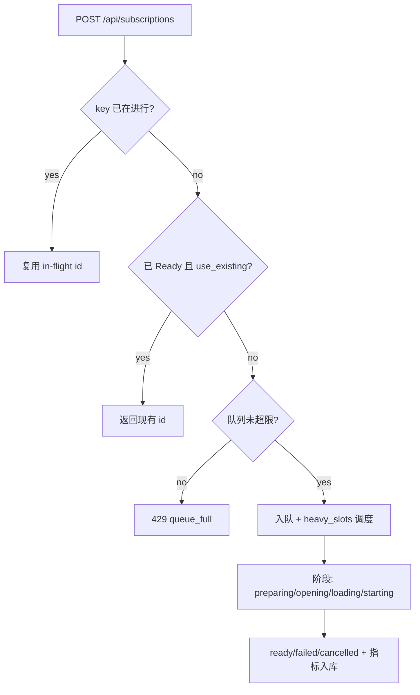

# 性能与资源防护（订阅路径）

本说明总结当前订阅路径的资源防护点与建议演进：

- 并发重负载：通过 `heavy_slots` 控制模型加载/管线启动并发，避免 GPU/解码拥塞。
- 队列上限：`pending_` 超限直接 429（queue_full），防止无限堆积（默认 1024，可后续配置化）。
- 幂等复用：
  - in-flight：相同 key（stream_id:profile）若仍在进行，直接返回正在进行的订阅 id。
  - ready：use_existing=true 时，已 Ready 的订阅直接返回现有 id，避免切换抖动。
- 指标：`va_subscriptions_total{status}`、`va_subscription_duration_seconds_*`、`va_subscriptions_inflight` 用于告警与容量规划。

建议后续：
- 将 `max_queue_`、`heavy_slots_` 配置化，随环境按需调优。
- 订阅阶段细分错误码（RTSP 失败、模型加载失败、超时等），便于告警精确定位。
- 限流策略可按源/租户维度做配额，避免单租户拖垮系统。

