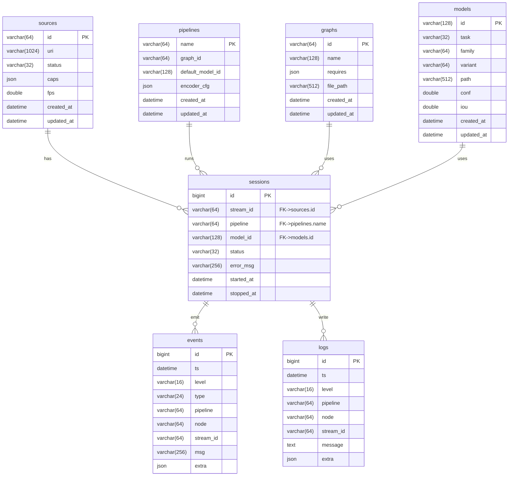
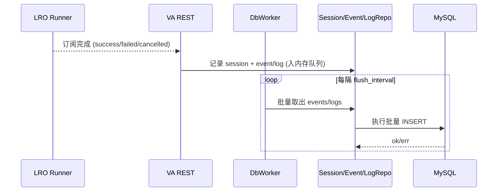

# 控制面与 VA 存储访问详细设计（2025-11-14）

## 1 概述

### 1.1 目标

本说明书详细描述控制面（Controlplane）与 Video Analyzer 在存储层面的设计，包括 MySQL 数据库、连接池与仓储（Repo）模式，以及与训练/订阅等业务流程的关系。

### 1.2 范围

- 控制平面（CP）侧：
  - `controlplane/src/server/db.cpp` 及其与配置的关系；
  - 训练任务与模型元数据的读写路径。
- VA 侧：
  - `video-analyzer/src/storage/*` 中的 DbPool 与各 Repo；
  - REST 层与 DB 的交互流程（事件、日志、会话等）。

### 1.3 相关文档

- 概要设计：`docs/design/architecture/整体架构设计.md`
- VA 详细设计：`docs/design/architecture/video_analyzer_详细设计.md`
- Controlplane 设计：`docs/design/architecture/controlplane_design.md`

## 2 数据库设计（cv_cp，MySQL 8.0）

本节整合原《数据库设计（MySQL 8.0）》文档内容，统一说明控制面数据库的目标、实体关系、表结构与迁移策略。

### 2.1 背景与目标

- 目标：
  - 为 CV 系统（VSM/VA/前端）提供可靠的持久化存储，用于保存“源/会话/图/模型/事件/日志”等控制面数据；
  - 支持重启恢复、分页查询、观测与多端协作。
- 范围（MVP）：
  - 源（sources）与会话（sessions）持久化；
  - 图/模型元数据（graphs/models/pipelines）；
  - 事件（events）与日志（logs）落库与分页查询；
  - 保持现有 watch 长轮询实时性，SSE 稳定后可逐步启用。
- 总体架构：
  - 存储：MySQL 8.0（InnoDB，utf8mb4），部分字段使用 JSON 存放半结构化数据（caps/requires/extra 等）。
  - 数据流：
    - VSM → CP/VA：VSM 状态通过现有 list/describe/watch 采集；
    - CP/VA → DB：控制面组件将“源快照/会话/事件/日志”等写入 DB（异步或小批）；
    - 前端 → CP：`/api/*` 从“内存聚合 + DB”返回；watch 仍走内存 rev 指纹，降低 DB 压力。
  - 配置：数据库连接在 `app.yaml:database` 段配置（host/port/user/password/db/pool/driver）。

### 2.2 实体关系（ER 图）

### 2.3 表结构与索引要点

- `sources`：
  - 保存源 URI、状态、最新 caps（JSON），常用字段：`id/uri/status/caps/fps/created_at/updated_at`；
  - 建议索引：`(status, updated_at)`，便于按状态筛选与最近变更排序。
- `pipelines`：
  - 管线定义：`name/graph_id/default_model_id/encoder_cfg/...`；
  - `encoder_cfg` 使用 JSON 存放编码参数（码率/GOP/AQ 等），可按需增加 JSON 校验。
- `graphs`：
  - graph 元数据与配置文件路径，字段包括 `id/name/requires/file_path/...`；
  - `requires` 为 JSON，描述 Graph 对模型/源/配置的依赖。
- `models`：
  - 模型元数据（`id/task/family/variant/path/conf/iou/...`），与训练流水线产物对应；
  - 可根据 `task/family/variant` 建组合索引，方便 CP 查询。
- `sessions`：
  - 订阅会话生命周期（`id/stream_id/pipeline/model_id/status/error_msg/started_at/stopped_at`）；
  - 建议索引：
    - `(stream_id, started_at)`：按源维度查询历史；
    - `(pipeline, started_at)`：按管线维度查询历史；
    - `(status, started_at)`：按状态/时间查询。
- `events` 与 `logs`：
  - 观测事件与日志，字段包括 `ts/level/pipeline/node/stream_id/msg/extra` 等；
  - 索引：
    - `(ts)`、`(pipeline, ts)` 用于时间线查询；
    - 视需要增加 `(level, ts)` 或 `(stream_id, ts)`。

### 2.4 访问与索引策略（按接口维度）

- `/api/sources`：
  - 以内存聚合（VA pipelines）为主，DB 作为非活跃源回放；
  - 按 `updated_at` 排序分页，避免扫描全表。
- `/api/sources/watch`：
  - 保持内存 rev 指纹与长轮询，DB 仅作为补全，不直接参与 watch。
- `/api/logs` / `/api/events`：
  - 读：基于日志/事件表的分页查询，按 `ts/pipeline/level` 过滤；
  - 写：通过 VA/CP 中的后台写线程批量落库，避免请求路径内频繁写入。
- `sessions`：
  - 在订阅 LRO 完成（ready/failed/cancelled）或取消时更新记录；
  - 支持按 stream/pipeline 查询历史订阅行为。

### 2.5 迁移与部署

- 建库与导入：
  - 建议集中维护 `db/schema.sql`，由运维按环境导入；
  - Windows 环境可使用 PowerShell 脚本：
    - `pwsh -File tools/db/import_schema.ps1 -Host 127.0.0.1 -Port 13306 -User root -Password 123456 -Database cv_cp -SchemaPath db/schema.sql`
- Docker 部署（可选）：
  - 使用 `mysql:8.0` 与 Adminer/phpMyAdmin 组合；
  - 或在现有 MySQL 实例上直接导入 schema。
- 迁移工具（建议）：
  - 使用 Flyway/Liquibase 管理版本化迁移脚本（如 `V1__init.sql`、`V2__add_sessions_indexes.sql` 等）。

### 2.6 安全与运维

- 最小权限：
  - 为应用创建专用账号，仅授予 `cv_cp` 上必要的 CRUD 与索引权限；
  - 避免使用 root 账号直连业务数据库。
- 密钥管理：
  - 生产环境中不应在配置文件写死密码，应通过环境变量或安全配置服务（Vault/KMS 等）注入；
  - 支持在 `app.yaml` 中引用环境变量。
- 容量与归档：
  - `events/logs` 建议按时间分区或定期归档（如按月归档到历史表或对象存储）；
  - 必要时增加应用级审计，记录关键操作。

### 2.7 渐进计划

- M0：
  - 完成 schema 设计与脚本产出；
  - 在 `/api/system/info` 中透出 database 概要（driver/host/schema/health）。
- M1：
  - 接入 logs/events 的“写入 + 分页查询”，watch 仍走内存；
  - 验证在典型日志/事件写入压力下的性能。
- M2：
  - 接入 sessions 生命周期持久化与查询；
  - 根据实际需要补充 rollup 指标表或历史归档方案。

## 3 VA 存储访问设计

### 3.1 DbPool 抽象

头文件：`video-analyzer/src/storage/db_pool.hpp`  
实现：`video-analyzer/src/storage/db_pool.cpp`

- `DbPool` 抽象数据库连接池，统一管理连接创建、复用与统计：
  - `static std::shared_ptr<DbPool> create(const AppConfigPayload::DatabaseConfig& cfg)`：
    - 当 driver 为 `mysql` 或相关配置完整时创建真实 `MySqlDbPool`；
    - 否则创建 `NullDbPool`，所有操作为 no-op，保证 VA 在无 DB 环境下仍可运行。
  - `getStats(Stats* out)`：返回连接数、失败次数等统计（用于 `/api/_debug/db` 等）。
- `MySqlDbPool`：
  - 持有 MySQL 连接配置（host/port/user/password/schema/timeout）；
  - 按需创建连接，并在 Repo 中以 RAII 方式使用。
- `NullDbPool`：
  - 所有方法返回“不可用”或空结果，但不会抛异常，用于 dev/PoC 环境。

### 3.2 Repo 模式

VA 使用 Repo 模式封装具体表的读写逻辑，典型例子：

- `SessionRepo`（`session_repo.hpp`）：
  - 负责向 `sessions` 表写入/更新订阅会话信息：
    - `append` 或 `upsert` 在订阅成功/失败/取消时记录 session；
    - 根据 stream/pipeline 查询历史会话。
- `EventRepo`（`event_repo.hpp`）：
  - 记录事件（节流、失败、状态流转等），支持按 pipeline/时间范围分页查询。
- `LogRepo`（`log_repo.hpp`）：
  - 将结构化日志（级别、pipeline、node、stream_id、message、extra JSON）落库，用于后续检索。
- `GraphRepo` / `SourceRepo`：
  - 读写 graph 与源相关信息，用于 CP 或管理工具回放与补全。

Repos 的共同特征：

- 构造时接收 `std::shared_ptr<DbPool>` 与 DB 配置；
- 提供最小 CRUD 与分页接口；
- 内部使用 prepared statement，避免 SQL 注入与重复拼接逻辑。

### 3.3 VA REST 与 DB 的交互

头文件：`video-analyzer/src/server/rest_impl.hpp`  
实现：`video-analyzer/src/server/rest_impl_core.cpp`、`rest_metrics.cpp` 等

- 在 `RestServer::Impl` 中：
  - 根据 `app_config().database` 调用 `DbPool::create`；
  - 若 `db_pool->valid()`：
    - 初始化 `LogRepo/EventRepo/SessionRepo/GraphRepo/SourceRepo`；
    - 启动后台写入线程 `startDbWorker`，每隔固定间隔批量 flush 事件与日志；
    - 启动 retention 线程，定期清理旧数据并记录 retention 指标。
- REST handler 与 Repo 的典型交互：
  - 订阅成功/失败：
    - 在订阅 LRO 完成时，将 session 结果（status/reason/pipeline_key/...）通过 `SessionRepo` 持久化；
  - 日志/事件：
    - 在关键路径打点处，将事件与日志追加到内存队列，由 `db_worker` 线程批量落库；
  - `/api/system/info` 与 `/api/_debug/db`：
    - 通过 `DbPool::getStats` 与 Repo 统计信息返回 DB 状态（驱动/host/schema/错误快照等）。

### 3.4 数据流时序（VA）

## 4 Controlplane 存储访问设计

### 4.1 DB 模块与模式选择

头文件：`controlplane/include/controlplane/db.hpp`  
实现：`controlplane/src/server/db.cpp`

Controlplane 兼容多种访问模式：

- MySQL X DevAPI（`driver == "mysqlx"`）：
  - 使用 `mysqlx::Session` 与 X DevAPI 语句执行 JSON 查询；
  - 适用于直接返回 JSON 数组的场景（训练工件列表等）。
- ODBC MySQL（Windows）：
  - 使用 ODBC API 连接 MySQL 并执行 SQL 查询；
  - 主要用于读取 `models` 表，返回 JSON 序列。
- MySQL JDBC（可选）：
  - 仅在特定配置下使用，对 C++ 端来说是可选路径。

通过 `DbConfig` 中的 `driver/mysqlx_uri/host/port/user/password/schema/odbc_driver` 选择实际访问方式。

### 4.2 错误快照与调试

`db.cpp` 维护了一个进程内错误快照：

- `db_error_snapshot(nlohmann::json* out)`：
  - 返回最近一次 `mysqlx/odbc/jdbc` 相关错误，以 `{cat:{key:{...}}}` 形式存储；
- `db_error_clear()`：
  - 清空快照。

在 `controlplane/src/server/main.cpp` 中：

- `GET /api/_debug/db`：
  - 将错误快照与当前 DB 配置信息一起返回：`{code:"OK",data:{errors:{...},cfg:{...}}}`；
  - 便于快速确认连接字符串、driver 选择与最近错误。

### 4.3 训练相关数据流

Controlplane 的训练相关 API（`/api/train/*`）可以直接访问外部 Trainer 服务，也可以通过 DB 读取训练与工件信息：

- `train_create/train_update/train_get/train_list` 等辅助函数：
  - 在 `db.cpp` 中封装，使用 X DevAPI 或 ODBC 执行 SQL，然后返回 JSON 字符串；
  - 主线程在处理 `GET /api/train/status`、`/api/train/list` 等请求时调用这些函数，将结果透传给前端。

## 5 非功能性设计

### 5.1 性能与可靠性

- VA 侧通过批量写（events/logs）的方式减少 DB 写操作的频率，并在失败时进行节流日志输出；
- Controlplane 侧执行读多写少的查询，尤其是训练和模型列表，不在热路径上施加高压。

### 5.2 降级与回退

- 若 DB 配置为空或连接失败：
  - VA 使用 NullDbPool，所有落库操作静默失败但不影响订阅与推理链路；
  - CP 的训练相关 API 可能返回 `TRAINER_UNAVAILABLE` 或简化结果；`/api/_debug/db` 会显示具体错误信息。

### 5.3 安全

- 生产环境应为应用创建最小权限账号，仅授予 `cv_cp` 数据库所需的 CRUD 与索引权限；
- 不建议在配置文件中硬编码密码，可通过环境变量或安全配置管理工具注入。

本说明书作为存储访问层的详细设计基线，任何涉及新表、新 Repo 或更改 DB 访问方式的改动，均应同步更新本文件，并视情况补充迁移脚本与回滚策略。
