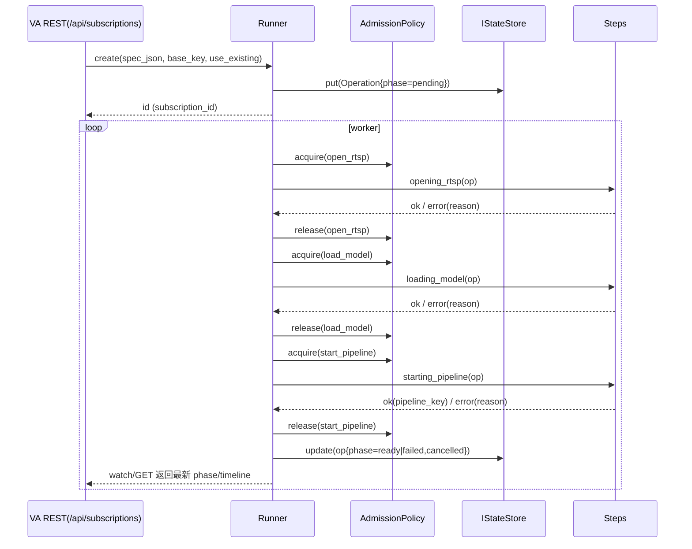

# LRO 通用库与订阅改造设计方案

## 目标与原则
- 抽象订阅等长耗时任务为通用 LRO 库（独立仓库），提供状态机/执行/限流/合并/背压/通知/可观测等共性能力。
- VA 订阅基于 LRO 实现，对外 REST/SSE/指标语义保持不变；最终删除 SubscriptionManager。
- 无 VA 内部耦合、可移植、可回退、性能与可观测不退化；先最小闭环，再逐步扩展。

## 库形态与目录结构
- 仓库：独立仓库（推荐）+ CMake 包目标 `lro::lro`，首期 header-first（便于快速集成）。
- 目录（建议）：
  - `include/lro/runner.h`：核心调度与执行（Runner/Operation/Step/Config）
  - `include/lro/state_store.h`：IStateStore、MemoryStore、WalStoreAdapter
  - `include/lro/admission.h`：AdmissionPolicy（多桶信号量+公平出队窗口）
  - `include/lro/metrics.h`：指标采样/快照
  - `include/lro/notifier.h`：INotifier（SSE/WS/Webhook）
  - `include/lro/reason.h`：错误归一 normalize
  - 可选适配：`include/lro/adapters/rest_simple.h`（REST 简化注册）、`include/lro/adapters/wal.hpp`

## 核心模型与 API
- Operation
  - `id, spec_json, status.phase, status.progress(0-100), status.reason, timeline{ts_pending..}, result_json`
- Step
  - `name, cls(IO|Heavy|Start), bucket_key, timeout_ms?, cancelable(true), fn(Operation&, Context&)`
- RunnerConfig
  - `store:IStateStore*`, `admission:AdmissionPolicy*`, `notifier:INotifier*?`
  - `fair_window:int=8`（公平出队窗口）
  - `retry_estimator: fn(queue_len:int, slots_min:int)->int`（默认动态估算1..60s）
  - `normalizer: fn(app_err:string, fallback:string)->string`
  - `merge_policy: { base_key_fn:fn(spec)->string, prefer_reuse_ready:bool }`
  - `wal: IWalAdapter?`
- Runner（最小接口）
  - `addStep(const Step&)` / `bindBucket(const string&, CountingSemaphore*)`
  - `create(spec_json, base_key, prefer_reuse_ready)->string` / `get(id)->Operation`
  - `cancel(id)->bool` / `watch(id, on_event(Operation))`
  - `metricsSnapshot()->LroMetrics`

## 类图与时序图




## Admission / 背压 / 公平 / 合并
- AdmissionPolicy：多桶信号量（open_rtsp/load_model/start_pipeline）。
- 公平出队：pending 为 deque，取窗口内（默认 8）首个 baseKey≠last_served 的任务；命中计 `rr_rotations_total`。
- 背压 Retry-After（默认估算）：
  - `slots = max(1, min(open>0?open:1, load>0?load:1, start>0?start:1))`
  - `est = clamp(max(base, ceil(queue_len/slots)), 1..60)`
- 合并 use_existing：
  - 命中非终态 → `merge_non_terminal++`
  - 命中 Ready 且 prefer_reuse_ready → `merge_ready++`
  - 请求复用但未命中 → `merge_miss++`

## 状态存储 / WAL
- IStateStore：`put/get/update/cas(Operation)`，MemoryStore 起步。
- WalStoreAdapter：`create()` 落 enqueue；终态（Ready/Failed/Cancelled）落 complete；启动扫描 inflight 计入 `failed_restart_total`（与现有一致）。

## 错误归一与时间线
- normalizeReason：保留现有映射（open_rtsp_* / load_model_* / subscribe_failed / cancelled / unknown…）。
- timeline：`ts_pending/ts_preparing/ts_opening/ts_loading/ts_starting/ts_ready/ts_failed/ts_cancelled`；ETag 由 timeline+phase 计算。

## 可观测与指标（库快照，VA 导出旧名）
- 队列/在途/阶段直方图/失败原因。
- 背压：`va_subscriptions_slots{type=open_rtsp|load_model|start_pipeline}`、`va_backpressure_retry_after_seconds`。
- 合并：`va_subscriptions_merge_total{type=non_terminal|ready|miss}`。
- 公平：`va_subscriptions_rr_rotations_total`。
- SSE：`va_sse_connections{channel=subscriptions|sources|logs|events}`、`va_sse_reconnects_total`。

## VA 集成（无桥接，内联替换）
- REST 层：`rest_subscriptions.cpp` 直接调用 Runner：Create/Get/Cancel/Watch；保留 202+Location、ETag/304、SSE 字段与事件名。
- 业务 Steps（VA 内实现回调）：
  - preparing：装载/校验配置；
  - opening_rtsp（bucket=open_rtsp）：构建/打开源，异常归一 open_rtsp_*；
  - loading_model（bucket=load_model）：解析/加载模型，异常归一 load_model_*；
  - starting_pipeline（bucket=start_pipeline）：build+start，成功写 `result_json={pipeline_key,whep_url}`。
- 指标导出：`rest_metrics.cpp` 从 Runner.metricsSnapshot 输出现有指标名。
- WAL：使用 WalStoreAdapter 保持现行为，/api/admin/wal/* 不变。

## 配置与运行时开关
- `app.yaml`：
  ```yaml
  lro:
    fairness_window: 8
    buckets: { open_rtsp: 2, load_model: 2, start_pipeline: 2 }
    backpressure: { min: 1, max: 60 }
  ```
- 迁移期开关：`VA_LRO_ENABLED=1`（默认 off；稳定后移除）。

## 删除 SubscriptionManager（必须项）
- 删除：`video-analyzer/src/server/subscription_manager.cpp/.hpp` 与 CMake 索引。
- 替换引用：
  - `rest_subscriptions.cpp` → 调用 Runner；
  - `rest_metrics.cpp` → 使用 Runner snapshot；
  - ETag/Timeline → 由 Operation.timeline/phase 提供。
- 回退方案：分支 `legacy-subscription-manager` 保留历史版本。

## 迁移阶段与时间
- M0（2–3 天）：完成 LRO 库（Runner/StateStore/Admission/merge/backpressure/fairness），VA 接入 Runner（开关 off），编译通过。
- M1（2 天）：打开开关替换订阅执行；全量回归；指标/面板核验；删除 SubscriptionManager；开关默认 on，保留观测窗口。
- M2（1–2 天）：移除回退开关；文档/示例补全；可选 gRPC 适配。

## 测试与验收
- 脚本（均已存在/新增）：
  - 订阅/取消/SSE：`check_subscription_flow.py`、`check_cancel_sse_trace.py`；
  - 指标/头：`check_metrics_*`、`check_headers_cache.py`；
  - WAL：`check_wal_scan.py`、`check_wal_rotation_ttl.py`；
  - 背压/公平/合并：`check_merge_metrics.py`、`check_sse_metrics.py`；
  - 失败路径：`check_fail_rtsp_open.py`（稳健），`check_fail_model_load.py`。
- 面板与告警：Grafana 大盘无需修改（Codec 面板已补齐）。
- 语义：POST 202+Location、GET ETag/304、DELETE、SSE 事件名/字段完全一致。

## 风险与缓解
- 行为回归：严格复用旧字段与指标名；保留回退开关；脚本 gate；
- 性能抖动：公平窗口默认 8，可调；监控 `va_subscriptions_rr_rotations_total`；
- WAL 时序：create/complete 统一落点；重启/尾部证据脚本验证；
- 合并争用：在加锁段处理 idempotency/merge；合并计数幂等。

## 交付物
- LRO 仓库（含 CMake 包、README、REST 示例、API 文档）。
- VA 集成补丁（订阅改为 LRO Runner；删除 SubscriptionManager）。
- 文档更新：`docs/references/Long-Running_Operation_Design.md`、`docs/context/*`、迁移与回退说明。

## 组件关系（Mermaid）
```mermaid
flowchart LR
  FE[Frontend] -- REST/SSE --> VA[VA REST]
  subgraph VA Backend
    RST[rest_subscriptions.cpp]
    MET[rest_metrics.cpp]
    LRO[Runner (lro::Runner)]
    ADM[AdmissionPolicy]
    ST[IStateStore + WAL]
    STEPS[Steps: preparing/opening_rtsp/loading_model/starting_pipeline]
  end
  RST -- Create/Get/Cancel/Watch --> LRO
  LRO -- acquire/release --> ADM
  LRO -- put/get/cas --> ST
  LRO -- run --> STEPS
  MET -- snapshot --> LRO
```

## 附录 A：lro_runtime 编译库方案概要

> 该附录概述将 LRO 运行时实现为可复用编译库（lro_runtime）的方案，便于在 VA/VSM 等多个子项目之间共享。

### A.1 目录与构建

- include/lro/
  - `status.h`：通用状态枚举（Pending/Running/Ready/Failed/Cancelled）。
  - `operation.h`：操作对象（id、幂等键、status/phase/progress/spec/result/创建时间）。
  - `state_store.h`：状态存储 SPI + MemoryStore 实现与工厂。
  - `executors.h`：有界线程池 BoundedExecutor + Executors 单例（io/heavy/start）。
  - `notifier.h`：通知 SPI（on_status/on_keepalive）。
  - `runner.h`：Runner 与 Step 定义，封装 admission、幂等等。
- src/lro/：Executors、MemoryStore、Runner 实现文件。
- 可选 adapters：REST/gRPC/WAL 等示例适配层。

### A.2 核心 API 摘要

- `Status`：`Pending | Running | Ready | Failed | Cancelled`。
- `Operation`：`id/idempotency_key/status/phase/progress/reason/spec_json/result_json/created_at`。
- `IStateStore`：`put/get/getByKey/update`；起步实现为内存 map + 索引。
- `BoundedExecutor`：带最大队列与阻塞提交的轻量线程池；`Executors` 提供 io/heavy/start 三类执行器。
- `INotifier`：`on_status/on_keepalive`，用于对接 SSE/WS/Webhook/MQ。
- `RunnerConfig`：`store/notifier/admission/retry_estimator/merge_policy/wal` 等。
- `Runner`：
  - `create(spec_json, idempotency_key)` 负责幂等创建/复用；
  - `get/cancel/watch/metricsSnapshot` 提供查询与观测能力。

### A.3 指标与集成

- 库侧仅提供快照数据（队列长度、状态分布、失败原因与阶段直方图），导出形式由宿主决定；
- VA 通过 REST `/metrics` 与 `/system/info` 从 Runner 快照中构造 Prometheus 文本或 JSON 字段。
