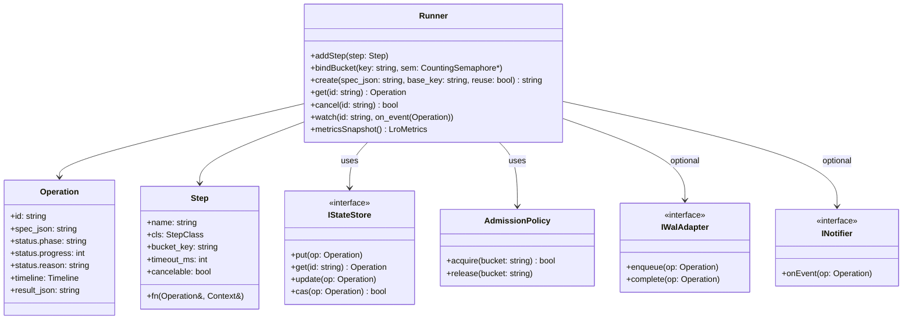
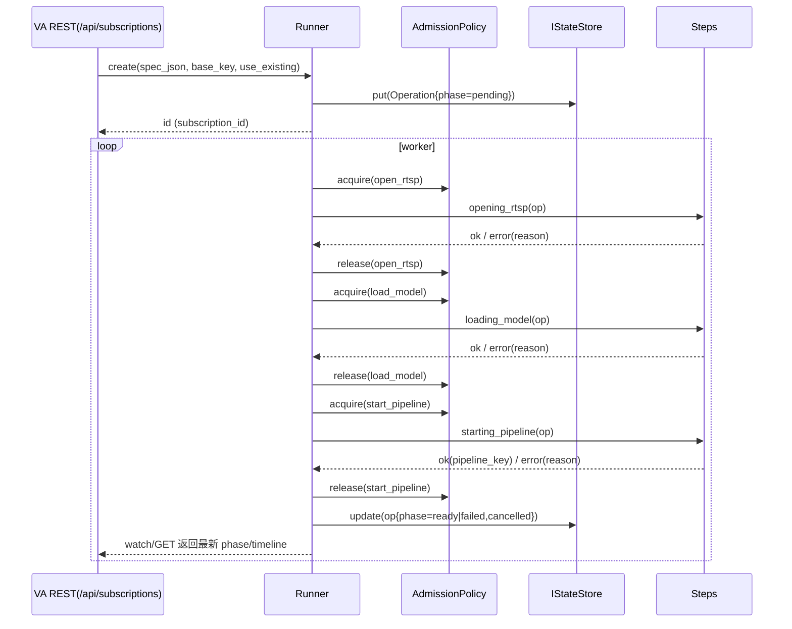

# LRO 通用库与订阅改造设计方案

## 目标与原则
- 抽象订阅等长耗时任务为通用 LRO 库（独立仓库），提供状态机/执行/限流/合并/背压/通知/可观测等共性能力。
- VA 订阅基于 LRO 实现，对外 REST/SSE/指标语义保持不变；最终删除 SubscriptionManager。
- 无 VA 内部耦合、可移植、可回退、性能与可观测不退化；先最小闭环，再逐步扩展。

## 库形态与目录结构
- 仓库：独立仓库（推荐）+ CMake 包目标 `lro::lro`，首期 header-first（便于快速集成）。
- 目录（建议）：
  - `include/lro/runner.h`：核心调度与执行（Runner/Operation/Step/Config）
  - `include/lro/state_store.h`：IStateStore、MemoryStore、WalStoreAdapter
  - `include/lro/admission.h`：AdmissionPolicy（多桶信号量+公平出队窗口）
  - `include/lro/metrics.h`：指标采样/快照
  - `include/lro/notifier.h`：INotifier（SSE/WS/Webhook）
  - `include/lro/reason.h`：错误归一 normalize
  - 可选适配：`include/lro/adapters/rest_simple.h`（REST 简化注册）、`include/lro/adapters/wal.hpp`

## 核心模型与 API
- Operation
  - `id, spec_json, status.phase, status.progress(0-100), status.reason, timeline{ts_pending..}, result_json`
- Step
  - `name, cls(IO|Heavy|Start), bucket_key, timeout_ms?, cancelable(true), fn(Operation&, Context&)`
- RunnerConfig
  - `store:IStateStore*`, `admission:AdmissionPolicy*`, `notifier:INotifier*?`
  - `fair_window:int=8`（公平出队窗口）
  - `retry_estimator: fn(queue_len:int, slots_min:int)->int`（默认动态估算1..60s）
  - `normalizer: fn(app_err:string, fallback:string)->string`
  - `merge_policy: { base_key_fn:fn(spec)->string, prefer_reuse_ready:bool }`
  - `wal: IWalAdapter?`
- Runner（最小接口）
  - `addStep(const Step&)` / `bindBucket(const string&, CountingSemaphore*)`
  - `create(spec_json, base_key, prefer_reuse_ready)->string` / `get(id)->Operation`
  - `cancel(id)->bool` / `watch(id, on_event(Operation))`
  - `metricsSnapshot()->LroMetrics`

## 类图与时序图





## Admission / 背压 / 公平 / 合并
- AdmissionPolicy：多桶信号量（open_rtsp/load_model/start_pipeline）。
- 公平出队：pending 为 deque，取窗口内（默认 8）首个 baseKey≠last_served 的任务；命中计 `rr_rotations_total`。
- 背压 Retry-After（默认估算）：
  - `slots = max(1, min(open>0?open:1, load>0?load:1, start>0?start:1))`
  - `est = clamp(max(base, ceil(queue_len/slots)), 1..60)`
- 合并 use_existing：
  - 命中非终态 → `merge_non_terminal++`
  - 命中 Ready 且 prefer_reuse_ready → `merge_ready++`
  - 请求复用但未命中 → `merge_miss++`

## 状态存储 / WAL
- IStateStore：`put/get/update/cas(Operation)`，MemoryStore 起步。
- WalStoreAdapter：`create()` 落 enqueue；终态（Ready/Failed/Cancelled）落 complete；启动扫描 inflight 计入 `failed_restart_total`（与现有一致）。

## 错误归一与时间线
- normalizeReason：保留现有映射（open_rtsp_* / load_model_* / subscribe_failed / cancelled / unknown…）。
- timeline：`ts_pending/ts_preparing/ts_opening/ts_loading/ts_starting/ts_ready/ts_failed/ts_cancelled`；ETag 由 timeline+phase 计算。

## 可观测与指标（库快照，VA 导出旧名）
- 队列/在途/阶段直方图/失败原因。
- 背压：`va_subscriptions_slots{type=open_rtsp|load_model|start_pipeline}`、`va_backpressure_retry_after_seconds`。
- 合并：`va_subscriptions_merge_total{type=non_terminal|ready|miss}`。
- 公平：`va_subscriptions_rr_rotations_total`。
- SSE：`va_sse_connections{channel=subscriptions|sources|logs|events}`、`va_sse_reconnects_total`。

## VA 集成（无桥接，内联替换）
- REST 层：`rest_subscriptions.cpp` 直接调用 Runner：Create/Get/Cancel/Watch；保留 202+Location、ETag/304、SSE 字段与事件名。
- 业务 Steps（VA 内实现回调）：
  - preparing：装载/校验配置；
  - opening_rtsp（bucket=open_rtsp）：构建/打开源，异常归一 open_rtsp_*；
  - loading_model（bucket=load_model）：解析/加载模型，异常归一 load_model_*；
  - starting_pipeline（bucket=start_pipeline）：build+start，成功写 `result_json={pipeline_key,whep_url}`。
- 指标导出：`rest_metrics.cpp` 从 Runner.metricsSnapshot 输出现有指标名。
- WAL：使用 WalStoreAdapter 保持现行为，/api/admin/wal/* 不变。

## 配置与运行时开关
- `app.yaml`：
  ```yaml
  lro:
    fairness_window: 8
    buckets: { open_rtsp: 2, load_model: 2, start_pipeline: 2 }
    backpressure: { min: 1, max: 60 }
  ```
- 迁移期开关：`VA_LRO_ENABLED=1`（默认 off；稳定后移除）。

## 删除 SubscriptionManager（必须项）
- 删除：`video-analyzer/src/server/subscription_manager.cpp/.hpp` 与 CMake 索引。
- 替换引用：
  - `rest_subscriptions.cpp` → 调用 Runner；
  - `rest_metrics.cpp` → 使用 Runner snapshot；
  - ETag/Timeline → 由 Operation.timeline/phase 提供。
- 回退方案：分支 `legacy-subscription-manager` 保留历史版本。

## 迁移阶段与时间
- M0（2–3 天）：完成 LRO 库（Runner/StateStore/Admission/merge/backpressure/fairness），VA 接入 Runner（开关 off），编译通过。
- M1（2 天）：打开开关替换订阅执行；全量回归；指标/面板核验；删除 SubscriptionManager；开关默认 on，保留观测窗口。
- M2（1–2 天）：移除回退开关；文档/示例补全；可选 gRPC 适配。

## 测试与验收
- 脚本（均已存在/新增）：
  - 订阅/取消/SSE：`check_subscription_flow.py`、`check_cancel_sse_trace.py`；
  - 指标/头：`check_metrics_*`、`check_headers_cache.py`；
  - WAL：`check_wal_scan.py`、`check_wal_rotation_ttl.py`；
  - 背压/公平/合并：`check_merge_metrics.py`、`check_sse_metrics.py`；
  - 失败路径：`check_fail_rtsp_open.py`（稳健），`check_fail_model_load.py`。
- 面板与告警：Grafana 大盘无需修改（Codec 面板已补齐）。
- 语义：POST 202+Location、GET ETag/304、DELETE、SSE 事件名/字段完全一致。

## 风险与缓解
- 行为回归：严格复用旧字段与指标名；保留回退开关；脚本 gate；
- 性能抖动：公平窗口默认 8，可调；监控 `va_subscriptions_rr_rotations_total`；
- WAL 时序：create/complete 统一落点；重启/尾部证据脚本验证；
- 合并争用：在加锁段处理 idempotency/merge；合并计数幂等。

## 交付物
- LRO 仓库（含 CMake 包、README、REST 示例、API 文档）。
- VA 集成补丁（订阅改为 LRO Runner；删除 SubscriptionManager）。
- 文档更新：`docs/references/Long-Running_Operation_Design.md`、`docs/context/*`、迁移与回退说明。

## 组件关系（Mermaid）
```mermaid
flowchart LR
  FE[Frontend] -- REST/SSE --> VA[VA REST]
  subgraph VA Backend
    RST[rest_subscriptions.cpp]
    MET[rest_metrics.cpp]
    LRO[Runner (lro::Runner)]
    ADM[AdmissionPolicy]
    ST[IStateStore + WAL]
    STEPS[Steps: preparing/opening_rtsp/loading_model/starting_pipeline]
  end
  RST -- Create/Get/Cancel/Watch --> LRO
  LRO -- acquire/release --> ADM
  LRO -- put/get/cas --> ST
  LRO -- run --> STEPS
  MET -- snapshot --> LRO
```

## 附录 A：lro_runtime 编译库方案概要

> 该附录概述将 LRO 运行时实现为可复用编译库（lro_runtime）的方案，便于在 VA/VSM 等多个子项目之间共享。

### A.1 目录与构建

- include/lro/
  - `status.h`：通用状态枚举（Pending/Running/Ready/Failed/Cancelled）。
  - `operation.h`：操作对象（id、幂等键、status/phase/progress/spec/result/创建时间）。
  - `state_store.h`：状态存储 SPI + MemoryStore 实现与工厂。
  - `executors.h`：有界线程池 BoundedExecutor + Executors 单例（io/heavy/start）。
  - `notifier.h`：通知 SPI（on_status/on_keepalive）。
  - `runner.h`：Runner 与 Step 定义，封装 admission、幂等等。
- src/lro/：Executors、MemoryStore、Runner 实现文件。
- 可选 adapters：REST/gRPC/WAL 等示例适配层。

### A.2 核心 API 摘要

- `Status`：`Pending | Running | Ready | Failed | Cancelled`。
- `Operation`：`id/idempotency_key/status/phase/progress/reason/spec_json/result_json/created_at`。
- `IStateStore`：`put/get/getByKey/update`；起步实现为内存 map + 索引。
- `BoundedExecutor`：带最大队列与阻塞提交的轻量线程池；`Executors` 提供 io/heavy/start 三类执行器。
- `INotifier`：`on_status/on_keepalive`，用于对接 SSE/WS/Webhook/MQ。
- `RunnerConfig`：`store/notifier/admission/retry_estimator/merge_policy/wal` 等。
- `Runner`：
  - `create(spec_json, idempotency_key)` 负责幂等创建/复用；
  - `get/cancel/watch/metricsSnapshot` 提供查询与观测能力。

### A.3 指标与集成

- 库侧仅提供快照数据（队列长度、状态分布、失败原因与阶段直方图），导出形式由宿主决定；
- VA 通过 REST `/metrics` 与 `/system/info` 从 Runner 快照中构造 Prometheus 文本或 JSON 字段。

## 附录 B：VA 集成与迁移指南（摘要）

> 该附录总结 VA 从 SubscriptionManager 迁移到 LRO Runner 的接入步骤与注意事项。

### B.1 组件与接口

- `Runner`：创建/查询/取消/观察订阅（create/get/cancel/watch），支持 IO/Heavy/Start 三类 Step。
- `StateStore`：内置 MemoryStore，SPI 可替换为 Redis/DB/WAL。
- `Notifier`：对接 SSE/WS/Webhook/MQ。
- `AdmissionPolicy`：并发/队列/重试估算 SPI，映射到 429 Retry-After 与相关指标。

### B.2 接入步骤

1. 引入库：在 CMake 中添加 `add_subdirectory(../lro)` 并链接 `lro_runtime` 或使用 `find_package(lro)`。
2. 切换 REST 路由：
   - 在 `rest_subscriptions.cpp` 中，`POST/GET/DELETE/SSE` 全部改为调用 Runner；
   - 保留 `202+Location`、弱 ETag、SSE 事件名与字段结构。
3. 指标与系统信息：
   - `/metrics` 输出 queue_length/in_progress/states/duration 直方图等；
   - `/system/info` 在 `subscriptions` 字段中回显 slots/queue/states 与来源（config/env）。
4. Admission/Retry-After：
   - 针对全局/按 key 并发、按 key 速率、queue_full 等场景使用 Admission 策略估算重试时间（上限 60s）。
5. WAL 集成：在 create/终态（GET 命中或 DELETE）时落证据记录；重启时扫描 inflight 并计入失败统计。
6. 清理与回滚：删除 SubscriptionManager 源与引用即可完成迁移；如需回滚，可恢复旧路由与链接配置。

### B.3 验证清单

- 最小 API：POST→GET→DELETE+SSE；重复 POST 可幂等复用已有任务；
- 失败路径：覆盖 ACL 拒绝、模型加载失败、订阅失败与取消；
- 指标：`va_subscriptions_*` 与 WAL/Quota/SSE/Codec 相关指标齐全；
- E2E：通过 CI 脚本验证订阅、事件与 WAL 行为符合预期。

## 附录 C：早期异步订阅管线设计概览（SubscriptionManager 版本）

> 本附录基于历史文档 `async_subscription_pipeline.md`，用于保留早期围绕 VA 内部 `SubscriptionManager` 与 `/api/subscriptions` 的设计要点，作为 LRO 方案的设计来源与对照。具体命名与接口以当前实现与本文主体章节为准。

### C.1 设计动机与范围

- 问题背景：早期 `/api/subscribe` 在单个 HTTP 请求内同步完成 RTSP 打开、模型加载与 Pipeline 启动，耗时 3–10 秒：
  - 阻塞浏览器同一 keep-alive 连接上的其他请求；
  - 并发订阅会占用大量线程、重复加载模型，容易拖垮 VA；
  - 难以观测各阶段耗时与失败原因。
- 目标：改造为异步任务模式：
  - `POST /api/subscriptions` 仅创建任务并返回 `202 Accepted + id`；
  - 后台按阶段推进任务，前端通过 `GET /api/subscriptions/{id}` 或 SSE 获取状态；
  - 支持限流、幂等、防重复以及阶段化观测。

### C.2 核心组件与状态机

- `SubscriptionManager`：
  - 维护 `ConcurrentMap<id, SubState>` 与 `ConcurrentMap<baseKey, id>`（避免重复任务）；
  - 管理内部线程池/任务队列，负责执行订阅各阶段；
  - 持有分阶段信号量（模型加载/RTSP 打开/总并发）实现限流；
  - 负责向 SSE 与 Prometheus 指标输出状态变化。
- 典型状态结构（简化）：
  - `SubPhase`：`Pending | Preparing | OpeningRtsp | LoadingModel | StartingPipeline | Ready | Failed | Cancelled`；
  - `SubState`：记录 `phase/reason/stream_id/profile/pipeline_key/whep_url/source_uri/model_id/cancel/created_at` 等字段。
- 状态流转由 SubscriptionManager 维护，对外序列化为 JSON。

### C.3 请求与任务执行流程

- `POST /api/subscriptions`：
  - 校验参数，生成 `subscription_id` 并创建初始 `SubState`；
  - 以 `stream_id + profile` 作为幂等 key，复用已有未终止任务（或返回冲突）；
  - 将闭包任务投递到线程池队列，立即返回 `202 Accepted`。
- 异步任务阶段（逻辑在线程池中执行）：
  - `Preparing`：加载配置、申请限流资源；
  - `OpeningRtsp`：调用 RTSP 打开逻辑，失败则标记 `Failed` 并释放资源；
  - `LoadingModel`：调用模型解析与加载逻辑，期间支持取消检查；
  - `StartingPipeline`：构建并启动 Pipeline，成功后 `phase=Ready`，写入 `pipeline_key` 等；
  - 任一阶段异常：更新 `reason`，`phase=Failed`，释放限流资源；
  - 取消标志置位时，若已创建 Pipeline 则停止之并转为 `Cancelled`。
- `GET /api/subscriptions/{id}`：返回当前 phase、reason、创建时间、pipeline_key、whep_url 等；
- `DELETE /api/subscriptions/{id}`：置位 cancel，必要时调用 `unsubscribeStream`，终态 `Cancelled`；
- SSE（可选）：通过事件流推送 `{ id, phase, timestamp }`，避免前端轮询。

### C.4 限流、幂等与回收策略

- 分阶段限流：
  - 信号量限制模型加载、RTSP 打开等重阶段的最大并发，避免瞬间压垮进程；
  - 控制整体任务队列长度（如 `max_queue`），避免状态表无界增长。
- 幂等策略：
  - 使用 `baseKey = stream_id + profile` 维护 `map<baseKey, sub_id>`；
  - 若存在未终止任务则复用其 ID；终态任务则允许创建新的订阅。
- 回收策略：
  - Ready/Failed/Cancelled 状态保留一段 TTL（如 15 分钟）后定期清理；
  - Ready 任务对应的 Pipeline 在 `DELETE` 或应用退出时自动取消订阅。

## 附录 D：异步订阅补强设计要点（硬化方案）

> 本附录基于历史文档 `async_subscription_hardening.md`，归纳异步订阅在排队/限流、取消、缓存预热、可观测与前端体验等方面的硬化诉求。这些要点已在 LRO Runner 与 Controlplane 设计中部分吸收，其余可作为后续增强参考。

### D.1 排队与限流策略

- 队列上限：
  - 配置项 `subscriptions.max_queue` 控制订阅任务队列长度（如默认 1024）；
  - 队列已满时返回 `429 Too Many Requests`，附 `Retry-After: <sec>`。
- 分阶段并发槽位：
  - 配置 `subscriptions.{open_rtsp_slots, load_model_slots, start_pipeline_slots}`；
  - 向后兼容旧的 `model_slots/rtsp_slots`；重资源阶段全部在内部 executor 中执行。
- HTTP 工作线程隔离：
  - 负责快速解析与排队，重任务全部在专用线程池中执行，减少对整体 HTTP 延迟的影响。

### D.2 取消语义与可中断性

- 在 `opening_rtsp / load_model / start_pipeline` 等关键路径埋设取消检查点：
  - 当状态中的 `cancel` 置位时，尽快中止当前操作并释放资源；
  - 使用 RAII/finally 保证信号量、管线句柄、GPU/ORT/TRT 资源被正确清理。
- 取消入口：
  - 任一阶段 `DELETE /api/subscriptions/{id}` 均可生效；
  - 如已有 `pipeline_key`，需先执行 `unsubscribeStream` 再终态标记 Cancelled 并持久化记录。

### D.3 模型与编解码缓存、预热

- 模型缓存（ModelRegistry）：
  - 以 `model_hash + EP_opts` 为 key，维护 LRU 缓存与 idle TTL；
  - Ready/Failed/Cancelled 后将模型返回缓存，减少重复加载。
- 编解码资源缓存（CodecRegistry，可选）：
  - 对高频使用的解码器进行重用，降低反复创建/销毁的开销。
- 预热策略：
  - 在启动或低峰时按配置预热常用模型和编解码器，缩短首次订阅的冷启动时间。

### D.4 状态持久化与恢复（轻量 WAL）

- 轻量持久化：
  - 使用 WAL/Redis 记录 `subscription_id/baseKey/phase/reason_code/timestamps` 等关键信息；
  - 在重启恢复时，对“进行中”任务统一标记为 `failed(restart)` 并输出相应告警指标。
- 与 LRO 集成：
  - 在 Runner 层通过可选 `IWalAdapter` 适配上述 WAL 方案，保持实现解耦。

### D.5 API 细节与错误表示

- POST `/api/subscriptions`：
  - 正常返回 `202 Accepted` 与 `Location: /api/subscriptions/{id}`；
  - 队列已满时返回 `429`，携带 `Retry-After` 并使用标准化 `reason_code`。
- GET `/api/subscriptions/{id}`：
  - 建议支持 `ETag/If-None-Match`，基于 `phase + updated_at_ms` 生成弱 ETag，方便前端与中间层缓存。

### D.6 安全、配额与可观测性

- 配额与 ACL：
  - 支持按用户/源/模型/并发订阅数/GPU 资源等维度进行限额控制；
  - 拒绝时返回清晰的错误码与用户可理解的提示信息。
- 指标与告警：
  - 核心指标示例：
    - `va_subscriptions_queue_length/in_progress/states{phase}`；
    - `va_subscriptions_completed_total{result}`；
    - `va_subscription_duration_seconds_*` 与 `va_subscription_phase_seconds_*{phase}`；
    - `va_subscriptions_failed_by_reason_total{reason_code}`；
  - 告警场景：队列长度过长、失败率上升、阶段耗时 P95/99 超阈值、重启后失败数异常等。

### D.7 前端体验与回滚策略

- 前端补强：
  - AnalysisPanel 展示各阶段耗时与“上次构建用时”；在拿到 `subId` 之后即可提供取消按钮；
  - SSE 断线重连 + 短期轮询兜底，保证订阅状态在弱网络场景下仍可追踪。
- 兼容与回滚：
  - 旧接口 `/api/subscribe|/api/unsubscribe` 由配置开关保护，阶段性保留；
  - 回滚时可关闭细粒度限流/队列策略与高级特性，仅保留基础异步执行与总时长指标。
