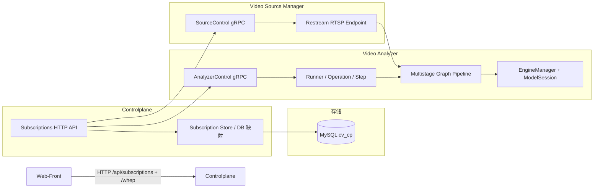
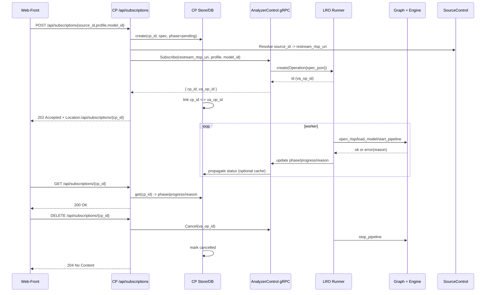

# 订阅流水线详细设计说明书（2025-11-15）

## 1 引言

### 1.1 编写目的

本说明书在 `lro_subscription_design.md`、`multistage_graph_详细设计.md`、`tensorrt_engine.md` 与 `triton_inprocess_integration.md` 的基础上，从“订阅流水线”的角度系统梳理控制平面（CP）、Video Analyzer（VA）、Video Source Manager（VSM）与推理引擎之间的协作关系，给出核心接口、执行时序与扩展点，并说明设计如何满足 SOLID 等面向对象设计原则。

### 1.2 范围

- 覆盖从前端 `POST /api/subscriptions` 到 WHEP 播放的完整执行链路；
- 涉及 CP HTTP + gRPC 接口、VA 内部 LRO Runner 与多阶段 Graph、VSM 源管理与 Restream 的交互；
- 聚焦订阅流水线的结构与协作，不重复底层类/函数细节（详见各专题设计）。

### 1.3 相关文档

- 概要设计：`docs/design/architecture/整体架构设计.md`
- 控制平面详细设计：`docs/design/architecture/controlplane_design.md`
- VA 详细设计：`docs/design/architecture/video_analyzer_详细设计.md`
- VSM 详细设计：`docs/design/architecture/video_source_manager_详细设计.md`
- 订阅 LRO 设计：`docs/design/subscription_pipeline/lro_subscription_design.md`
- 多阶段 Graph 设计：`docs/design/subscription_pipeline/multistage_graph_详细设计.md`
- 推理引擎设计：`docs/design/subscription_pipeline/tensorrt_engine.md`、`docs/design/subscription_pipeline/triton_inprocess_integration.md`
- 协议与错误码：`docs/design/protocol/控制平面HTTP与gRPC接口说明.md`、`docs/design/protocol/控制面错误码与语义.md`

## 2 订阅流水线概览

### 2.1 业务视角

订阅流水线负责将“用户在前端选择源与分析配置”的动作，转换为后台 VA 上的一条媒体处理管线，并通过 WHEP 将结果回推到浏览器。核心目标：

- 对前端暴露统一的 HTTP 接口与错误语义；
- 在 VA 内部以 LRO + 多阶段 Graph 方式执行长耗时步骤；
- 对 VSM 屏蔽上游摄像头稳定性，通过 Restream 端点提供稳定输入；
- 对推理引擎屏蔽模型/设备差异，通过统一 Engine 抽象与配置驱动。

### 2.2 结构视图

### 2.3 执行时序（概要）

详细的 LRO 内部状态机与时序见 `lro_subscription_design.md`。

## 3 核心职责与模块边界

### 3.1 Controlplane：订阅编排层

- 对前端承担：
  - 提供订阅 REST API：`POST/GET/DELETE /api/subscriptions`、`GET /api/subscriptions/{id}/events`；
  - 提供 WHEP 入口：`/whep`，封装 WHEP 与 VA 之间的协议差异；
  - 将复杂的 LRO 状态机与错误原因映射为稳定的 HTTP 状态码与 `reason_code`。
- 对后端承担：
  - 通过 `AnalyzerControl` gRPC 调度 VA LRO Runner；
  - 通过 `SourceControl` gRPC 与 VSM 交互，解析 `source_id`/`source_uri`；
  - 在 MySQL 中维护 `cp_id ↔ va_op_id` 映射与订阅元数据。

内部可抽象为三个逻辑模块：

- `SubscriptionHttpHandler`：解析/校验 HTTP 请求，构造内部订阅 spec，并统一处理异常 → 错误码；
- `SubscriptionService`：面向应用层的编排服务，负责编排 VSM/VA/DB，多数逻辑在此聚合；
- `SubscriptionStore`：持久化与查询订阅对象，封装 DB 访问，避免 Handler 关注 SQL 细节。

### 3.2 Video Analyzer：订阅执行层

- 负责将 `SubscribeRequest` 转换为一条实际运行的多阶段 Graph：
  - 构造 LRO Operation（spec/timeline）；
  - 注册订阅相关 Steps：`open_rtsp` / `load_model` / `start_pipeline` / `wait_ready` 等；
  - 执行 Graph + Engine pipeline，并将 WHEP 输出与订阅关联。
- 通过 `AnalyzerControl` 暴露：
  - `Subscribe`：创建订阅并返回内部 key；
  - `Get` / `Watch`：获取订阅 phase/progress/timeline；
  - `Cancel`：取消并回收资源；
  - `QueryRuntime` / `SetEngine`：查询/调整引擎配置（与订阅的 engine_options 关联）（详见 VA 详细设计）。

VA 不关心 CP 的 `cp_id`，只对内部 `va_op_id` 与 pipeline key 负责。

### 3.3 Video Source Manager：源管理层

- 提供稳定的 `restream_rtsp_uri`：
  - 维护源配置、拉流与 Restream；
  - 对 CP 暴露 `SourceControl` gRPC 接口。
- 在订阅流水线中承担：
  - 将 `source_id` 转换成 VA 可消费的 RTSP 端点；
  - 报告源健康状态，供 CP 决定是否允许订阅。

### 3.4 推理引擎与多阶段 Graph：分析执行层

- 多阶段 Graph（详见 `multistage_graph_详细设计.md`）：
  - 将订阅 spec 映射到 Graph 配置（graph_id、profile、model 等）；
  - 为每种 profile 选择合适的 Graph 与 Node 配置。
- 推理引擎（详见 `tensorrt_engine.md`、`triton_inprocess_integration.md`）：
  - 基于 EngineManager 与 ModelSessionFactory，封装 TensorRT/Triton/ORT 等后端；
  - 支持 CPU/GPU、IOBinding、In-Process Triton 等多种执行模式；
  - 将订阅 spec 中的 engine_options 与实际 ModelSession 配置关联。

订阅流水线并不直接操作 Engine 细节，而是依靠 Graph + Engine 抽象对下游解耦。

## 4 核心接口设计

### 4.1 CP HTTP 接口（外部合同）

详见 `控制平面HTTP与gRPC接口说明.md`，此处只强调与订阅流水线相关部分：

- `POST /api/subscriptions?use_existing=1`：
  - 请求体：`{ source_id|source_uri, profile, model_id?, engine_overrides? }`；
  - 语义：创建订阅，若 `use_existing=1` 则尽量复用同 spec 的 ready 订阅；
  - 响应：`202 Accepted` + `Location: /api/subscriptions/{cp_id}`，Body 包含简要状态。
- `GET /api/subscriptions/{cp_id}`：
  - 返回 `phase/progress/reason/timeline` 等；
  - 与 LRO Operation 状态一一对应，保证前端可根据 phase 进行 UI 显示。
- `DELETE /api/subscriptions/{cp_id}`：
  - 语义：取消订阅；
  - CP 需保证幂等：多次调用不会导致错误。
- （可选）`GET /api/subscriptions/{cp_id}/events`：
  - SSE 通道，用于推送 phase/timeline 更新；
  - 与 LRO `watch()` 能力对齐。

CP 层负责将内部错误（gRPC、LRO、DB）映射为 HTTP 状态码与 `reason_code`，具体见错误码设计文档。

### 4.2 CP ↔ VA：AnalyzerControl gRPC 合同

在订阅流水线中，重点使用以下接口（名称以当前实现为准）：

- `Subscribe(SubscribeRequest)->SubscribeReply`：
  - 输入：`stream_id` / `source_uri` / `profile` / `model_id` / `engine_options` 等；
  - 输出：VA 侧 `op_id`、内部 `pipeline_key` 以及初始 phase。
- `Get(SubscriptionKey)->SubscriptionStatus`：
  - 返回 phase/progress/reason/timeline 与当前 WHEP/输出相关元信息。
- `Cancel(SubscriptionKey)`：
  - 停止多阶段 Graph 并释放资源。
- `Watch(SubscriptionKey)`：
  - 用于 SSE 或内部调试的实时通知。

这些接口对外表现为 gRPC 服务，对 VA 内部则由 LRO Runner 与 Graph/Pipeline 实现。

### 4.3 VA 内部：LRO Runner 与 Step 接口

LRO 核心接口详见 `lro_subscription_design.md`，订阅流水线主要使用：

- `Runner::create(spec_json, base_key, prefer_reuse_ready)`：
  - 根据订阅 spec 创建或复用 Operation；
  - `spec_json` 包含 `restream_rtsp_uri`、graph/profile/model 与 engine_options 等。
- `Runner::get(id)` / `watch(id, on_event)`：
  - 获取当前 Operation 状态或订阅事件流；
- `Runner::cancel(id)`：
  - 将 Operation 标记为取消并通知流水线。

订阅相关 Step 一般包括：

- `open_rtsp`：打开 Restream RTSP 源（依赖 `SourceConfig` 与 TrackManager）；
- `load_model`：加载/准备模型（通过 EngineManager 与 ModelSession）；
- `start_pipeline`：构建并启动多阶段 Graph pipeline；
- `wait_ready`：等待首帧/关键事件达到“准备就绪”条件；
- `cleanup`：清理资源（取消/失败时）。

每个 Step 都遵循“单一职责”：只完成一类动作，并将结果通过 Operation 状态与日志/指标呈现。

### 4.4 VSM：SourceControl gRPC 合同

在订阅流水线中，CP 通过 `SourceControl` 完成：

- 查询源状态：`WatchState` / `GetHealth`；
- 更新源配置：`Update` / `Attach` / `Detach`；
- 获取 Restream 地址：基于源配置拼接 `restream_rtsp_base + source_id`。

订阅流水线不直接操作 VSM 内部实现，而是以 `source_id` 为 key，依赖 VSM 提供稳定的 Restream 端点。

## 5 设计原则（SOLID）体现

### 5.1 单一职责原则（SRP）

- CP 层：
  - HTTP Handler 只负责协议与校验；
  - Service 只负责业务编排与错误映射；
  - Store 只负责 DB/缓存访问。
- VA 层：
  - LRO Runner 只负责 Operation 状态机与调度；
  - Step 只做单一动作（打开源/加载模型/启动 pipeline 等）；
  - Graph/Engine 只负责媒体处理与推理。
- VSM 层：
  - 专注于源管理与 Restream，不参与订阅生命周期细节。

### 5.2 开闭原则（OCP）

- 新增订阅步骤：
  - 通过新增 Step 并在 Runner 中按顺序注册，即可扩展能力（如增加预检查/冷启缓存）；
  - 不需要修改现有 Step 实现。
- 新增推理引擎：
  - 通过实现新的 `ModelSession`/Factory 并在 EngineManager 中注册 provider；
  - 上层订阅流水线只感知统一的 engine_options。
- 新增订阅入口或前端场景：
  - 只要遵守现有 HTTP/gRPC 合同，即可新增页面或 CLI 工具，不影响流水线内部。

### 5.3 里氏替换原则（LSP）

- LRO 相关接口：
  - 任意实现 `IStateStore`（内存/Redis/WAL）与 `AdmissionPolicy` 的类，都可替换而不影响 Runner 外部行为；
  - 编写测试时可以用内存 Store 替换真实 DB Store。
- 引擎接口：
  - TensorRT/Triton In-Process 等实现都通过 `IModelSession` 抽象对外；
  - Graph 节点只依赖该抽象即可调用推理，无需关注具体后端。

### 5.4 接口隔离原则（ISP）

- 对外：
  - 将订阅 REST 与 WHEP 分离，前端只需关注所需接口；
  - 将 AnalyzerControl 与 SourceControl 换成最小 gRPC 服务，而不是一个大而全的单体服务接口。
- 对内：
  - LRO Runner 面向 Step 暴露简单的 `fn(Operation&, Context&)`；Step 无需知道 Store/Admission 细节；
  - Graph 与 Engine 通过清晰的接口隔离，避免媒体处理代码依赖 LRO/HTTP 细节。

### 5.5 依赖倒置原则（DIP）

- CP 层依赖抽象：
  - `SubscriptionService` 依赖 `SubscriptionStore`、`AnalyzerControlClient`、`SourceControlClient` 的接口，而不是具体实现；
  - 在测试环境中可以注入 mock 实现进行端到端验证。
- VA 层依赖抽象：
  - LRO Runner 依赖 `IStateStore`/`AdmissionPolicy`/`INotifier` 接口；
  - EngineManager 依赖 `IModelSessionFactory` 接口，具体引擎通过工厂注入。

## 6 与推理引擎的协作

### 6.1 EngineManager 与订阅 spec

订阅 spec 中与引擎相关的重要字段包括：

- `profile`：决定使用的 Graph 与默认模型；
- `model_id`：指定模型（可覆盖 profile 默认）；
- `engine_overrides`：覆盖 Engine 默认配置（如 provider、device、precision、IOBinding、零拷贝开关等）。

在 `start_pipeline` Step 中：

- Service/Step 根据 `profile/model_id/engine_overrides` 构造 EngineDescriptor；
- 调用 EngineManager 选择合适的 ModelSession（TensorRT/Triton/ORT）；
- 将 EngineSession 注入 Graph 对应节点（例如 `NodeModel`）。

### 6.2 CPU/GPU 与零拷贝策略

订阅流水线并不直接控制 GPU 路径，而是通过 engine_options 与 Graph 配置影响：

- CPU NMS / GPU NMS 切换；
- CUDA 预处理与 IOBinding；
- TensorRT/Triton In-Process 的启用与回退。

相关设计与实现细节见：

- `zero_copy_execution_详细设计.md`
- `tensorrt_engine.md`
- `triton_inprocess_integration.md`

流水线设计保证：

- 在开启零拷贝路径前，仍可使用 CPU 路径作为基线；
- 对关键 profile，可通过配置/前端模式开关在 CPU/GPU 路径间切换。

## 7 扩展与演进方向

未来在订阅流水线上的典型扩展包括：

- 新的订阅类型：
  - 例如离线片段分析、批量导出等，可复用 LRO Runner 与 Step 模型；
  - 通过额外的 HTTP 前缀与独立 spec 进行区分。
- 更丰富的错误归因与恢复策略：
  - 在 LRO Operation 中携带更细的错误字段；
  - 在 CP 中提供自动重试/回滚策略配置。
- 更细粒度的多阶段 Graph 控制：
  - 在订阅 spec 中直接携带部分 Graph/节点参数（如 NMS conf/iou），由 Step 写入 Graph 配置；
  - 形成“配置驱动”的订阅流水线。

所有扩展应优先遵循本说明书中的抽象边界与 SOLID 原则，在保持现有 HTTP/gRPC 与 LRO 合同稳定的前提下演进实现。***
