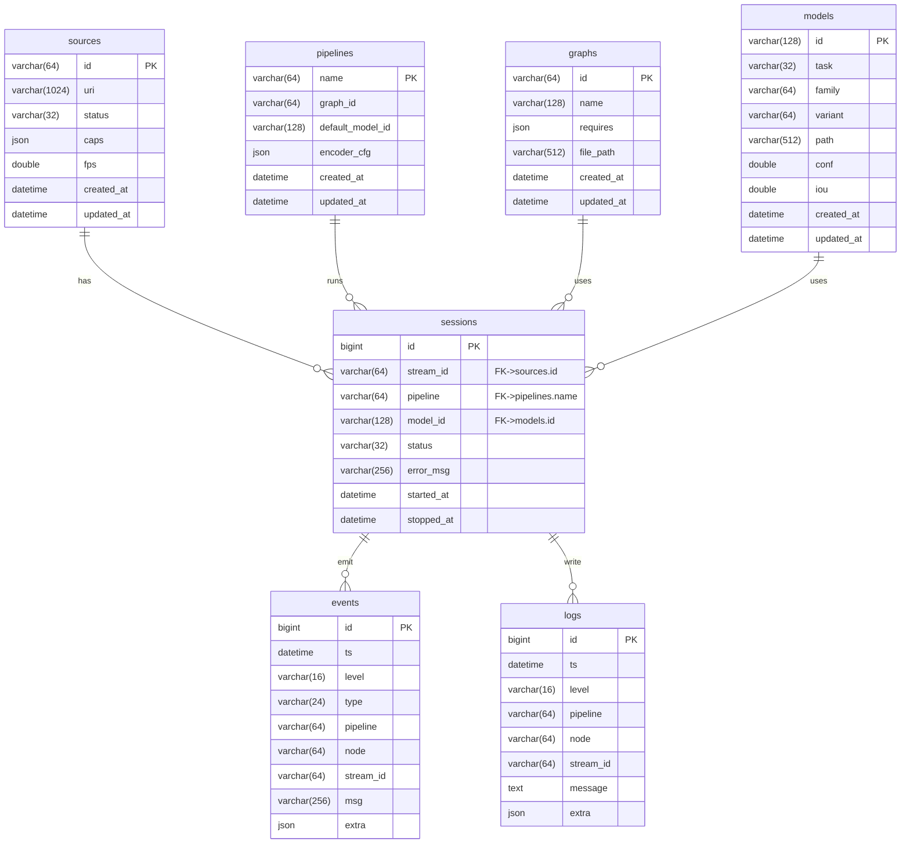

# 数据库设计（MySQL 8.0）

本文档描述本项目控制面数据库的目标、架构、实体关系、表结构要点、访问与索引策略、接入实现与迁移部署方案。配套的建库建表脚本见 `db/schema.sql`，一键导入脚本见 `tools/db/import_schema.ps1`。

## 背景与目标

- 目标：为现有 CV 系统（VSM/VA/前端）引入可靠的持久化存储，用于保存“源/会话/图/模型/事件/日志”等控制面数据，支持重启恢复、分页查询、观测与多端协作。
- 范围（MVP）：
  - 源（sources）与会话（sessions）持久化
  - 图/模型元数据（graphs/models/pipelines）
  - 事件（events）与日志（logs）落库与分页查询
  - 保持现有 watch 长轮询实时性，SSE 后续逐步稳定后可启用

## 总体架构

- 存储：MySQL 8.0（InnoDB，utf8mb4），部分字段使用 JSON 存放半结构化数据（如 caps/requires/extra）。
- 数据流：
  - VSM → CP（VA）：VSM 状态通过现有 list/describe/watch 采集
  - CP → DB：CP 将“源快照/会话/事件/日志”等写入 DB（写入异步或小批）
  - 前端 → CP：/api/* 从“内存聚合 + DB”返回；watch 仍走内存 rev 指纹，降低 DB 压力
- 配置：数据库连接在 `video-analyzer/config/app.yaml:database` 中配置（host/port/user/password/db/pool）

## 实体关系（ER）

## 表结构（概览）

- sources：保存源 URI、状态、最新 caps（JSON），索引 `status/updated_at`
- pipelines/graphs/models：管线、图、模型元数据；JSON 字段（encoder_cfg/requires）增加 `JSON_VALID` 检查
- sessions：订阅会话生命周期，外键关联 sources/pipelines/models，并建立 `stream_id+started_at` 与 `pipeline+started_at` 索引
- events/logs：观测事件/日志，索引 `(ts)` 与 `(pipeline, ts)`，保留 `extra JSON`

完整 DDL 请见 `db/schema.sql`。

## 访问与索引策略

- /api/sources：以内存聚合（VA pipelines）为主，DB 作为非活跃源回放；按 `updated_at` 排序分页
- /api/sources/watch：保持内存 rev 指纹与长轮询（SSE 后续稳定后再开放）
- /api/preflight：不落库；如需缓存可增 `preflight_cache`（可选）
- /api/logs,/api/events：读 DB 分页 + 条件（pipeline/level）；写入时小批量/异步以削峰
- sessions：Subscribe/Unsubscribe 时写入/更新，支持按 stream/pipeline 查询历史

## 接入实现（后端）

- 配置读取：`ConfigLoader` 已解析 `database` 段（driver/host/port/user/password/db/pool）
- 建议引入：
  - 连接池 `DbPool`（mysql-connector-c++ 8.x），统一管理连接与超时
  - `SourceRepo/SessionRepo/EventRepo/LogRepo`，接口仅暴露必要 CRUD 与分页
  - 所有 SQL 采用 PreparedStatement；批量写事务化
- 渐进式接入：
  1) 先接入 logs/events 的“写入 + 分页查询”，watch 仍走内存（接口不变）
  2) 再接入 sessions 生命周期
  3) 最后补齐 sources 的回放/补全

## 迁移与部署

- 一键导入（PowerShell）：
  - `pwsh -File tools/db/import_schema.ps1 -Host 127.0.0.1 -Port 13306 -User root -Password 123456 -Database cv_cp -SchemaPath db/schema.sql`
- Docker（可选）：使用 `mysql:8.0` 与 `adminer` 组合；或在已有 MySQL 上直接导入脚本
- 迁移工具（建议）：Flyway/Liquibase，迁移脚本命名 `V1__init.sql`、`V2__...sql`

## 安全与运维

- 最小权限：为应用创建专用账号，仅授予 cv_cp 上的 CRUD/索引权限
- 密钥管理：生产环境勿写死配置，使用安全存储（Vault/KMS/Windows Credential Manager）注入
- 审计与容量：events/logs 可按时间分区或定期归档；必要时加入应用级审计

## 渐进计划

- M0（已完成）
  - 产出 `db/schema.sql`，解析 `app.yaml:database`，在 `/api/system/info` 透出 database 概要
- M1
  - 接入 logs/events 的落库与读取；提供基础分页/过滤
- M2
  - 会话（sessions）完备；rollup 指标表；权限/多租（可选）

---

如需我继续落地 `DbPool` 与最小 `EventRepo/LogRepo` 骨架，请告知优先级与编译环境（是否可引入 mysql-connector-c++ 依赖）。

