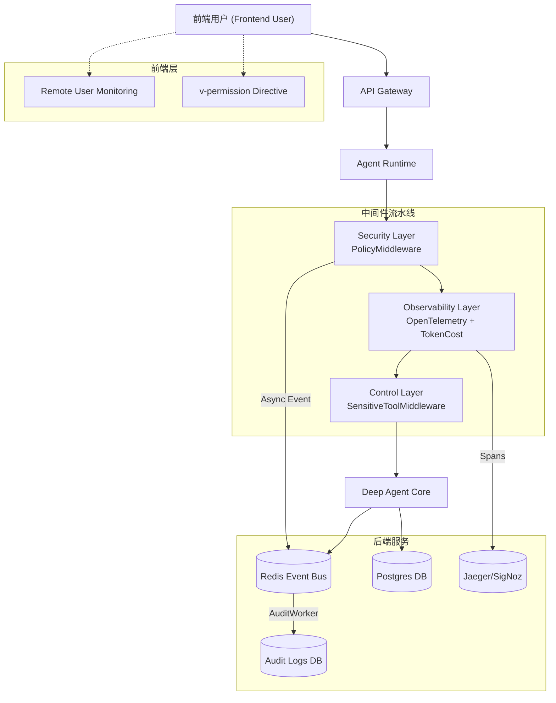
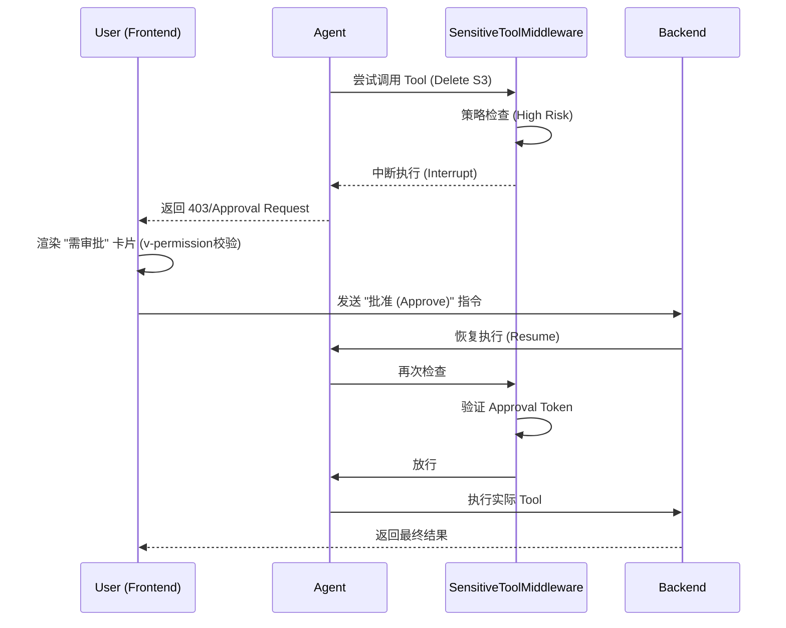

# 企业级 Agent 平台：生产就绪方案

基于对当前 `agent-platform` 架构的分析，为了解决可观测性、权限管理、人在回路（HITL）及稳定性等挑战，我们制定了以下综合技术方案。

## 1. 架构概览 (增强版)

我们将在 `agent-core` 基础上扩展三个新层级：
1.  **安全层 (Security Layer)**: 引入 `PolicyMiddleware` 实现 RBAC（基于角色的访问控制），以及 `AuditCallback` 实现全链路可追溯。
2.  **控制层 (Control Layer)**: 将 HITL（人在回路）机制泛化为通用的 `SensitiveToolMiddleware`。
3.  **观测层 (Observability Layer)**: 集成 `TokenCountingCallback` 进行成本核算，并接入 `OpenTelemetry`。

### 核心架构图 (Architecture Diagram)

### 敏感操作拦截时序图 (HITL Sequence)

## 2. 核心能力详解

### A. 权限与审计 (Security)

**目标**: “谁授权的操作？AI 到底做了什么？”

#### 1. 基于角色的访问控制 (RBAC)
- **组件**: `PolicyMiddleware` (新增)
- **机制**: 拦截 Tool Call，基于 `policy.yaml` 校验角色权限。

#### 2. 异步审计架构 (Async Audit via Event Bus)
- **反馈优化**: 采纳建议，使用 Event Bus 解耦审计，避免阻塞 Agent 主流程。
- **流程**:
    1.  **Capture**: `AuditCallback` 捕获关键事件（Decision/Tool/Output）。
    2.  **Publish**: 将事件发布到 Redis Stream `agent:audit_events`。
    3.  **Consumer**: 独立的 `AuditWorker` 消费队列。
    4.  **Preserve**: 批量写入 Postgres `audit_logs` 表 (对于海量日志，可升级为 ClickHouse/Elasticsearch)。
- **存储方案**: 生产环境强烈建议写入持久化数据库 (Postgres)，以便于合规查询和回溯。

### B. 人在回路 (HITL)

*...（保持不变）...*

### C. 深度可观测性 (Deep Observability)

**目标**: “不仅仅是 Token，而是全链路性能与质量洞察。”

#### 1. 为什么只看 Token 不够？
- Token 仅代表成本，无法反映：
    - **Latency**: 某个工具调用卡顿了多久？
    - **Quality**: Agent 是否陷入了思维循环？
    - **Error Rate**: 外部 API 的调用成功率。

#### 2. OpenTelemetry 集成 (Standard Tracing)
- **是什么**: OpenTelemetry (OTel) 是云原生计算基金会 (CNCF) 的行业标准追踪协议。
- **存储与展示**:
    - **选型决策**: 鉴于私有化部署需求，我们选用 **Jaeger (All-in-one)**。
    - **部署方案**: 在 `docker/monitoring/docker-compose.yml` 中新增 `jaeger` 服务 (OpenSearch backend可选)。
    - **轻量级**: 单容器镜像 `jaegertracing/all-in-one:latest` 即可满足日均百万级 Span 的开发与中试环境。

### D. 前端工程化 (Frontend Readiness)

**反馈优化**: 增加前端视角的生产就绪设计。

#### 1. 前端可观测性 (RUM)
- **Trace Context 透传**: 前端发起请求时生成或透传 `trace_id`，确保用户侧报错能直接定位到后端具体的 Log。
- **用户体验监控**: 监控首屏加载时间 (FCP) 和 Agent 响应延迟 (TTFB)。

#### 2. UI 权限控制
- **指令级鉴权**: 实现 Vue 指令 `v-permission="['analyst']"`，在 DOM 级别隐藏无权操作的按钮（如“删除知识库”）。
- **403 优雅降级**: 当后端返回 `PermissionDenied` 时，Frontend 展示友好的申请权限弹窗，而非崩溃。

### E. 管理后台 (Admin Console)

**目标**: “不仅要记录，还要能看见。”

#### 1. 审计日志查看器 (Audit Log Viewer)
- **功能**:
    - **多维筛选**: 按用户、时间范围、工具类型、Trace ID 筛选日志。
    - **可视化 Diff**: 展示 Agent 思考前后的 State 变化（Snapshot Diff）。
    - **风险标记**: 高亮显示“被拦截”或“失败”的高危操作。

#### 2. 可观测性仪表盘 (Observability Dashboard)
- **集成策略**:
    - **轻量级**: 在 Admin 侧直接渲染基于 ECharts 的关键指标图表（今日调用量、Token 消耗趋势、平均响应耗时）。
    - **专业级**: 通过 `<iframe>` 嵌入 Grafana 或 SigNoz 的完整 Dashboard（需处理免登鉴权）。

### F. 稳定性 (Stability)

#### 1. 状态回滚
- API: `graph.update_state` 实现时光倒流。
#### 2. 事务性工具
- 强制副作用工具实现 `dry_run`。

## 3. Event Bus 拓展策略 (Event Bus Strategy)

事件总线 (Redis Streams) 不仅仅用于审计，它更是 Agent 系统解耦的中枢神经。我们将扩展以下核心场景：

### 1. 异步任务编排 (Heavy Compute Offloading)
- **场景**: 视频渲染、大规模数据清洗、PDF OCR。
- **模式**:
    - **Producer**: Agent 调用工具 `request_video_render(prompt)`，此工具**不执行**渲染，而是向 `agent:tasks:video` Stream 发送指令任务。
    - **Consumer**: 独立的 Python Worker (配备 GPU) 消费任务，处理完成后通过回调更新任务状态。

### 2. 第三方系统集成 (Webhooks Integration)
- **场景**: 当 Agent 完成任务时，自动通知 Slack/飞书/钉钉。
- **模式**:
    - **Event**: Agent 发布事件 `agent:event:task_completed`。
    - **Integrator**: 一个轻量级的 `IntegrationWorker` 订阅此事件，负责将 JSON Payload 转换为飞书卡片消息并推送，失败重试不影响 Agent 主线程。

### 3. 实时前端反馈 (Real-time UX)
- **场景**: 在前端展示“正在搜索具体数据...”的详细进度条。
- **模式**:
    - Agent 内部细粒度发布 `agent:progress` 事件 (Step 1/10)。
    -后端 API 层 (SSE Gateway) 订阅此频道，并实时推送给前端。

## 4. 实施路线图

### 第一阶段：安全与审计 (第1周)
- [ ] 在 `agent_core` 中实现 `PolicyMiddleware`。
- [ ] 在 `runtime.py` 中添加 `AuditCallback`。

### 第二阶段：HITL 泛化 (第2周)
- [ ] 将 `SensitiveToolMiddleware` 全局化。
- [ ] 升级前端 `AsyncTaskCard` 以支持通用的“审批”请求。

### 第三阶段：可观测性 (第3周)
- [ ] 接入 Token/成本 追踪逻辑。
- [ ] 开发“Agent 成本监控仪表盘”。

### 第四阶段：稳定性 (第4周)
- [ ] 在 `tasks.py` 暴露“撤销/回滚” API。
- [ ] 标准化副作用工具的 `dry_run` 参数规范。

## 4. 架构设计的 SOLID 原则分析

本方案严格遵循 SOLID 软件设计原则，以确保系统的可扩展性与可维护性：

### 单一职责原则 (SRP)
- **设计体现**: 将安全 (`PolicyMiddleware`)、控制 (`SensitiveToolMiddleware`) 和 观测 (`TokenCostCallback`) 拆分为独立的中间件或回调。
- **收益**: 每一层逻辑独立演进。修改计费逻辑不会影响权限校验，增加新的敏感工具不会影响审计记录。

### 开闭原则 (OCP)
- **设计体现**: `AgentMiddleware` 和 `BaseCallbackHandler` 提供扩展点。
- **收益**: 新增业务规则（如“禁止周五发布”）只需新增 Middleware，无需修改 `agent-core` 或 `create_deep_agent` 的核心代码。

### 里氏替换原则 (LSP)
- **设计体现**: 所有的 Middleware 都继承自 `AgenteMiddleware` 基类，所有的 Tool 都遵循 `BaseTool` 接口。
- **收益**: 运行时 (`Runtime`) 可以统一处理任何中间件，无需进行 `if type == X` 的特判，确保了组件的可替换性。

### 接口隔离原则 (ISP)
- **设计体现**: `Runtime` 与 `Backend` 交互时，依赖于细粒度的接口（如 `StoreBackend`），而不是庞大的单体接口。
- **收益**: 子 Agent (`SubAgent`) 只需关注与其相关的存储接口，无需感知全局的文件系统或复杂的配置加载逻辑。

### 依赖倒置原则 (DIP)
- **设计体现**: 上层 Agent 业务逻辑不直接依赖底层实现（如 OpenAI 或 Postgres），而是依赖于抽象接口（`BaseChatModel`, `AsyncSaver`）。
- **收益**: 通过依赖注入（如在 `graph.py` 中注入 `model` 和 `checkpointer`），实现了纯离线的单元测试能力，彻底解耦了基础设施与业务逻辑。
