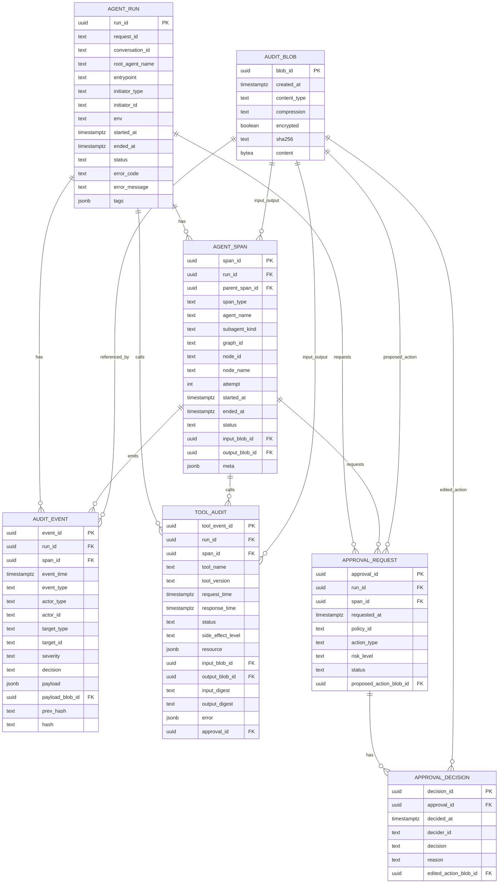

# Agent 审计模块｜数据库审计日志表结构设计（DeepAgent / LangGraph）

优先级: P1
状态: 草稿
类型: 数据库设计

## 目标

- 为 LangChain 1.0 DeepAgent（多子 agent：ReAct + CompiledSubAgent/LangGraph）提供**可追溯、可检索、可扩展**的审计日志存储。
- 覆盖：Run 级别、子步骤/节点（Span）级别、事件流（Event）级别，以及 Tool 调用与 HITL 审批。

## 设计原则

- **Append-only**：审计事件只追加，不更新。
- **分层建模**：Run → Span → Event，支持按 run/节点快速定位。
- **敏感信息最小化**：表内存结构化字段与摘要，正文大对象外置（或独立 blob 表）。
- **可扩展**：事件类型/跨度类型用枚举或字典表管理。
- **可治理**：支持分区、归档、保留策略。

## ER 图（Mermaid）



## 表结构说明（摘要）

### 1. agent_run

- 一次 DeepAgent 执行实例（一次用户消息触发 / 一次 job）。

### 2. agent_span

- 一次子步骤或节点执行（ReAct step / tool call / langgraph node / compiledsubagent）。
- 通过 `parent_span_id` 表达树结构，便于链路追踪。

### 3. audit_event

- 核心审计事件流，append-only。
- `payload` 建议只放脱敏后的结构化字段；大字段用 `payload_blob_id` 外置。

### 4. tool_audit

- 针对 tool 调用的结构化审计（副作用等级、资源范围、输入输出摘要）。

### 5. approval_request / approval_decision

- HITL 审批与结果，强关联 `run_id/span_id`。

### 6. audit_blob

- 大对象存储（prompt、messages、tool input/output、state before/after 等），支持压缩/加密与哈希。

## 索引与分区建议

- `audit_event` 建议按 `event_time` **月分区**。
- 常用索引：
    - audit_event(run_id, event_time)
    - audit_event(event_type, event_time desc)
    - agent_span(run_id, started_at)
- 对 `payload` 的 GIN 索引谨慎使用，优先靠结构化列过滤。

## 实现方案（基于 Redis Streams 的审计采集与入库）

目标是让业务链路“只发事件、不写库”，审计侧异步消费入库，做到低侵入、可重放、可幂等。

### 1) 组件划分

- **AuditEmitter（运行时侧）**：统一的事件发送接口（只负责写 Redis Streams）。
- **AuditConsumer/AuditWorker（旁路服务）**：消费 Streams，做规范化/脱敏/外置大对象，然后批量写入 Postgres。

### 2) Streams 规划（建议）

- [`audit.events`](http://audit.events)：主事件流（append-only）。
- `audit.dlq`：死信流（解析失败、落库失败且超过重试次数的消息）。

### 3) 消息结构（建议扁平化关键字段 + payload_json）

建议每条 stream entry 至少包含：

- `event_id`（uuid，幂等关键）
- `schema_version`
- `event_type`
- `event_time`
- `run_id` / `span_id` / `parent_span_id`
- `actor_type` / `actor_id`
- `component`
- `payload_json`（脱敏后的 JSON 字符串）
- `payload_ref`（可选：大对象外置引用）

### 4) 基于 Callback + Node Wrapper 的事件采集（全部用 `config` 透传，不用 contextvars）

目标：

- **LLM/Tool/Run** 事件由 **LangChain CallbackHandler** 全量捕获。
- **Node** 事件由 **node wrapper** 补齐（`langgraph_node_started/finished/node_failed`）。
- 两者通过 `config.metadata` 共享 `run_id/span_id`，实现事件关联。

#### 4.1 AuditEmitter（唯一写 Redis Streams 的地方）

```python
import json, time, uuid
from dataclasses import dataclass

@dataclass
class AuditEmitter:
	reedis: any
	stream_key: str = "audit.events"

	async def emit(
		self,
		*,
		event_type: str,
		run_id: str,
		span_id: str | None,
		parent_span_id: str | None = None,
		component: str | None = None,
		payload: dict | None = None,
		actor_type: str = "agent",
		actor_id: str = "worker",
	):
		fields = {
			"event_id": str(uuid.uuid4()),
			"schema_version": "1",
			"event_type": event_type,
			"event_time": str(time.time()),
			"run_id": run_id,
			"span_id": span_id or "",
			"parent_span_id": parent_span_id or "",
			"component": component or "",
			"actor_type": actor_type,
			"actor_id": actor_id,
			"payload_json": json.dumps(payload or {}, ensure_ascii=False),
		}
		await self.redis.xadd(self.stream_key, fields, maxlen=1_000_000, approximate=True)
```

#### 4.2 统一 config 约定

- `config["callbacks"]`：注入 `AuditCallbackHandler`。
- `config["metadata"]`：统一放运行时信息（在整个执行链路中透传）。

**建议的 metadata 字段**

- `user_id`, `session_id`, `trace_id`
- `run_id`：一次执行实例的全局标识（入口生成）
- `span_id`：当前步骤/节点标识（node wrapper 注入）
- `parent_span_id`
- `graph_id`（可选）
- `node_id` / `node_name`（可选）

#### 4.3 入口注入（Run 级）

```python
run_id = new_run_id()
config = {
	"callbacks": [AuditCallbackHandler(emitter)],
	"metadata": {
		"user_id": user_id,
		"session_id": session_id,
		"trace_id": trace_id,
		"run_id": run_id,
	},
	"tags": [f"agent:{agent_key}", f"session:{session_id}"]
}

await graph.astream(inputs, config=config)
```

#### 4.4 CallbackHandler：LLM/Tool/Run 全量采集（只从 metadata 取上下文）

> 原则：callback 不“猜” run/span，只从 `metadata` 读取，并把事件写入 Streams。
> 

```python
from langchain.callbacks.base import BaseCallbackHandler

class AuditCallbackHandler(BaseCallbackHandler):
	def __init__(self, emitter: AuditEmitter):
		self.emitter = emitter

	def _md(self, kwargs) -> dict:
		return kwargs.get("metadata", {}) or {}

	async def on_chain_start(self, serialized, inputs, **kwargs):
		md = self._md(kwargs)
		await self.emitter.emit(event_type="run_started", run_id=md["run_id"], span_id=md.get("span_id"), component="chain", payload={"inputs_digest": str(inputs)[:2000]})

	async def on_chain_end(self, outputs, **kwargs):
		md = self._md(kwargs)
		await self.emitter.emit(event_type="run_finished", run_id=md["run_id"], span_id=md.get("span_id"), component="chain", payload={"outputs_digest": str(outputs)[:2000]})

	async def on_llm_start(self, serialized, prompts, **kwargs):
		md = self._md(kwargs)
		await self.emitter.emit(event_type="llm_called", run_id=md["run_id"], span_id=md.get("span_id"), component="llm", payload={"prompts_digest": str(prompts)[:2000]})

	async def on_llm_end(self, response, **kwargs):
		md = self._md(kwargs)
		await self.emitter.emit(event_type="llm_output_received", run_id=md["run_id"], span_id=md.get("span_id"), component="llm", payload={"generations_digest": str(response)[:2000]})

	async def on_llm_error(self, error, **kwargs):
		md = self._md(kwargs)
		await self.emitter.emit(event_type="llm_failed", run_id=md["run_id"], span_id=md.get("span_id"), component="llm", payload={"failure_domain": "llm", "error_class": type(error).__name__, "error_message": str(error)[:2000]})

	async def on_tool_start(self, serialized, input_str, **kwargs):
		md = self._md(kwargs)
		await self.emitter.emit(event_type="tool_call_requested", run_id=md["run_id"], span_id=md.get("span_id"), component="tool", payload={"tool_name": serialized.get("name"), "input_digest": str(input_str)[:2000]})

	async def on_tool_end(self, output, **kwargs):
		md = self._md(kwargs)
		await self.emitter.emit(event_type="tool_call_executed", run_id=md["run_id"], span_id=md.get("span_id"), component="tool", payload={"output_digest": str(output)[:2000]})

	async def on_tool_error(self, error, **kwargs):
		md = self._md(kwargs)
		await self.emitter.emit(event_type="tool_failed", run_id=md["run_id"], span_id=md.get("span_id"), component="tool", payload={"failure_domain": "tool", "error_class": type(error).__name__, "error_message": str(error)[:2000]})
```

#### 4.5 Node wrapper：补齐 Node 事件 + 注入 span_id（通过派生子 config）

> 关键：node wrapper 负责生成 `span_id`，并将其写入 `config2.metadata`，再调用真实 node。
> 

```python
import uuid, time

def new_span_id() -> str:
	return str(uuid.uuid4())

def with_span(config: dict, *, graph_id: str, node_id: str) -> dict:
	md = dict(config.get("metadata", {}))
	parent_span_id = md.get("span_id")
	span_id = new_span_id()
	md.update({
		"graph_id": graph_id,
		"node_id": node_id,
		"parent_span_id": parent_span_id,
		"span_id": span_id,
	})
	new_cfg = dict(config)
	new_cfg["metadata"] = md
	return new_cfg

def audited_node(node_id: str, *, emitter: AuditEmitter, graph_id: str):
	def deco(fn):
		async def wrapper(state, config, *args, **kwargs):
			config2 = with_span(config, graph_id=graph_id, node_id=node_id)
			md = config2["metadata"]
			t0 = time.time()

			await emitter.emit(
				event_type="langgraph_node_started",
				run_id=md["run_id"],
				span_id=md["span_id"],
				parent_span_id=md.get("parent_span_id"),
				component="node",
				payload={"graph_id": md.get("graph_id"), "node_id": md.get("node_id")},
			)
			try:
				out = await fn(state, config2, *args, **kwargs)
				await emitter.emit(
					event_type="langgraph_node_finished",
					run_id=md["run_id"],
					span_id=md["span_id"],
					parent_span_id=md.get("parent_span_id"),
					component="node",
					payload={"graph_id": md.get("graph_id"), "node_id": md.get("node_id"), "latency_ms": int((time.time()-t0)*1000)},
				)
				return out
			except Exception as e:
				await emitter.emit(
					event_type="node_failed",
					run_id=md["run_id"],
					span_id=md["span_id"],
					parent_span_id=md.get("parent_span_id"),
					component="node",
					payload={"failure_domain": "node", "graph_id": md.get("graph_id"), "node_id": md.get("node_id"), "error_class": type(e).__name__, "error_message": str(e)[:2000], "latency_ms": int((time.time()-t0)*1000)},
				)
				raise
		return wrapper
	return deco
```

建图时使用：

```python
workflow.add_node("draft", audited_node("draft", emitter=emitter, graph_id="content_agent_v1")(draft_node))
workflow.add_node("review", audited_node("review", emitter=emitter, graph_id="content_agent_v1")(review_node))
```

#### 4.6 事件关联效果

- `run_id`：串起一次执行的所有事件。
- `span_id`：把某个 node 内的 LLM/Tool 事件挂靠到同一个 span。
- `parent_span_id`：形成树（主 agent → 子 agent → 子图 node → tool）。

### 5) 代码里“在哪里发送事件”才优雅（推荐 4 个统一封装点）

不要在业务 agent 代码里到处 `xadd`，而是在少数“统一封装点”集中 emit，保证不漏、好维护。

1. **Run/入口层**（一次请求的入口与出口）
- 位置：接收用户输入 → 触发 create_deep_agent → invoke/astream 的入口函数
- 事件：`run_started` / `run_finished`
1. **LLM 调用封装层**（所有模型调用都会经过的 wrapper）
- 位置：你们的统一 model client / Runnable wrapper / ChatModel wrapper
- 事件：`llm_called` / `llm_output_received` / `llm_failed`
1. **Tool 执行封装层**（所有 tool 最终执行都会经过的 executor）
- 位置：ToolExecutor / tool router（带副作用分级与权限判断的那层）
- 事件：`tool_call_requested` / `tool_call_executed` / `tool_call_denied` / `tool_failed`
1. **LangGraph 节点执行封装层**（node wrapper 或统一 node runner）
- 位置：给 graph node 包装 decorator，或在编译/运行时统一 hook
- 事件：`langgraph_node_started` / `langgraph_node_finished` / `node_failed`

> 说明：这 4 个点覆盖 ReAct 子 agent 和 CompiledSubAgent/LangGraph 两类执行形态，且最不容易漏事件。
> 

### 5) Consumer 侧处理要点

- **Consumer Group**：使用 `XREADGROUP`，多实例水平扩展。
- **幂等落库**：`audit_event.event_id` 唯一键，写入用 `ON CONFLICT DO NOTHING`。
- **重试与 Pending 回收**：对超时未 ack 的 pending 用 `XAUTOCLAIM` 领回重试；超过阈值写入 `audit.dlq`。
- **批量写入**：按条数或时间窗口攒批后写 DB，降低写入成本。
- **大对象外置**：payload 超阈值写 `audit_blob`，主表只留 ref + digest。

## 前端页面设计（审计日志展示）

> 目标：在只做“一个列表页”的前提下，把 Run/Span/Event 的信息有效呈现出来。
> 

### 1) 信息架构（IA）

- **列表粒度：一行 = 一次 Run（agent_run）**
    - 避免一行 = 一个 Event 导致信息碎片化。
- **行内展开（不跳页）**
    - 点击一行展开 run 的关键明细：失败概览、关键步骤、事件时间线。

### 2) 列表字段（建议）

每行 run 建议展示：

- `started_at`（可 hover 展示 `ended_at` / `duration`）
- `root_agent_name`
- `status`（failed 高亮）
- `initiator_type` + `initiator_id`
- `conversation_id`（支持复制）
- 统计指标（chips 或列）：
    - `llm_calls`（来自 llm_called / llm_failed 计数聚合）
    - `tool_calls`（来自 tool_call_executed / tool_failed 计数聚合）
    - `failures`（llm_failed + tool_failed + node_failed）
- `request_id`（可选，支持复制）

### 3) 展开区（建议 3 段）

#### 3.1 失败概览（Failures）

- 仅展示失败类事件：`llm_failed` / `tool_failed` / `node_failed`
- 每条展示：`event_time`、`event_type`、定位信息（tool_name/node_name/model）、`error_code`、`message`、`attempt`

#### 3.2 关键步骤（Spans）

- 先做简化版：按 `agent_span.started_at` 排序的列表（后续可升级为树）
- 每条展示：`span_type`、`agent_name`、`node_name/tool_name`、`status`、`duration`
- 失败 span 高亮，并可点击过滤右侧事件

#### 3.3 事件时间线（Events）

- 按 `event_time` 排序展示该 run 的事件流（默认只取最近 N 条，如 200）
- 默认只显示：`event_time + event_type + component + message`
- `payload` 使用“摘要 + 折叠 JSON viewer”的方式，避免淹没页面
- 如果有 `payload_ref/data_ref/trace_ref`，显示“查看/下载原始内容”按钮（需要权限控制）

### 4) 交互与筛选（建议）

- 顶部筛选：时间范围、`status`、`root_agent_name`、`event_type`（多选）
- 快捷筛选：
    - 只看失败（failed runs）
    - 只看 tool 失败（tool_failed）
    - 只看模型失败（llm_failed）
- 行内展开后：点击某个 failure/span，可自动滚动并高亮对应事件

### 5) 接口与查询建议（支持列表 + 行内展开）

- `GET /audit/runs`：返回 run 基础字段 + 聚合统计（llm_calls/tool_calls/failures）
- `GET /audit/runs/{run_id}/summary`：返回 failures 列表 + spans 列表 + 最近 events（分页/limit）

---

## 事件与字段规范（建议做成字典表 + 统一 payload schema）

### 1) 事件类型（event_type）

按“发生了什么”来命名事件类型，便于检索与统计。下面是推荐的最小集合：

**运行级（Run）**

- `run_started`
- `run_finished`

**子 agent / 子图级（Span）**

- `subagent_started`
- `subagent_finished`
- `langgraph_node_started`
- `langgraph_node_finished`

**模型调用（LLM）**

- `llm_called`
- `llm_output_received`
- `llm_failed`

**工具调用（Tool）**

- `tool_call_requested`
- `tool_call_executed`
- `tool_call_denied`
- `tool_failed`

**审批（HITL）**

- `hitl_requested`
- `hitl_approved`
- `hitl_rejected`

**策略与治理（Policy）**

- `policy_violation`
- `redaction_applied`

> 说明：最终结果仍建议写入 `agent_span.status` 与 `agent_run.status`（succeeded/failed）。事件用于“过程证据”，status 用于“结果判断”。
> 

### 2) `audit_event.payload` 统一字段

建议所有事件的 `payload` 至少包含：

- `schema_version`: string（便于未来演进）
- `component`: string（llm/tool/node/agent/system 等）
- `message`: string（简短描述，脱敏）
- `data_ref`: string/uuid（可选：大对象外置到 audit_blob）

### 3) 失败类事件的 payload 规范（适用于 llm_failed / tool_failed / node_failed）

失败事件不单独作为“处理流程”章节，而是作为 **event_type 的一类**，并且 payload 结构尽量一致。

#### 3.1 通用字段（所有 *_failed 都应包含）

- `failure_domain`: string（llm/tool/node）
- `error_class`: string
- `error_code`: string（内部错误码或 provider 错误码）
- `error_message`: string（脱敏）
- `retryable`: boolean
- `attempt`: int
- `latency_ms`: int
- `trace_ref`: string/uuid（可选：堆栈、原始响应等外置到 audit_blob）

#### 3.2 分域扩展字段

**A. `llm_failed`**

- `provider`: string（如 vLLM/openai/自建网关）
- `model`: string
- `endpoint`: string（可选，注意不要记录密钥）
- `request_params`: object（temperature、top_p、max_tokens 等）
- `prompt_ref`: string/uuid（指向 audit_blob）
- `messages_digest`: string（messages 的 hash 或截断摘要）
- `http_status`: int（若适用）

**B. `tool_failed`**

- `tool_name`: string
- `tool_version`: string（可选）
- `side_effect_level`: string（none/read/write/external_write）
- `resource`: object（db/table/record_ids/url 等）
- `input_ref`: string/uuid（大入参外置）
- `input_digest`: string
- `output_ref`: string/uuid（大出参外置）
- `output_digest`: string
- `http_status`: int（若适用）
- `approval_id`: string/uuid（若该 tool 受 HITL 审批约束）

**C. `node_failed`**

- `graph_id`: string
- `node_id`: string
- `node_name`: string
- `checkpoint_id`: string（若有 checkpointer 概念）
- `state_before_ref`: string/uuid（可选，外置）
- `state_after_ref`: string/uuid（可选，外置）