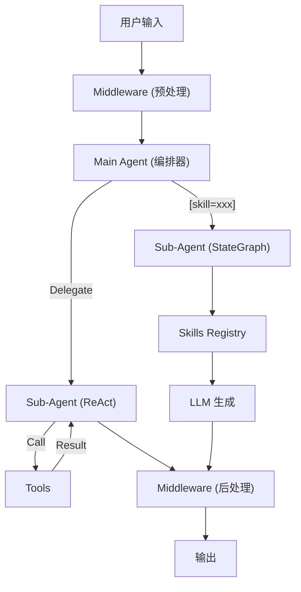

# LangChain DeepAgent 开发最佳实践指南

本文档基于对 `article_agent` (Deep Agent 架构文章生成版) 和 `agent_langchain` (Deep Agent 架构数据分析版) 的代码分析，总结了使用 LangChain DeepAgent 库开发高可靠性 Agent 系统的最佳实践。

## 1. 核心架构设计 (Architecture Patterns)

### 分层多智能体架构 (Hierarchical Multi-Agent)
推荐采用 **主智能体 (Main Agent) + 子智能体 (Sub-Agents)** 的分层结构。
*   **Main Agent**: 负责任务分发、流程编排、状态管理。它不直接执行具体工具，而是调用 Sub-Agent。
*   **Sub-Agent**: 专注特定领域任务（如 SQL 查询、Python 执行、文章撰写）。

### Sub-Agent 的两种实现模式

根据任务的确定性程度，选择不同的实现方式：

| 模式 | 实现类 | 适用场景 | 示例 |
| :--- | :--- | :--- | :--- |
| **LLM 驱动模式** | `CompiledSubAgent` | 任务灵活、步骤不固定、强依赖语义理解。 | `sql_agent`, `planner_agent`, `researcher_agent` |
| **固化流模式 (StateGraph)** | `StateGraph` | 步骤严格固定、对数据准确性要求极高、容易幻觉的场景。 | `python_agent`, `visualizer_agent`, `report_agent` |

> **最佳实践**: 对于关键的数据处理流程（如"先看数据再写代码"），不要依赖 LLM 自行决定调用顺序，应使用 `StateGraph` 将流程固化为代码逻辑（Code-First），仅在需要生成的环节调用 LLM。这能彻底解决幻觉和步骤跳过问题。

## 2. 状态管理与上下文传递 (State & Context)

### 全局唯一标识 (Analysis/Article ID)
*   **必须性**: 在多 Agent 协作中，必须有一个全局 ID (`analysis_id` 或 `article_id`) 贯穿始终，用于关联文件、数据和上下文。
*   **传递机制**:
    *   **Prompt 显式传递**: Main Agent 在调用 Sub-Agent 时，必须在 `description` 中包含 ID（例如 `description="[analysis_id=xyz] 查询..."`）。
    *   **Middleware 隐式注入**: 使用 Middleware (`AnalysisIDMiddleware`) 自动从上下文提取 ID 并注入到 Tool 的参数中，防止 LLM 忘记传参。

### 共享存储 (Shared Store)
*   使用 `InMemoryStore` 或持久化 Store 在不同 Agent 线程间共享数据（如生成的文章内容、临时数据表路径）。

## 3. 提示词工程 (Prompt Engineering)

### 严格的流程控制
*   在 `MAIN_AGENT_PROMPT` 中明确定义标准工作流（SOP）。
*   使用 **"严禁..."**, **"必须..."** 等强硬措辞约束行为。
*   明确“完成条件”，例如“只有收到 `report_agent` 的 Markdown 输出才算结束”。

### 结构化输入输出
*   Sub-Agent 的 System Prompt 中应包含详细的参数说明和示例。
*   对于需要精确格式的输出（如 JSON），使用 Pydantic Model (`response_format`) 结合 Middleware 强制格式化。

## 4. 工具设计与调用控制 (Tooling)

### 强制工具调用 (Forced Tool Calling)
对于必须执行动作的 Agent（如 `planner` 必须生成大纲），不要让 LLM 选择是否调用工具，而是使用 `tool_choice="required"` 或绑定特定工具名。
```python
# 示例: 强制 planner 必须调用 generate_outline_tool
planner_llm_forced = planner_llm.bind_tools(
    [generate_outline_tool],
    tool_choice={"type": "function", "function": {"name": "generate_outline_tool"}}
)
```

### 专注于原子能力
*   工具功能应单一且原子化（如 `db_run_sql` 只跑 SQL，不负责解释）。
*   复杂的逻辑组合应交给 Graph 或 Agent 编排。

## 5. 多模态输入与 Content Block 处理 (Content Blocks)

现代 Agent 系统通常需要处理多模态输入（如文件上传）。消息内容不再是单纯的字符串，而是 **Content Block 列表**。

### 消息结构
前端上传的文件通常以 Block 形式封装在 `HumanMessage` 中：
```python
# HumanMessage.content 示例
[
    {"type": "text", "text": "分析这个文档"},
    {
        "type": "file", 
        "mimeType": "application/pdf", 
        "data": "base64_encoded_string...",
        "metadata": {"filename": "report.pdf"}
    }
]
```

### 处理策略
不要让 Agent 直接处理巨大的 Base64 字符串。应使用 Middleware 在 `before_agent` 阶段进行预处理：

1.  **拦截 (Intercept)**: 检查 `message.content` 是否为 List 类型。
2.  **提取 (Extract)**: 识别 `type="file"` 的 Block，解码 Base64 数据并保存到共享工作区 (`/data/workspace/uploads/`)。
3.  **替换 (Replace)**: 将 File Block 替换或追加为包含**文件绝对路径**的 Text Block。
    *   *Before*: `[FileBlock(data=...)]`
    *   *After*: `[TextBlock(text="用户上传了文件: /data/workspace/uploads/report.pdf")]`

> **最佳实践**: 参考 `PDFAttachmentMiddleware` 的实现，将多模态数据流转换为 LLM 易于理解的文本路径引用，实现**"文件输入 -> 路径引用 -> 工具读取"**的闭环。

## 6. 中间件机制 (Middleware)

充分利用 Middleware 处理切面逻辑，保持业务代码纯净：

*   **Result Bubbling**: (`ArticleContentMiddleware`, `StructuredOutputToTextMiddleware`) 将 Sub-Agent 的复杂执行结果（如生成的长文、图表数据）提取并"冒泡"给 Main Agent 或前端，防止被 LLM 总结时丢失细节。
*   **Logging & Debug**: (`ThinkingLoggerMiddleware`) 记录思维链和工具调用参数，便于调试。
*   **Validation**: (`IllustratorValidationMiddleware`) 在 Agent 返回结果前拦截并校验（如检查生成图片路径是否存在），自动修复错误。

## 6. 防错与自愈 (Robustness)

*   **Reviewer Loop**: 引入 `reviewer_agent` 对生成内容（代码、文章）进行审核。如果审核不通过，打回重写。
*   **Programmatic Fallback**: 在 `StateGraph` 中，如果 LLM 生成代码失败，可以捕获异常并返回错误信息，或者回退到安全模式。
*   **System Hints**: 在工具输出中注入 `[SYSTEM HINT]`（如 "`DO NOT FINISH, Call report_agent next`"），在上下文中即时纠正 Main Agent 的行为。

## 7. 文件系统与工作区 (Filesystem Backend)

DeepAgent 使用 `Backend` 抽象来管理文件操作。正确配置 Backend 对于安全性和数据隔离至关重要。

### 推荐配置
使用 `CompositeBackend` 组合文件系统和内存存储：

```python
backend=lambda rt: CompositeBackend(
    default=FilesystemBackend(
        root_dir="/data/workspace",  # 此为容器内绝对路径
        virtual_mode=True            # 开启沙箱模式，RESTRICT 文件操作在此目录及其子目录内
    ),
    routes={
        "/_shared/": StoreBackend(rt),  # 将特定路径路由到内存/Redis Store，用于跨 Agent 高速共享
    }
)
```

### 最佳实践
1.  **开启 Virtual Mode**: 务必设置 `virtual_mode=True`，防止 Agent 越权访问系统敏感文件（如 `/etc/passwd`）。
2.  **统一工作区根目录**: 所有 Tool 的操作路径应基于此根目录。
3.  **Artifact 目录结构**: 建议按 ID 隔离 Artifacts，例如 `/data/workspace/artifacts/{analysis_id}/`，避免不同任务间文件冲突。

## 8. 技能模式 (Skills Pattern)

当一个 Agent 需要处理多种类型的任务（如通用分析、统计分析、机器学习）时，推荐使用 **Skills 模式** 替代多个独立 Agent。

### 核心设计
```python
# skills/registry.py
SKILLS_REGISTRY = {
    "general": "通用数据处理指令...",
    "statistics": "统计分析专用指令（包含 scipy/statsmodels 示例）...",
    "ml": "机器学习指令（包含 sklearn pipeline 示例）...",
}
```

### 调用方式
Main Agent 通过标签指定技能：
```
[skill=statistics] 对 result DataFrame 执行回归分析
```

Python Agent 的 `step2_llm_generate_code` 动态解析标签，将对应的技能指令注入到 System Prompt 中。

### 优势
| 对比项 | 多 Agent 模式 | Skills 模式 |
| :--- | :--- | :--- |
| 上下文共享 | 需显式传递 DataFrame 路径 | 同一 Python 环境，直接复用 `df` 变量 |
| Graph 复杂度 | 节点多，路由复杂 | 单一 Agent，内部切换 Prompt |
| 扩展性 | 新增 Agent 需改图 | 仅需更新 `SKILLS_REGISTRY` |

## 9. 总结架构图


