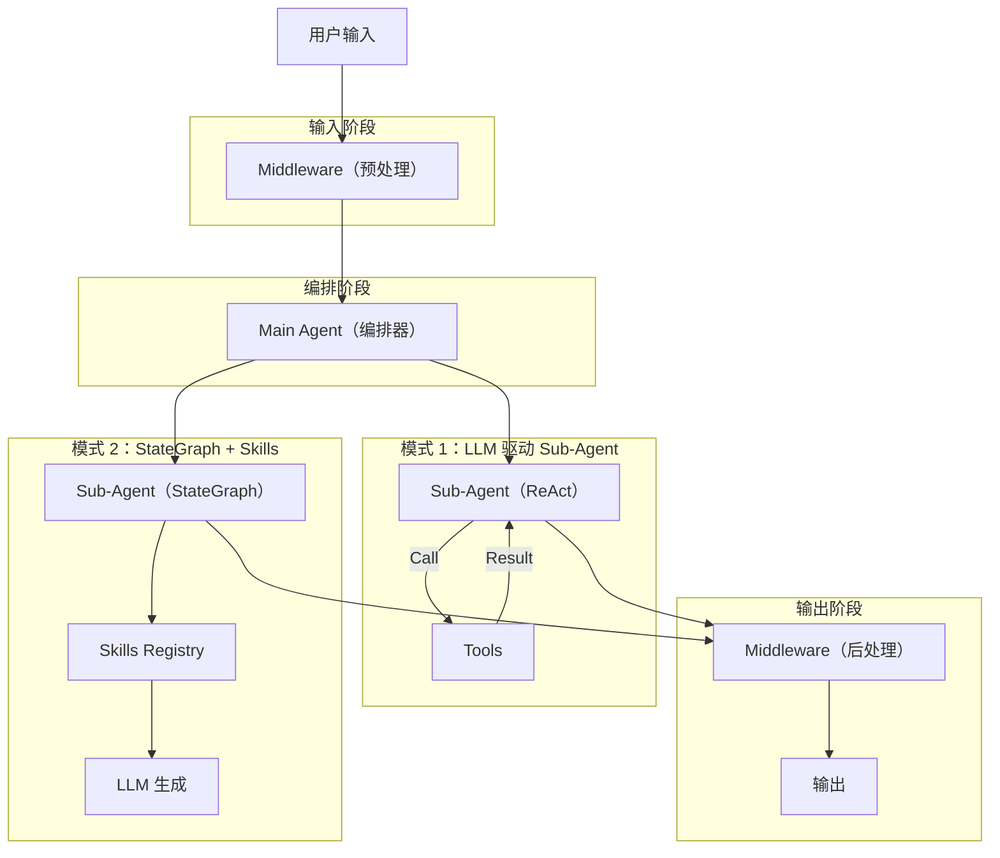

# LangChain DeepAgent 开发最佳实践指南

本文档基于对 `article_agent` (Deep Agent 架构文章生成版) 和 `agent_langchain` (Deep Agent 架构数据分析版) 的代码分析，总结了使用 LangChain DeepAgent 库开发高可靠性 Agent 系统的最佳实践。

## 1. 核心架构设计 (Architecture Patterns)

### 分层多智能体架构 (Hierarchical Multi-Agent)
推荐采用 **主智能体 (Main Agent) + 子智能体 (Sub-Agents)** 的分层结构。
*   **Main Agent**: 负责任务分发、流程编排、状态管理。它不直接执行具体工具，而是调用 Sub-Agent。
*   **Sub-Agent**: 专注特定领域任务（如 SQL 查询、Python 执行、文章撰写）。

### Sub-Agent 的两种实现模式

根据任务的确定性程度，选择不同的实现方式：

| 模式 | 实现类 | 适用场景 | 示例 |
| :--- | :--- | :--- | :--- |
| **LLM 驱动模式** | `CompiledSubAgent` | 任务灵活、步骤不固定、强依赖语义理解。 | `planner_agent`, `researcher_agent` |
| **固化流模式 (StateGraph + Command)** | `StateGraph` | 步骤严格固定、对数据准确性要求极高、容易幻觉的场景。 | `sql_agent`, `python_agent`, `visualizer_agent`, `report_agent` |

> **最佳实践**: 对于关键的数据处理流程（如"先看数据再写代码"），不要依赖 LLM 自行决定调用顺序，应使用 `StateGraph` 将流程固化为代码逻辑（Code-First），仅在需要生成的环节调用 LLM。这能彻底解决幻觉和步骤跳过问题。

## 2. 状态管理与资源共享 (State Management & Resource Sharing)

### 全局唯一标识 (Analysis/Article ID)
*   **必须性**: 在多 Agent 协作中，必须有一个全局 ID (`analysis_id` 或 `article_id`) 贯穿始终，用于关联文件、数据和上下文。
*   **传递机制 (Config Propagation)**:
    *   **推荐方式**: 通过 LangChain/LangGraph 的 `config` 对象传递。前端发起请求时将 ID 放入 `config.configurable`，后端所有 Agent、Tool 和 Middleware 均可直接从 `config` 中读取，无需污染 Prompt 或函数签名。
    *   **Frontend**: 请求体包含 `{ "configurable": { "analysis_id": "..." } }`。
    *   **Backend**: 
        *   **Agent/Tool**: `config.get("configurable", {}).get("analysis_id")`
        *   **Middleware**: `runtime.config.get("configurable", {}).get("analysis_id")` 或 `runtime.context.get("analysis_id")`

### 共享存储 (Shared Store)
使用 `runtime.store`（LangGraph BaseStore）在 Middleware 间共享数据。

> **⚠️ 重要**: `ContextVar` 在异步 Middleware 环境中**不可靠**，跨 `await` 边界可能丢失上下文。必须使用 `runtime.store`。

**最佳实践**：在 Middleware 中使用**异步 API**（`aput`/`aget`），否则会报 `Synchronous calls to BatchedStore detected` 错误。

```python
# middleware.py
class AsyncStateMiddleware(AgentMiddleware):
    async def abefore_agent(self, state, runtime):
        thread_id = state.get("configurable", {}).get("thread_id")
        # 异步读取
        await runtime.store.aget(namespace=("shared",), key=thread_id)
        return state
```

### 文件系统与工作区 (Filesystem Backend)

DeepAgent 使用 `Backend` 抽象来管理文件资源的共享与隔离。正确配置 Backend 对于安全性和数据流转至关重要。

**推荐配置 (CompositeBackend)**：
```python
backend=lambda rt: CompositeBackend(
    default=FilesystemBackend(
        root_dir="/data/workspace",  # 此为容器内绝对路径
        virtual_mode=True            # ✅ 开启沙箱模式：限制 Agent 只能访问 root_dir 及其子目录
    ),
    routes={
        "/_shared/": StoreBackend(rt),  # 将特定路径路由到内存/Redis Store，用于跨 Agent 高速共享小文件
    }
)
```

**最佳实践**：
1.  **沙箱隔离**: 务必开启 `virtual_mode=True`，防止越权访问主机敏感文件（如 `/etc/passwd`）。
2.  **按 ID 隔离**: 建议按 `analysis_id` 创建子目录（如 `/data/workspace/artifacts/{analysis_id}/`），防止不同任务间文件冲突。
3.  **统一根目录**: 所有 Tool 的文件操作路径都应基于此根目录。

## 3. 提示词工程 (Prompt Engineering)

### 严格的流程控制
*   在 `MAIN_AGENT_PROMPT` 中明确定义标准工作流（SOP）。
*   使用 **"严禁..."**, **"必须..."** 等强硬措辞约束行为。
*   明确“完成条件”，例如“只有收到 `report_agent` 的 Markdown 输出才算结束”。

### 提示词纯净原则 (Clean Prompts)
*   **分离业务与基建**：Prompt 应专注于“做什么”和“怎么做”（业务逻辑），而不是“怎么传参”（基础设施）。
*   **无需手动传递 ID**：配置信息（如 `analysis_id`、`user_id`）应由代码层自动处理，**严禁**在 Prompt 中要求 LLM 手动提取或传递这些 ID。这能减少 Token 消耗并降低幻觉风险。

### 结构化输入输出
*   Sub-Agent 的 System Prompt 中应包含详细的参数说明和示例。
*   对于需要精确格式的输出（如 JSON），使用 Pydantic Model (`response_format`) 结合 Middleware 强制格式化。

### response_format 与 Agent 终止条件

在 DeepAgent/LangGraph 中，`response_format` 参数不仅控制输出格式，更重要的是**定义 Agent 的终止条件**。

#### 支持的类型
| 类型 | 示例 | 说明 |
| :--- | :--- | :--- |
| **Pydantic Model** | `MainAgentOutput` | ✅ 推荐。LLM 必须调用此"响应工具"才算完成。 |
| **ToolStrategy(Model)** | `ToolStrategy(MainAgentOutput)` | ✅ 推荐。将 Schema 包装为工具调用。 |
| **None** | `response_format=None` | ⚠️ 危险。行为不稳定，可能立即结束或无限循环。 |
| **str** | `response_format=str` | ❌ 不支持。框架会报错。 |

#### 行为对比
| 配置 | Agent 行为 |
| :--- | :--- |
| 有 `response_format` | LLM 必须调用"响应工具"才终止，行为可预测 |
| 无 `response_format` | LLM 输出纯文本即终止，可能过早结束或死循环 |

#### 最佳实践
```python
from langchain.agents.structured_output import ToolStrategy

class MainAgentOutput(BaseModel):
    """简化版：只保留必要字段，复杂数据由 Middleware 注入。"""
    summary: str = Field(description="任务完成后的简短总结")
    confidence: str = Field(description="low/medium/high")
    # chart/report 等数据由 FileContentInjectionMiddleware 从文件注入

response_format = ToolStrategy(MainAgentOutput)
```

> **注意**: 如果使用 Middleware 从文件系统注入 Chart/Report 等大数据，Schema 中就不需要包含这些字段，可以显著简化 LLM 的输出负担。

## 4. 工具设计与调用控制 (Tooling)

### 强制工具调用 (Forced Tool Calling)
对于必须执行动作的 Agent（如 `planner` 必须生成大纲），不要让 LLM 选择是否调用工具，而是使用 `tool_choice="required"` 或绑定特定工具名。
```python
# 示例: 强制 planner 必须调用 generate_outline_tool
planner_llm_forced = planner_llm.bind_tools(
    [generate_outline_tool],
    tool_choice={"type": "function", "function": {"name": "generate_outline_tool"}}
)
```

### 专注于原子能力
*   工具功能应单一且原子化（如 `db_run_sql` 只跑 SQL，不负责解释）。
*   复杂的逻辑组合应交给 Graph 或 Agent 编排。

### 上下文感知工具与全栈传递 (Context-Aware Tools & Full-Stack Propagation)

在 LangGraph 里，**运行时配置 (Runtime Config) ≠ Agent 初始化参数**。它是在每一次 `run` / `invoke` 时动态传入的上下文参数。

**典型用途**:
1.  **用户身份**: `user_id`, `session_id`
2.  **功能开关**: 前端传来的开关（如 `enable_chart_generation=true`）
3.  **动态模型**: 此次运行指定的模型（如 `model_name="gpt-4"`）
4.  **业务参数**: 风格、字数限制、目标语言
5.  **调试控制**: `trace=true`, debug 标记
6.  **资源配置**: `backend` 路径, `runtime.store` 命名空间

在 LangGraph CLI 部署模式下，`configurable` 参数是连接前端与后端工具的桥梁。

#### 1. 前端传递 (Frontend Request)
调用 LangGraph API (`POST /threads/{thread_id}/runs`) 时，将业务 ID 放入 `config.configurable` 字段。

```javascript
// 前端请求示例
await fetch(`/api/threads/${threadId}/runs`, {
  method: 'POST',
  body: JSON.stringify({
    assistant_id: 'agent_name',
    input: { messages: [...] },
    // ✅ 关键：放入 configurable
    config: {
      configurable: {
        analysis_id: "idx_123",
        user_id: "usr_456"
      }
    }
  })
})
```

#### 2. 后端接收 (Backend Access: Tool & Node)
LangGraph 会自动将 API 请求中的 `config` 注入到 **Tool** 和 **Node** 的执行上下文中。

> **注意**: 凡是被 `Runnable` 接口调用或包装的函数（包括 Tool 和 Node），只要签名中包含 `config` 参数，运行时都会自动注入配置。

*   **定义**: 函数必须包含 `config: RunnableConfig` 参数。
*   **读取**: 直接从 `config["configurable"]` 获取。

**示例 1: Tool (工具)**
```python
from langchain_core.runnables import RunnableConfig

@tool
def my_tool(arg1: str, config: RunnableConfig) -> str:
    # ✅ 正确：从 config 读取上下文
    analysis_id = config.get("configurable", {}).get("analysis_id")
    # ...
```

**示例 2: Node (普通节点函数)**
```python
def my_node(state: AgentState, config: RunnableConfig) -> dict:
    # ✅ Node 同样可以接收 config
    user_id = config.get("configurable", {}).get("user_id")
    return {"status": "processing", "user": user_id}
```

#### 3. Middleware 获取 (Middleware Access)
在 LangGraph Runtime 中，Middleware 的所有 Hook 方法（如 `awrap_tool_call`, `abefore_agent`, `aafter_agent`）都可以通过 `runtime.context` 访问这些值。

*   **场景**: 在 `awrap_tool_call`（拦截工具）或 `aafter_agent`（结果处理）中访问全局配置。
*   **方式**: 优先检查 `runtime.context`。

```python
class MyMiddleware(AgentMiddleware):
    # 示例 1: 拦截工具调用
    async def awrap_tool_call(self, request, handler):
        analysis_id = self._get_config_value(request.runtime, "analysis_id")
        return await handler(request)

    # 示例 2: 处理 Agent 结果
    async def aafter_agent(self, state, runtime, result):
        analysis_id = self._get_config_value(runtime, "analysis_id")
        # 使用 analysis_id 读取文件或处理结果...
        return result
        
    def _get_config_value(self, runtime, key):
        # 1. 尝试从 runtime.context 获取 (LangGraph CLI)
        if hasattr(runtime, "context") and isinstance(runtime.context, dict):
            val = runtime.context.get(key)
            if val: return val
            
        # 2. 回退到 runtime.config
        config = getattr(runtime, "config", {})
        return config.get("configurable", {}).get(key)
```

## 5. 多模态文件流处理 (Multimodal File Flow)

处理用户上传文件（PDF/Image/Excel）的核心挑战是：**LLM 上下文窗口限制与 Token 成本**。直接将文件 Base64 放入 Prompt 是不可持续的。

### 核心策略：Payload Offloading (负载卸载)

使用 Middleware 实现 **"拦截 -> 落盘 -> 引用"** 的转换机制：

1.  **拦截 (Intercept)**: 前端协议将文件封装为自定义的 `FileBlock`（包含 Base64 数据）。
2.  **落盘 (Offload)**: Middleware 识别 `type="file"`，将 Base64 解码并写入共享文件系统 (`/data/workspace/uploads/`)。
3.  **引用 (Reference)**: 将原来的 File Block **替换**为 Text Block，仅保留文件路径。

### 转换示例
**输入消息 (前端发送)**:
```json
[
  {"type": "text", "text": "分析这个文档"},
  {"type": "file", "data": "JVBERi0xLjQK...", "name": "report.pdf"}
]
```

**输出消息 (LLM 看到)**:
```text
分析这个文档
[System: 用户上传了文件: /data/workspace/uploads/report.pdf]
```

> **优势**: 
> 1. LLM 仅看到路径，零 Token 消耗。
> 2. 下游工具（如 Python/SQL Agent）可以直接读取本地文件进行处理。

## 6. 中间件机制 (Middleware)

充分利用 Middleware 处理切面逻辑，保持业务代码纯净：

*   **Result Bubbling**: (`ArticleContentMiddleware`, `StructuredOutputToTextMiddleware`) 将 Sub-Agent 的复杂执行结果（如生成的长文、图表数据）提取并"冒泡"给 Main Agent 或前端，防止被 LLM 总结时丢失细节。
*   **Logging & Debug**: (`ThinkingLoggerMiddleware`) 记录思维链和工具调用参数，便于调试。
*   **Validation**: (`IllustratorValidationMiddleware`) 在 Agent 返回结果前拦截并校验（如检查生成图片路径是否存在），自动修复错误。
*   **HITL Interrupt**: (`SubAgentHITLMiddleware`) 在指定 Sub-Agent 完成后触发中断，等待用户审核。

#### Subgraph Streaming 模式（推荐）

当 Sub-Agent 生成文件型产物（图表、报告）时，**推荐使用 subgraph streaming** 而非 Middleware 注入。Sub-Agent 直接在输出消息中包含结构化数据：

```python
# visualizer_agent 的 format_output 节点
def viz_format_final_output(state, config):
    # ... 生成图表后 ...
    chart_message = json.dumps({"type": "chart", "data": chart_data}, ensure_ascii=False)
    return {"messages": [AIMessage(content=f"VISUALIZER_AGENT_COMPLETE: {chart_message}")]}

# report_agent 的 format_output 节点  
def report_format_output(state, config):
    # ... 生成报告后 ...\
    report_message = json.dumps({"type": "report", "content": content}, ensure_ascii=False)
    return {"messages": [AIMessage(content=f"REPORT_AGENT_COMPLETE: {report_message}")]}
```

#### 思考内容过滤 (无 `--reasoning-parser` 场景)

当 vLLM 未启用 `--reasoning-parser`（如 Qwen3 存在兼容性问题时），模型的思考过程会以 `<think>...</think>` 标签形式包含在原始文本中。需要在后端过滤：

```python
import re

def report_step2_generate(state, config):
    # ... LLM 生成报告 ...
    content = extract_text_from_message(response)
    
    # 🚀 过滤思考内容：移除 <think>...</think> 标签及其内容
    think_pattern = r'<think>.*?</think>'
    content = re.sub(think_pattern, '', content, flags=re.DOTALL | re.IGNORECASE)
    
    # 清理多余的空行
    content = re.sub(r'\n{3,}', '\n\n', content).strip()
    
    # ... 保存报告并返回 ...
```

> **适用场景**：当无法使用服务端 reasoning parser 时，使用正则表达式在后端过滤思考内容，确保前端预览只显示最终报告。

**前端处理** (从 stream 中解析):
```javascript
// 在 stream 处理循环中
const content = msg.content
if (content && typeof content === 'string') {
    // 解析 VISUALIZER_AGENT_COMPLETE
    if (content.startsWith('VISUALIZER_AGENT_COMPLETE:')) {
        const jsonStr = content.substring('VISUALIZER_AGENT_COMPLETE:'.length).trim()
        const parsed = JSON.parse(jsonStr)
        if (parsed.type === 'chart' && parsed.data) {
            chartConfig.value = parsed.data.option || parsed.data
            renderChart()
        }
    }
    // 解析 REPORT_AGENT_COMPLETE
    if (content.startsWith('REPORT_AGENT_COMPLETE:')) {
        const jsonStr = content.substring('REPORT_AGENT_COMPLETE:'.length).trim()
        const parsed = JSON.parse(jsonStr)
        if (parsed.type === 'report') {
            analysisResult.value = parsed.content
        }
    }
}
```

> **优势**: 
> 1. 无需额外 Middleware，代码更简洁
> 2. 前端实时收到数据，无需等待整个工具调用完成
> 3. 利用 `stream_subgraphs: true` 的原生能力

### Middleware 同步/异步 Hook
LangChain AgentMiddleware 同时支持同步和异步版本的 hook 方法：

| 同步方法 | 异步方法 |
|---------|----------|
| `before_agent` | `abefore_agent` |
| `after_agent` | `aafter_agent` |
| `wrap_tool_call` | `awrap_tool_call` |
| `wrap_model_call` | `awrap_model_call` |

**优先使用异步版本**，因为 `runtime.store` 要求使用 `aput()`/`aget()` 异步 API。


## 7. LangGraph Command 模式 (Dynamic Routing)

LangGraph 提供了两种方式来控制节点间的流程跳转：

### 传统方式：`add_conditional_edges`
```python
def check_retry(state):
    if state.get("error_feedback") and state.get("retry_count", 0) < 3:
        return "retry"
    return "continue"

graph.add_conditional_edges("execute", check_retry, {"retry": "generate", "continue": "output"})
```
**缺点**：逻辑分散在两处（节点函数 + routing 函数），不易维护。

### 推荐方式：`Command` 模式
将状态更新和流程跳转合并到节点函数内部，返回 `Command` 对象：
```python
from langgraph.types import Command
from typing import Literal

def step_execute(state: State) -> Command[Literal["generate", "output"]]:
    result = execute_code(state.get("code"))
    
    if not result.success and state.get("retry_count", 0) < 3:
        return Command(
            update={"error_feedback": result.error, "retry_count": state["retry_count"] + 1},
            goto="generate"  # 重试
        )
    
    return Command(update={"result": result.output}, goto="output")
```

### 最佳实践
1. **类型注解**：使用 `-> Command[Literal["node_a", "node_b"]]` 明确可跳转节点，IDE 和类型检查器可捕获错误。
2. **逻辑内聚**：所有判断逻辑集中在节点函数内，无需额外的 routing 函数。
3. **简化 Graph 定义**：无需 `add_conditional_edges`，Graph 构建代码更简洁。

---

## 8. Human-in-the-Loop (HITL) 集成

对于需要用户审核的关键步骤（如图表生成、报告生成），使用 **`SubAgentHITLMiddleware`** 在 Middleware 层实现中断。

### 后端：SubAgentHITLMiddleware

```python
from typing import Dict, List, Union
from langgraph.types import interrupt
from langchain_core.messages import ToolMessage

class SubAgentHITLMiddleware(AgentMiddleware):
    def __init__(
        self,
        interrupt_subagents: List[str] = None,
        allowed_decisions: List[str] = None,
        description: Union[str, Dict[str, str]] = "Please confirm to proceed"  # ✅ 支持动态描述
    ):
        super().__init__()
        self.interrupt_subagents = interrupt_subagents or ["visualizer_agent", "report_agent"]
        self.allowed_decisions = allowed_decisions or ["approve", "reject"]
        self.description = description
    
    async def awrap_tool_call(self, request, handler):
        tool_call = request.tool_call
        tool_name = tool_call.get('name', '') if isinstance(tool_call, dict) else getattr(tool_call, 'name', '')
        args = tool_call.get('args', {}) if isinstance(tool_call, dict) else getattr(tool_call, 'args', {})
        tool_call_id = tool_call.get('id', '') if isinstance(tool_call, dict) else getattr(tool_call, 'id', '')
        
        if tool_name == 'task':
            subagent_type = args.get('subagent_type', '')
            
            if subagent_type in self.interrupt_subagents:
                # 1. 先执行 subagent
                response = await handler(request)
                
                # 2. 提取预览内容 (用于前端展示)
                preview_content = None
                if isinstance(response, str):
                    preview_content = response
                elif hasattr(response, 'content'):
                    preview_content = response.content
                
                # 3. 动态获取描述 (支持 Dict 按 agent 类型配置)
                if isinstance(self.description, dict):
                    desc = self.description.get(subagent_type, self.description.get("default", "操作完成，请确认是否继续"))
                else:
                    desc = self.description
                
                # 4. 触发中断，等待用户审核
                interrupt_res = interrupt({
                    "action_requests": [{"name": subagent_type, "args": args, "description": desc}],
                    "review_configs": [{"action_name": subagent_type, "allowed_decisions": self.allowed_decisions}],
                    "preview": preview_content  # ✅ 包含 subagent 输出供前端预览
                })
                
                # 5. 处理用户决策
                if isinstance(interrupt_res, dict) and "decisions" in interrupt_res:
                    decision = interrupt_res["decisions"][0]
                    if decision.get("type") == "reject":
                        feedback = decision.get("message", "用户拒绝")
                        # ✅ 必须返回 ToolMessage，否则 deepagents.FilesystemBackend 会报错
                        return ToolMessage(content=f"USER_INTERRUPT: {feedback}", tool_call_id=tool_call_id)
                
                # 6. 用户批准，返回 ToolMessage
                if subagent_type == "visualizer_agent":
                    content = "USER_APPROVED: Chart approved."
                elif subagent_type == "report_agent":
                    content = "USER_APPROVED: Report approved."
                else:
                    content = f"USER_APPROVED: {subagent_type} approved."
                
                return ToolMessage(content=content, tool_call_id=tool_call_id)
        
        return await handler(request)
```

> **⚠️ 关键点**：
> 1. **返回 `ToolMessage`**：`deepagents.FilesystemBackend` 的 `_intercept_large_tool_result` 方法期望工具返回 `ToolMessage` 类型，返回普通字符串会抛出 `AssertionError`。
> 2. **动态 description**：支持传入 `Dict[str, str]`，为不同 subagent 配置不同的提示语。
> 3. **preview 字段**：将 subagent 的输出包含在 interrupt payload 中，供前端预览。

### 配置示例 (graph.py)

```python
from agent_core.middleware import SubAgentHITLMiddleware

graph = create_deep_agent(
    # ...
    middleware=[
        SubAgentHITLMiddleware(
            interrupt_subagents=["visualizer_agent", "report_agent"],
            allowed_decisions=["approve", "reject"],
            description={
                "visualizer_agent": "图表生成完成，请确认是否继续",
                "report_agent": "报告生成完成，请确认是否继续",
                "default": "操作完成，请确认是否继续"
            },
        ),
    ],
)
```

### 前端：InterruptBlock 组件

Vue 组件需要处理嵌套的 interrupt payload 结构，并区分图表预览和报告预览。

#### 核心：数据解包 (unwrapData)

interrupt payload 可能被多层包装（如 `{type: "interrupt", __interrupt__: [...]}`），需要递归解包：

```typescript
function unwrapData(data: any): any {
  if (!data) return null
  
  // 找到目标字段即返回
  if (data.action_requests || data.preview || data.review_configs) {
      return data
  }
  
  // 解包 .interrupt 或 .__interrupt__
  if (data.interrupt && Array.isArray(data.interrupt)) {
      return unwrapData(data.interrupt[0])
  }
  if (data.__interrupt__ && Array.isArray(data.__interrupt__)) {
      return unwrapData(data.__interrupt__[0])
  }
  
  // 解包数组
  if (Array.isArray(data)) {
      return unwrapData(data[0])
  }

  return data
}
```

#### 预览类型检测与渲染

```typescript
const previewContent = computed(() => {
  const data = unwrapData(props.interruptData)
  if (!data?.preview) return null
  
  if (typeof data.preview === 'string') {
    let jsonStr = data.preview
    
    // 移除前缀
    if (jsonStr.includes('VISUALIZER_AGENT_COMPLETE:')) {
      jsonStr = jsonStr.replace('VISUALIZER_AGENT_COMPLETE:', '').trim()
    } else if (jsonStr.includes('REPORT_AGENT_COMPLETE:')) {
      jsonStr = jsonStr.replace('REPORT_AGENT_COMPLETE:', '').trim()
    }
    
    try {
      const parsed = JSON.parse(jsonStr)
      
      // 图表类型：返回 chart data 供 ChartRenderer 渲染
      if (parsed.type === 'chart' && parsed.data) {
        return parsed.data
      }
      
      // 报告类型：返回 markdown content 供 MarkdownRenderer 渲染
      if (parsed.type === 'report' && parsed.content) {
        return parsed.content
      }
    } catch { }
  }
  
  return data.preview
})

const previewType = computed(() => {
  // ... 类似逻辑判断返回 'chart' | 'text'
})
```

#### 模板结构

```vue
<template>
  <div class="interrupt-block">
    <div class="interrupt-header">
      <el-icon class="status-icon warning"><Warning /></el-icon>
      <span class="label">等待用户审核</span>
    </div>
    
    <!-- 描述区域 -->
    <div v-if="interruptDescription" class="description-section">
      <MarkdownRenderer :content="interruptDescription" />
    </div>

    <!-- 预览区域 -->
    <div v-if="previewContent" class="preview-section">
      <ChartRenderer v-if="previewType === 'chart'" :chartData="previewContent" />
      <MarkdownRenderer v-else :content="previewContent" />
    </div>
    
    <!-- 操作按钮 -->
    <div class="action-buttons">
      <el-button type="success" @click="handleApprove">批准</el-button>
      <el-button type="danger" @click="handleReject">拒绝</el-button>
    </div>
  </div>
</template>
```

### Main Agent 反馈透传

当用户拒绝后，Middleware 返回的 `USER_INTERRUPT` 消息会包含用户反馈。Main Agent 会自动将反馈包含在重新调用 Sub-Agent 的 `description` 中：

```
# Middleware 返回
USER_INTERRUPT: 用户反馈: 去掉折线上的标签。请根据反馈修改后再次调用 visualizer_agent。

# Main Agent 调用 Sub-Agent
task(subagent_type='visualizer_agent', description='用户反馈：去掉折线上的标签。请根据此反馈修改图表。')
```

---

## 9. 防错与自愈 (Robustness Patterns)

### 1. Error-as-Input (错误即输入自愈)
当工具执行失败（如 Python 代码报错）时，将 stderr 作为 Input 返回给当前 Agent。
*   **ReAct 模式**: 让 LLM 在同一个 Loop 中根据错误自修正代码。
*   **Graph 模式**: 配置 `conditional_edge`，如果连续 N 次修正失败，自动路由到 `HumanFallback` 节点。

### 2. 节点内重试机制
在执行节点（如 `python_execute`、`sql_execute`）内部实现重试逻辑，结合 Command 模式使用：

```python
def step_execute(state: State) -> Command[Literal["generate", "output"]]:
    retry_count = state.get("retry_count", 0)
    
    try:
        result = execute(state["code"])
        if not result.success:
            raise ExecutionError(result.error)
        return Command(update={"result": result}, goto="output")
    
    except Exception as e:
        if retry_count < 3:  # 熔断阈值
            return Command(
                update={"retry_count": retry_count + 1, "error_feedback": str(e)},
                goto="generate"  # 回到 LLM 重新生成
            )
        else:
            # 超过重试次数，强制结束并输出错误
            return Command(
                update={"result": f"执行失败: {e}"},
                goto="output"
            )
```

**最佳实践**:
1. **熔断机制**：设置最大重试次数（通常 3 次），超过后强制结束，避免无限循环。
2. **错误反馈**：将错误信息存入 `error_feedback` 状态，LLM 可在下次生成时参考修正。

### 3. Reviewer Loop (图层级审核循环)
不要让生成节点直接连接结束。在 `Generate` 和 `End` 之间插入 `Review` 节点。
*   **Agent-Reviewer**: 引入专门的 `reviewer_agent`（配置更严格的 Prompt）对生成内容进行审核。不通过则路由回 `Generate` 重写。
*   **Human-in-the-loop**: 在任意关键节点（如生成图表后、生成报告后）使用 `interrupt` 暂停，等待用户确认或修改。

### 4. System Hints (系统旁白/导航)
在 Tool 的输出结果中动态注入 `[SYSTEM HINT]`（如 "`DO NOT FINISH, Call report_agent next`"）。
*   **作用**: 像 GPS 导航一样，在多步任务执行中即时纠正 Agent 的下一步行动，防止其在长 Context 中遗忘最终目标或过早结束。


## 10. Python 沙箱执行 (Python Sandbox Execution)

在动态执行用户/LLM 生成的 Python 代码时，需要特别注意 Python 3 的作用域规则。

### exec() 中的作用域陷阱

Python 的 `exec(code, globals, locals)` 在传入单独的 `locals` 字典时，会遇到**列表推导式作用域问题**：

> **Python 3 中，列表推导式、生成器表达式、字典推导式等都有独立的作用域**，它们只能访问 `globals`，无法访问 `exec()` 的 `locals`。

**反模式 (会导致 `NameError: name 'df' is not defined`)**:
```python
# ❌ 错误：使用单独的 locals 字典
safe_globals = {"load_dataframe": load_dataframe}
safe_locals = {}

code = '''
df = load_dataframe('result')
chart = {"series": [x for x in df.columns]}  # 列表推导式内部无法访问 df！
'''

exec(code, safe_globals, safe_locals)  # 报错！
```

**最佳实践 (只用 globals)**:
```python
# ✅ 正确：所有变量存入 globals，不使用单独的 locals
safe_globals = {"load_dataframe": load_dataframe}

code = '''
df = load_dataframe('result')
chart = {"series": [x for x in df.columns]}  # df 在 globals 中，推导式可访问
'''

exec(code, safe_globals)  # 成功！
```

### 关键要点
1.  **只传 `globals`**，不要传单独的 `locals` 参数
2.  **用户定义的变量**（如 `df`）会存入 `globals` 字典中
3.  这是 Python 3 的语言特性，与 LangChain 无关

## 11. 技能模式 (Skills Pattern)

当一个 Agent 需要处理多种类型的任务（如通用分析、统计分析、机器学习）时，推荐使用 **Skills 模式** 替代多个独立 Agent。

### 核心设计
```python
# skills/registry.py
SKILLS_REGISTRY = {
    "general": "通用数据处理指令...",
    "statistics": "统计分析专用指令（包含 scipy/statsmodels 示例）...",
    "ml": "机器学习指令（包含 sklearn pipeline 示例）...",
}
```

### 调用方式
Main Agent 通过标签指定技能：
```
[skill=statistics] 对 result DataFrame 执行回归分析
```

Python Agent 的 `step2_llm_generate_code` 动态解析标签，将对应的技能指令注入到 System Prompt 中。

### 优势
| 对比项 | 多 Agent 模式 | Skills 模式 |
| :--- | :--- | :--- |
| 上下文共享 | 需显式传递 DataFrame 路径 | 同一 Python 环境，直接复用 `df` 变量 |
| Graph 复杂度 | 节点多，路由复杂 | 单一 Agent，内部切换 Prompt |
| 扩展性 | 新增 Agent 需改图 | 仅需更新 `SKILLS_REGISTRY` |

## 12. 总结架构图



## 13. 全栈数据流最佳实践 (Full-Stack Data Flow)

在 LangGraph 流式传输场景下，确保大数据量（如图表配置）的完整性和前端解析的稳定性至关重要。以下是针对 LangChain 1.0/LangGraph 的关键优化模式。

### 后端序列化 (Backend Serialization)
LangGraph 在 `stream_mode="values"` 时，默认会将 Pydantic 状态对象转换为字符串流式传输。如果未做处理，输出的是 Python 对象的 `repr()`（如 `{'key': True}`），这会导致前端 JSON 解析失败。

**最佳实践**：
在 Pydantic 模型（如 `MainAgentOutput`）中重写 `__str__` 方法，强制返回标准 JSON。

```python
class MainAgentOutput(BaseModel):
    # ... fields ...

    def __str__(self):
        """Override string representation to return valid JSON.
        Ensures LangGraph streams valid JSON instead of Python object repr.
        """
        try:
            return self.model_dump_json(exclude_none=True)
        except Exception:
            return super().__str__()
```

### 前端流式解析 (Frontend SSE Parsing)
网络传输层会将大数据包（如几 KB 的 ECharts 配置）拆分为多个 TCP 包（Chunks）。前端不应假设每个 SSE 事件 (`data: ...`) 都应在单个 Chunk 中结束。

**反模式 (Naive Splitting)**:
```javascript
// ❌ 错误：假设 chunk.split('\n') 能完美分割 lines
const lines = chunk.split('\n') 
for (const line of lines) JSON.parse(line) // 如果 JSON 被截断则报错
```

**最佳实践 (Buffer Mechanism)**:
前端必须维护一个 Buffer 来拼接跨 Chunk 的数据。

```javascript
// ✅ 正确：使用 Buffer 拼接
let buffer = ''
while (reader) {
  const { value } = await reader.read()
  buffer += decoder.decode(value, { stream: true })
  
  const lines = buffer.split('\n')
  // 保留最后一行（可能是半截数据），留待下一次拼接
  buffer = lines.pop() || '' 
  
  for (const line of lines) {
    if (line.startsWith('data: ')) process(line)
  }
}
```

### 消息过滤 (Message Filtering)
虽然 Main Agent 被强制要求返回结构化输出（JSON），但在使用 Middleware 模式时，LangGraph 仍会广播两条语义重复的消息：
1.  **原始节点消息**: `MainAgent` 节点的直接输出（标准 JSON）。
2.  **Middleware 消息**: 经过 Middleware 再次封装的协议消息（如添加 `DATA_RESULT:` 前缀）。

**最佳实践**: 
前端应通过 `msg.name` 识别并**过滤掉原始节点消息**，只消费 Middleware 封装后的协议消息。
*   **原因**: 避免界面重复渲染同一份数据。
*   **优势**: Middleware 消息通常包含了从 Context 提取的额外元数据（如 `analysis_id`），且格式统一（Text/Markdown Wrapper），比纯 JSON 更适合直接对接聊天界面渲染器。

## 14. LangChain 核心消息对象详解 (LangChain Message Objects)

LangChain 定义了一套标准的消息协议。随着多模态和 Tool Calling 的发展，这些消息对象的结构变得灵活多态。正确解析它们是前端展示和后端逻辑的基础。

### 1. AIMessage (模型输出)

代表 LLM 的响应。继承自 `BaseMessage`。

| 字段 | 类型 | 说明 |
| :--- | :--- | :--- |
| **`content`** | `str \| List[Union[str, Dict]]` | **必填**。主要文本内容。多模态场景下为 Block 列表（Text/Image）。当 `tool_calls` 存在时可能为空。 |
| **`tool_calls`** | `List[ToolCall]` | **可选**。模型生成的工具调用请求列表。每个 `ToolCall` 包含 `name` (工具名), `args` (参数字典), `id` (唯一ID)。 |
| **`usage_metadata`** | `UsageMetadata` | **可选**。Token 消耗统计（`input_tokens`, `output_tokens`, `total_tokens`）。(LangChain 0.1.17+) |
| **`response_metadata`** | `Dict` | **可选**。底层模型提供商的原始响应元数据（如 `finish_reason`, `logprobs`）。 |
| **`invalid_tool_calls`** | `List[InvalidToolCall]` | **可选**。模型生成了无法解析为合法 ToolCall 的内容（如 JSON 格式错误），用于容错处理。 |
| **`name`** | `str` | **可选**。发送者名称（通常为空，但在多 Agent 场景可用于标记身份）。 |

### 2. ToolMessage (工具结果)

代表工具执行后的返回结果。必须紧跟在发起调用的 `AIMessage` 之后。

| 字段 | 类型 | 说明 |
| :--- | :--- | :--- |
| **`content`** | `str \| List` | **必填**。工具执行结果的**字符串表示**。这是 LLM 唯一能看到的内容。务必简洁，避免 Context 溢出。 |
| **`tool_call_id`** | `str` | **必填**。对应 `AIMessage.tool_calls[i].id`，用于将结果与请求匹配。 |
| **`artifact`** | `Any` | **可选** (LangChain 0.2+)。**原始执行结果**。可以存储 DataFrame、二进制图像、Pydantic 对象等。**LLM 看不到此字段**，专供后续 ToolNode 或 Middleware 使用。 |
| **`status`** | `'success' \| 'error'` | **可选**。工具执行状态。用于在 Frontend 区分展示或 Graph 路由判断（如 Error 时重试）。 |
| **`name`** | `str` | **可选**。工具名称。 |

### 3. 解析策略表
| 场景 | 关键字段 | 处理逻辑 |
| :--- | :--- | :--- |
| **普通对话** | `AIMessage.content` | 直接显示文本。注意处理流式输出中的空字符串。 |
| **工具调用** | `AIMessage.tool_calls` | 渲染为 "正在调用工具: {name}..."。应遍历列表处理并行调用。 |
| **工具结果** | `ToolMessage.content` | 渲染为工具执行摘要。 |
| **多模态展示** | `ToolMessage.artifact` | **优先使用**。由 Middleware 提取并转换为前端特定格式（如 `DATA_RESULT`）。不要试图从 content 解析复杂数据。 |
| **错误处理** | `AIMessage.invalid_tool_calls` | 如果存在，应提示用户模型意图识别失败或自动触发重试机制。 |

> **版本提示**: 本说明基于 LangChain 1.x / `langchain-core` 0.2+ 规范。老版本（0.0.x）可能缺少 `artifact`, `status`, `usage_metadata` 等字段。

### 4. Content Block 结构与访问 (Vendor Abstraction)

LangChain 为了屏蔽底层厂商（OpenAI, Anthropic 等）的格式差异，定义了一套**标准 Content Block**。

#### 标准 Block 类型

| Block 类型 | `type` 值 | 关键字段 | 说明 | 厂商适配 (LangChain 自动处理) |
| :--- | :--- | :--- | :--- | :--- |
| **文本块** | `"text"` | `text` | 纯文本内容。 | 基础通用。 |
| **思维链** | `"reasoning"` | `reasoning` | 模型的推理过程（CoT）。 | **LangChain 标准**。DeepSeek/Anthropic 的输出正逐渐标准化为此格式。 |
| **图片块** | `"image"` | `url` / `base64` | 图片资源。 | **OpenAI** 转为 `image_url` 对象；**Anthropic** 转为 `source` 对象。 |
| **工具调用** | `"tool_use"` | `id`, `name`, `input` | 模型发起的工具调用。 | **OpenAI** 转为 `function_call`；**Anthropic** 转为 `tool_use`。 |
| **工具结果** | `"tool_result"` | `tool_use_id`, `content` | 工具执行结果。 | —— |

> **注意**：`.content_blocks` 属性只负责解析 `message.content` 字段。如果底层模型接口（Provider）尚未适配标准，将思维链放在了 `additional_kwargs` 而非 `content` 中，那么 `.content_blocks` **不会包含**思维链数据。因此需要下文的双重检查策略。

#### 构造消息（推荐使用标准格式）
```python
# ✅ 推荐: 使用 LangChain 标准格式 (跨模型通用)
msg = HumanMessage(content=[
    {"type": "text", "text": "分析这张图片"},
    {"type": "image", "url": "http://example.com/img.jpg"}
])

# ❌ 不推荐: 使用厂商原生格式 (绑定特定模型)
msg = HumanMessage(content=[
    {"type": "text", "text": "分析这张图片"},
    {"type": "image_url", "image_url": {"url": "..."}}  # OpenAI 特定格式
])
```

#### 访问消息内容（使用 `.content_blocks`）

LangChain 1.x (`langchain-core` 1.2+) 引入了 **`.content_blocks`** 属性，解决了 `content` 字段类型不确定（`str | List`）的问题：

```python
# ❌ 繁琐：手动判断 content 类型
content = msg.content
if isinstance(content, str):
    text = content
elif isinstance(content, list):
    text = "".join(b.get("text", "") for b in content if b.get("type") == "text")

# ✅ 简洁：使用 .content_blocks，始终返回 List
def extract_text_from_message(message: BaseMessage) -> str:
    blocks = message.content_blocks  # 始终是 List[ContentBlock]
    return "".join(
        block.get("text", "") 
        for block in blocks 
        if isinstance(block, dict) and block.get("type") == "text"
    )

# ✅ 提取思维链（同时兼容标准 Block 和 additional_kwargs）
def extract_reasoning(message: BaseMessage) -> str:
    # 1. 优先尝试从标准 Block 提取
    blocks = message.content_blocks
    from_blocks = "".join(
        block.get("reasoning", "") 
        for block in blocks 
        if isinstance(block, dict) and block.get("type") == "reasoning"
    )
    if from_blocks: return from_blocks
    
    # 2. 回退到 additional_kwargs (兼容旧版 DeepSeek/vLLM)
    return message.additional_kwargs.get("reasoning_content", "")
```

> **提示**: `.content_blocks` 会自动将 `str` 类型的 `content` 包装为 `[{"type": "text", "text": content}]`，确保统一的访问接口。

## 15. 思维链 (Chain of Thought) 全链路配置指南

在使用 Qwen3、DeepSeek-R1 等支持思维链 (CoT) 的推理模型时，需要从模型部署层到前端展示层进行全链路配置，以确保 `<think>` 内容能被正确解析、传输和渲染。

### 15.1 模型部署层 (vLLM)

vLLM 服务端需要显式启用推理解析器，将原始输出中的 `<think>...</think>` 标签剥离为独立的 `reasoning_content` 字段，防止其干扰 Tool Call 的解析。

| 参数 | 推荐值 | 说明 |
| :--- | :--- | :--- |
| **`--reasoning-parser`** | `qwen3` 或 `deepseek_r1` | **核心参数**。启用 vLLM 服务端解析，将思考内容与正文分离。 |
| **`--enable-auto-tool-choice`** | `True` | 允许模型在推理后自动选择工具。 |
| **`--tool-call-parser`** | `hermes` | 配合 Qwen/DeepSeek 使用的高级工具解析器。 |

### 15.2 后端服务层 (LangChain)

在后端  初始化 `ChatOpenAI` 客户端时，需启用 v1 输出格式以支持标准化的 `content_blocks`。

```python
ChatOpenAI(
    model="qwen3-thinking",
    base_url="http://vllm:8000/v1",
    parameters={
        "temperature": 0.6,       # 推荐 0.6，防止思考过程被抑制
    },
    output_version="v1",          # ✅ 关键：启用 content_blocks 解析接口
    extra_body={
        "chat_template_kwargs": {
            "enable_thinking": True  # 显式告知 vLLM 开启思考模式
        }
    }
)
```

### 15.3 消息处理与解析 (Processing)

当上述配置正确时，LangChain 会自动将 vLLM 返回的 `reasoning_content` 封装为标准的 **Reasoning Block**。

**后端提取逻辑**:
业务代码（Logger, Streamer）应直接从 `content_blocks` 读取，**无需**编写复杂的 Regex 或检查 `additional_kwargs`。

```python
# ✅ 标准化提取方式
def extract_thinking(message: AIMessage) -> str:
    thinking = ""
    # 直接遍历 content_blocks，寻找 type="reasoning"
    for block in getattr(message, 'content_blocks', []):
        if block.get('type') == 'reasoning':
            thinking += block.get('reasoning', '')
    return thinking
```

### 15.4 前端界面层 (Web UI)

Web 前端接收到的消息 `content` 将是一个结构化的 Block 数组（而非单一字符串）。UI 组件应遍历此数组进行渲染。

**数据结构示例**:
```json
// LLM Response Content
[
  {
    "type": "reasoning",
    "reasoning": "首先，我需要查询用户上传的 Excel 文件..."
  },
  {
    "type": "text",
    "text": "我已经帮您分析了数据，结果如下..."
  }
]
```

**渲染逻辑**:
*   `type="reasoning"`: 渲染在折叠面板或灰色引用块中（通常带有 "思考过程" 标签）。
*   `type="text"`: 渲染为常规 Markdown 消息。

## 16. Agent 身份识别与流式输出 (Agent Identification & Streaming)

在多 Agent 架构中，前端需要实时区分当前正在输出的是哪个 Agent（Main Agent 还是 SQL/Python Sub-Agent），并正确展示其思维链。

### 后端配置 (Backend Tagging)

使用 `tags` 标记 LLM 调用，这是最可靠的元数据传递方式（比 `run_name` 更稳定）。

```python
# 在 Sub-Agent 中配置
async def step_node(state: State, config: RunnableConfig):
    # ...
    # ✅ 推荐: 使用 tags 标记 Agent 身份
    # "agent:sql_agent" 格式便于前端正则提取
    async for chunk in llm.with_config({"tags": ["agent:sql_agent"]}).stream(messages):
        yield chunk
```

### 前端流式接收 (Frontend Stream Mode)

LangGraph 的 `stream_mode` 必须包含 `"messages-tuple"` 才能接收到元数据（Metadata）。

*   **普通 `messages` 模式**: 仅返回 `[AIMessageChunk]`，**丢失** Metadata。
*   **`messages-tuple` 模式**: 返回 `[AIMessageChunk, Metadata]` 元组。

```javascript
// 前端请求配置
const response = await fetch('/api/runs/stream', {
    method: 'POST',
    body: JSON.stringify({
        // ...
        // ✅ 必须包含 messages-tuple 以获取 tags
        stream_mode: ["updates", "values", "custom", "messages-tuple"],
    })
})
```

### Resume (中断恢复) 的流式陷阱

在 Human-in-the-Loop 场景下，用户批准 (Approve) 后的 **Resume 请求** 往往容易被忽视。

> **⚠️ 关键坑点**: 如果 Resume 请求的 `stream_mode` 漏掉了 `"messages-tuple"`，那么中断恢复后执行的 Agent（如 Report Agent）的思维链将**无法显示**。

```javascript
// ✅ 正确的 Resume 请求
await fetch(`/api/threads/${threadId}/runs/stream`, {
    method: 'POST',
    body: JSON.stringify({
        command: { resume: { decisions } },
        // ⚠️ 务必再次指定 stream_mode，否则 LangGraph 使用默认值（无 messages-tuple）
        stream_mode: ["updates", "values", "custom", "messages-tuple"]
    })
})
```

### 17. Qwen3 Thinking 模式配置 (Qwen3 Integration)

整合 Qwen3-Thinking 模型时，需要处理 **思维链 (`<think>`)** 输出与 **工具调用** 的兼容问题。

### 当前配置方案

由于 vLLM 的 `--reasoning-parser qwen3` 存在兼容性问题，我们采用以下配置：

#### 1. vLLM 配置

```bash
# docker-compose.yml - vllm service command
--enable-auto-tool-choice          # ✅ 保留：启用工具自动选择
--tool-call-parser hermes          # ✅ 保留：使用 hermes 解析器
# --reasoning-parser qwen3         # ❌ 禁用：Qwen3 reasoning parser 有 bug
```

> **说明**：保留 `hermes` tool parser 以正确解析 JSON 格式的 Tool Call，但不启用 `reasoning-parser`。

#### 2. LangChain 配置

```python
# agent_core/runtime.py
ChatOpenAI(
    model=settings.llm_model,
    base_url=settings.vllm_base_url,
    temperature=0.6,
    output_version="v1",              # ✅ 启用 content_blocks 解析
    streaming=True,
    extra_body={
        "chat_template_kwargs": {
            "enable_thinking": True   # ✅ 告知模型启用思考模式
        },
    },
)
```

#### 3. 后端思考内容过滤

由于 `--reasoning-parser` 未启用，`<think>` 标签会作为原始文本输出。需要在业务代码中过滤：

```python
import re

# 在生成报告或其他需要展示给用户的内容时过滤
think_pattern = r'<think>.*?</think>'
content = re.sub(think_pattern, '', content, flags=re.DOTALL | re.IGNORECASE)
```

#### 4. 前端思考内容处理 (QwenStreamParser)

由于 `--reasoning-parser` 未启用，`<think>` 标签会作为原始文本混在 `content` 中。我们使用 `QwenStreamParser` 在后端流式解析，将其分离为 `reasoning_content`。

##### 核心解析逻辑

```python
# app/utils/stream_parser.py
class QwenStreamParser:
    """解析 Qwen 模型的流式输出，分离思维链 (<think>) 和正常内容。"""
    
    def __init__(self):
        self.in_think_block = False
        self.buffer = ""  # 处理标签截断的缓冲区
    
    def _parse_tags(self, new_text: str) -> List[Dict]:
        """解析 <think> 标签，处理标签截断的情况。"""
        self.buffer += new_text
        events = []
        
        while True:
            if not self.in_think_block:
                # 寻找 <think> 开始标签
                match = re.search(r"<think>", self.buffer)
                if match:
                    # 标签前的内容是普通回复
                    pre_text = self.buffer[:match.start()]
                    if pre_text:
                        events.append({"type": "content", "data": pre_text})
                    
                    self.in_think_block = True
                    self.buffer = self.buffer[match.end():]
                    continue
                else:
                    # 检查是否有截断风险 (如 buffer 结尾是 "<th")
                    if self._is_truncated_tag(self.buffer):
                        break  # 暂停处理，等待下一个 chunk
                    else:
                        if self.buffer:
                            events.append({"type": "content", "data": self.buffer})
                        self.buffer = ""
                        break
            else:
                # 寻找 </think> 结束标签
                match = re.search(r"</think>", self.buffer)
                if match:
                    think_text = self.buffer[:match.start()]
                    if think_text:
                        events.append({"type": "thinking", "data": think_text})
                    
                    self.in_think_block = False
                    self.buffer = self.buffer[match.end():]
                    continue
                else:
                    if self._is_truncated_tag(self.buffer):
                        break
                    else:
                        if self.buffer:
                            events.append({"type": "thinking", "data": self.buffer})
                        self.buffer = ""
                        break
        
        return events
```

##### 在 chat.py 中使用

```python
# app/routes/chat.py - event_generator
# 每个 subgraph 独立的 parser (隔离 buffer 状态)
subgraph_parsers: dict = {}

async for chunk in graph.astream(...):
    # ...
    if is_ai_message and isinstance(content, str) and content:
        sg_key = subgraph_name or "__main__"
        if sg_key not in subgraph_parsers:
            subgraph_parsers[sg_key] = QwenStreamParser()
        parser = subgraph_parsers[sg_key]
        
        events = parser._parse_tags(content)
        
        parsed_content = ""
        parsed_reasoning = ""
        for event in events:
            if event["type"] == "content":
                parsed_content += event["data"]
            elif event["type"] == "thinking":
                parsed_reasoning += event["data"]
        
        # 更新消息数据
        msg_data['content'] = parsed_content
        if parsed_reasoning:
            msg_data['additional_kwargs']['reasoning_content'] = parsed_reasoning
```

##### 前端渲染

`ThinkingBlock.vue` 组件读取 `additional_kwargs.reasoning_content` 并渲染思考过程（默认折叠状态）：

```vue
<ThinkingBlock 
  v-if="block.type === 'thinking'" 
  :content="block.content" 
  :isStreaming="isStreaming"
/>
```

---

## 15. Agent SDK (前端流式聊天封装)

Agent SDK 是一个框架无关的前端库，封装了与 Agent API 的流式通信逻辑。

### 架构

```
agent-sdk/
├── core/                    # 框架无关核心
│   ├── types.ts            # 类型定义
│   ├── stream-parser.ts    # SSE 流解析器
│   ├── client.ts           # HTTP/SSE 客户端
│   └── index.ts
├── vue/                     # Vue 3 适配器
│   ├── useStream.ts        # 组合式 API hook
│   └── index.ts
└── index.ts
```

### 核心 API

#### useStream (Vue 3)

```typescript
import { useStream } from '@agent-sdk/vue'

const stream = useStream({
  baseUrl: '/api',
  onDone: (blocks) => { /* 流结束回调 */ },
  onError: (error) => { /* 错误处理 */ }
})
```

| 属性/方法 | 类型 | 说明 |
|-----------|------|------|
| `blocks` | `Ref<MessageBlock[]>` | 消息块列表 |
| `isStreaming` | `Ref<boolean>` | 流传输状态 |
| `isInterrupted` | `Ref<boolean>` | HITL 中断状态 |
| `interruptData` | `Ref<any>` | 中断数据 |
| `submit(sessionId, message)` | `Promise<void>` | 发送消息 |
| `resume(sessionId, decision, feedback?)` | `Promise<void>` | HITL 恢复 |
| `stop()` | `void` | 停止当前流 (AbortController) |
| `reset()` | `void` | 重置状态 |
| `setInterruptState(interrupted, data?)` | `void` | 设置中断状态 |

### Docker 配置

SDK 位于项目根目录 `agent-sdk/`，在 Docker 中需要额外挂载：

```yaml
# docker-compose.yml
agent-chat-vue:
  environment:
    - DOCKER_ENV=true  # 用于路径检测
  volumes:
    - ../../agent-chat-vue/src:/app/src:ro
    - ../../agent-sdk:/agent-sdk:ro  # 挂载 SDK
```

```typescript
// vite.config.ts
resolve: {
  alias: {
    '@': resolve(__dirname, 'src'),
    '@agent-sdk': process.env.DOCKER_ENV 
      ? '/agent-sdk'                        // Docker
      : resolve(__dirname, '../agent-sdk'), // Local
  },
},
```

```json
// tsconfig.app.json
{
  "compilerOptions": {
    "paths": {
      "@agent-sdk/*": ["../agent-sdk/*"]
    }
  },
  "include": ["src/**/*.ts", "../agent-sdk/**/*.ts"]
}
```

### 使用示例

```typescript
// stores/chat.ts
import { useStream } from '@agent-sdk/vue'
import apiClient from '@/api/client'

export const useChatStore = defineStore('chat', () => {
  const stream = useStream({
    baseUrl: import.meta.env.VITE_API_URL || '/api',
    onDone: (blocks) => {
      messages.value.push({ role: 'assistant', blocks })
      stream.reset()
    }
  })

  // Session 管理 (业务层)
  async function createSession(title?: string) {
    return await apiClient.createSession(title)
  }

  // 流式聊天 (SDK)
  async function sendMessage(content: string) {
    if (!currentSessionId.value || stream.isStreaming.value) return
    messages.value.push({ role: 'user', blocks: [{ type: 'content', content }] })
    await stream.submit(currentSessionId.value, content)
  }

  // HITL 恢复 (SDK)
  async function resumeChat(decision: 'approve' | 'reject', feedback: string) {
    if (!currentSessionId.value) return
    await stream.resume(currentSessionId.value, decision, feedback)
  }

  function stopStream() {
    stream.stop()
  }

  return { ...stream, sendMessage, resumeChat, stopStream, createSession }
})
```

### 设计原则

1. **职责分离**: SDK 只负责流式聊天，Session/Agent 管理由业务层 (apiClient) 处理
2. **框架无关**: 核心逻辑在 `core/`，适配器 (Vue/React) 仅做响应式封装
3. **可取消**: 使用 `AbortController` 支持流中断
4. **HITL 友好**: 内置中断状态管理和恢复机制
