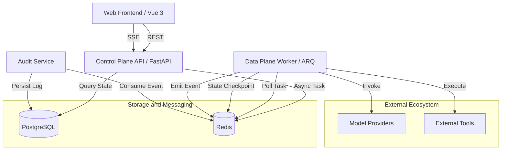
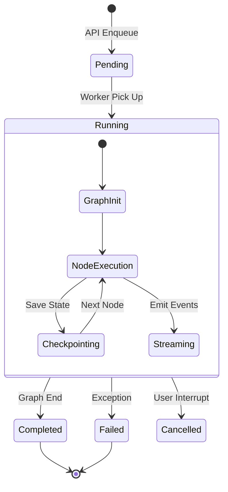

# Agent Platform Architecture Whitepaper (v2.0)

## 1. 概览 (Executive Summary)

**Agent Platform** 是一个企业级的通用多智能体（Multi-Agent）编排与执行平台。它旨在解决当前 Agent 开发中面临的 "交互难"、"观测难"、"扩展难" 三大核心痛点。通过提供标准化 Agent Runtime 容器、事件驱动的通信总线以及全链路审计机制，平台允许开发者专注于业务逻辑（Plugins），而将基础设施复杂性托管给平台。

### 核心能力指标
-   **并发能力**: 单 Worker 节点支持 10+ 并发长程 Agent 执行，支持 Kubernetes 水平扩展。
-   **响应延迟**: SSE 事件推送延迟 < 50ms。
-   **可观测性**: 审计日志覆盖率 100%（Chain/Tool/LLM/Network），支持 Trace ID 全链路追踪。
-   **扩展性**: 支持 Python 动态加载插件，无需重启核心服务即可热加载新能力。

## 2. 系统架构深度解析 (Architecture Deep Dive)

### 2.1 整体架构图 (System Context)

系统采用典型的控制面与数据面分离架构：



### 2.2 核心组件详解

#### 2.2.1 控制面 (Agent Platform API)
-   **职责**: 
    -   **网关层**: 统一鉴权 (Auth)、请求校验 (Pydantic)、限流 (Rate Limiting)。
    -   **会话管理**: 维护 `Session` 生命周期，隔离不同用户的对话上下文。
    -   **事件路由**: 通过 `Redis Pub/Sub` 或 `Stream` 订阅 Worker 产生的事件，并转换为 SSE (Server-Sent Events) 协议推送到前端。
    -   **插件同步**: 启动时扫描 `agent-plugins` 目录，将 Agent 元数据同步至数据库 `agents` 表。

#### 2.2.2 数据面 (Agent Worker)
-   **核心技术栈**: `arq` (异步任务队列) + `LangGraph` (Agent 运行时)。
-   **执行模型**:
    1.  Worker 启动，加载所有 Plugins 到内存。
    2.  从 Redis 队列 `arq:queue` 拉取任务 `agent_execute_task`。
    3.  根据 `agent_key` 实例化对应的 Agent 类 (`BaseAgent` 子类)。
    4.  调用 `agent.get_graph()` 获取编译后的 LangGraph Runnable。
    5.  使用 `graph.astream()` 运行图，注入 `AuditCallbackHandler`。
    6.  将流式输出 (Chunks) 和中间状态 (State) 实时发布到 Redis Event Bus。

#### 2.2.3 审计中心 (Audit Service)
-   **设计哲学**: "Fire and Forget"，审计不应阻塞业务主流程。
-   **实现机制**:
    -   生产者 (`agent-core`): 在 LangChain 回调中捕获事件，附带 `trace_id` 和上下文 Metadata，非阻塞写入 Redis Stream。
    -   消费者 (`AuditWorker`): 独立进程，批量拉取 Stream 消息。
    -   **Context Recovery**: 由于异步执行导致上下文碎片化，该服务利用 `run_id` 缓存机制，将 `_start` 事件的元数据（如 User ID, Tags）自动注入到对应的 `_end` 事件日志中，确保日志的完备性。

## 3. 详细设计规范 (Technical Specifications)

### 3.1 数据库模式 (Database Schema)

系统使用 PostgreSQL 存储结构化数据，关键表定义如下：

1.  **agents表**: 注册的智能体定义
    -   `key` (PK): 唯一标识符（如 `data_agent`）。
    -   `name`: 显示名称。
    -   `config_schema`: JSON Schema，定义该 Agent 接受的配置参数。
    -   `type`: builtin / custom。

2.  **sessions表**: 用户会话
    -   `id` (PK): UUID。
    -   `state`: JSONB，存储最近一次检查点状态摘要。
    -   `history_summary`: 文本摘要，用于快速回顾。

3.  **audit_logs表**: 执行流水日志
    -   `id` (PK): UUID。
    -   `session_id`: FK -> sessions.id。
    -   `trace_id`: 关联一次完整任务的追踪 ID。
    -   `event_type`: `chain_start`, `tool_start`, `llm_end` 等。
    -   `node`: 执行节点名称 (e.g. "Data Agent", "Product Researcher")。
    -   `data`: JSONB，包含完整的 Input/Output Payload。**该字段支持 pgvector 索引**，未来可支持基于语义的日志检索。

### 3.2 通信协议 (Communication Protocols)

#### 3.2.1 SSE 事件流 (Frontend <-> API)
前端通过 `EventSource` 连接 `/sessions/{id}/chat` 接口，API 下发标准 SSE 格式数据：

```text
event: message
data: {"type": "content", "content": "正在思考...", "node": "reasoning"}

event: message
data: {"type": "tool_start", "tool": "web_search", "input": "...", "node": "SearchTool"}

event: message
data: {"type": "content_delta", "content": "根据", "node": "final_response"}
```

#### 3.2.2 Redis Stream 事件 (Worker <-> API/Audit)
Stream Key: `agent:events:{session_id}`

Payload 结构 (Map):
-   `type`: 事件类型 (string)
-   `timestamp`: Unix Float (string)
-   `data`: JSON String (Serialized dict)
    -   `run_id`: LangChain 运行 ID。
    -   `metadata`: Context (user_id, trace_id)。
    -   `tags`: 标签列表 (e.g. `["agent:data_agent"]`)。

### 3.3 插件开发指南 (Plugin Development SDK)

开发者只需继承 `BaseAgent` 即可快速开发新能力。

**示例代码**:

```python
from agent_core.base import BaseAgent
from langgraph.graph import StateGraph, END
from typing import TypedDict

class MyAgentState(TypedDict):
    input: str
    output: str

class ContentAgent(BaseAgent):
    def get_config(self):
        return {
            "key": "content_agent",
            "name": "Content Generator",
            "description": "Writes blog posts."
        }
    
    def get_graph(self):
        workflow = StateGraph(MyAgentState)
        
        # Define Nodes
        workflow.add_node("draft", self.draft_node)
        workflow.add_node("review", self.review_node)
        
        # Define Edges
        workflow.set_entry_point("draft")
        workflow.add_edge("draft", "review")
        workflow.add_edge("review", END)
        
        return workflow.compile()
        
    async def draft_node(self, state: MyAgentState):
        # Implementation...
        return {"output": "Draft content..."}
```

## 4. 关键流程详解 (Key Workflows)

### 4.1 异步任务生命周期 (Worker Lifecycle)



### 4.2 中间件机制 (Middleware)

Agent 运行时被包裹在一系列中间件中，类似于 Web 框架的 Middleware：
1.  **RateLimitMiddleware**: 防止模型调用频率过高。
2.  **ContextCompressor**: 在长对话中自动修剪历史消息，防止 Context Window 溢出。
3.  **PatchToolMiddleware**: 动态修正模型生成的错误 JSON 格式的工具调用参数 (Self-Healing)。
4.  **AuditCallback**: 透明地拦截所有操作并发送至 Event Bus。

## 5. 安全与性能 (Security & Performance)

### 5.1 安全设计
-   **沙箱执行**: Agent 代码在 Docker 容器中运行，Python 代码执行器 (如 `repl`) 被限制在受限环境中，禁止网络访问（除非通过白名单 Proxy）。
-   **API 鉴权**: 基于 JWT (JSON Web Token) 的身份验证。
-   **Input Validation**: 所有入参经过 Pydantic 严格校验，防止 SQL 注入或 Shell 注入。

### 5.2 性能优化
-   **Redis Pipelining**: 批量发送 Stream 消息，减少 RTT。
-   **Connection Pooling**: 数据库连接池 (SQLAlchemy async engine) 和 Redis 连接池复用。
-   **Vector Indexing**: 使用 `pgvector` 的 HNSW 索引加速 Audit 日志的语义检索。

## 6. 实战案例: Data Agent 插件解析 (Case Study)

为了更直观地展示 Agent Plugin 的开发模式，我们以系统内置的复杂智能体 **Data Agent (`agent-plugins/data_agent`)** 为例。该 Agent 具备 SQL 查询、Python 数据处理和 Echarts 可视化能力，是一个典型的多模态、工具增强型智能体。

### 6.1 目录结构

```text
agent-plugins/data_agent/
├── __init__.py          # 入口文件，定义 DataAgent 类
├── graph.py             # LangGraph 图定义（核心逻辑）
├── prompts.py           # 提示词管理
├── schemas.py           # 输入输出 Pydantic 模型
└── subagents/           # 子智能体目录
    ├── sql.py           # SQL 生成与执行
    ├── python.py        # Python 代码沙箱
    └── visualizer.py    # 图表配置生成
```

### 6.2 核心定义 (`__init__.py`)

插件仅需暴露符合 `BaseAgent` 协议的类：

```python
from agent_core.base import BaseAgent
from .graph import get_data_deep_agent_graph

class DataAgent(BaseAgent):
    """Deep Data Analysis Agent Plugin"""
    
    def get_graph(self):
        # 返回编译好的 LangGraph Runnable
        return get_data_deep_agent_graph()

    def get_config(self):
        return {
            "name": "Data Agent",
            "key": "data_agent",
            "description": "Powerful data analysis agent..."
        }
```

### 6.3 复合图架构 (`graph.py`)

Data Agent 采用了 **Hierarchical Multi-Agent (分层多智能体)** 架构。主 Agent (Main Agent) 负责意图识别和任务拆解，将具体工作分发给垂直领域的子 Agent。

```python
def get_data_deep_agent_graph(llm=None):
    # 1. 定义主模型
    main_llm = llm or build_chat_llm(task_name="data_deep_main")
    
    # 2. 组装图 (create_deep_agent 是对 LangGraph 的封装)
    graph = create_deep_agent(
        model=main_llm,
        # 注册子智能体能力
        subagents=[
            sql_agent,        # 负责查库
            python_agent,     # 负责 pandas 处理
            visualizer_agent, # 负责生成 Echarts 配置
            report_agent      # 负责生成总结报告
        ],
        # 3. 配置中间件 (如敏感操作审核)
        middleware=[
            SensitiveToolMiddleware(
                sensitive_tools=["visualizer_agent"],
                description={"visualizer_agent": "生成图表"}
            )
        ],
        # 4. 虚拟文件系统 (隔离不同用户的分析结果)
        backend=lambda rt: CompositeBackend(
            default=FilesystemBackend(root_dir=get_workspace_dir(rt))
        )
    )
    return graph
```

### 6.4 子智能体交互流程

1.  **任务接收**: 用户输入 "帮我统计所有用户的平均消费额"。
2.  **主 Agent 思考**: 识别需要查询数据库，生成调用 `sql_agent` 的指令。
3.  **路由分发**: 运行时将控制权交给 `sql_agent` 子图。
4.  **子图执行**: `sql_agent` 生成 SQL -> 执行 -> 返回结果 (List of Dict)。
5.  **结果回传**: `sql_agent` 结束，数据回到主 Agent 上下文。
6.  **后续处理**: 主 Agent 决定调用 `visualizer_agent` 绘制柱状图。
7.  **最终输出**: 所有图表和文本汇总为最终回复。

此模式展示了平台强大的 **"工具即 Agent" (Tool as Agent)** 能力——子 Agent 对主 Agent 而言就像一个具备复杂逻辑的工具函数。

### 6.5 子智能体深度解析 (Sub-Agent Deep Dive)

Data Agent 的强大之处在于其子智能体均采用了 **"Fixed Flow with Self-Correction" (带自愈能力的固定流)** 模式。

#### 6.5.1 SQL Agent (`subagents/sql.py`)
SQL Agent 并非简单的 Text-to-SQL，而是一个包含完整 Schema 检索和错误修正的闭环。

-   **状态定义**:
    ```python
    class SQLAgentState(TypedDict):
        messages: Sequence[BaseMessage]
        schema_info: str       # 表结构上下文
        generated_sql: str     # LLM 生成的中间 SQL
        sql_result: str        # 执行结果或报错信息
        retry_count: int       # 自愈重试计数
        error_feedback: str    # 具体的数据库报错
    ```

-   **执行流程**:
    1.  **List Tables**: 首先查询数据库获取所有 `m_` 开头的业务表名。
    2.  **Get Schema**: 获取这些表的 DDL，确保 LLM 基于真实的字段名生成 SQL。
    3.  **Generate SQL**: 根据 Schema 和用户需求生成 SQL。此处使用了 **Streaming** 技术，将 `<think>` 标签内的思考过程实时推送到前端。
    4.  **Run SQL & Self-Heal**:
        -   执行 SQL。若成功，流转至结束。
        -   若失败 (e.g., Syntax Error)，捕获错误信息，将 `error_feedback` 注入回 `Generate SQL` 步骤，让 LLM 进行自我修正 (Max Retries=3)。

#### 6.5.2 Python Agent (`subagents/python.py`)
负责处理复杂的数据清洗和分析任务。

-   **Data Profile**: 第一步调用 `df_profile` 工具，快速扫描 Dataframe 的结构（列名、空值率、前几行数据），构建 Prompt 上下文。
-   **Skill Injection**: 支持基于任务描述动态挂载 Skill（如机器学习 Skill、统计分析 Skill），通过 `[skill=xxx]` 标签路由。
-   **Sandboxed Execution**: 生成的代码在受限环境中执行，只能访问特定的全局变量 (如 `df`)，保障安全性。

#### 6.5.3 子智能体实现模式 (Implementation Pattern)

所有的子智能体都遵循统一的 **Graph-as-a-Tool** 设计模式。这意味着它们本质上是一个独立的 LangGraph 图，但被封装成主智能体可以调用的"工具"。

**标准化模板**:

1.  **定义隔离状态**: 每个子智能体拥有独立的 `State`，不与主 Graph 混淆。
    ```python
    class SubAgentState(TypedDict):
        input: str
        internal_var: int
        final_result: str
    ```

2.  **构建状态机**: 使用 `StateGraph` 定义处理节点的流转。
    ```python
    graph = StateGraph(SubAgentState)
    graph.add_node("process", processing_node)
    graph.add_edge(START, "process")
    graph.add_edge("process", END)
    compiled_graph = graph.compile()
    ```

3.  **封装为插件**: 使用 `CompiledSubAgent` 将图包装为可注册单元。
    ```python
    from deepagents import CompiledSubAgent
    
    sub_agent = CompiledSubAgent(
        name="my_sub_agent",
        description="描述该 Agent 能做什么，供主 LLM 路由参考",
        runnable=compiled_graph
    )
    ```

当主 Agent (Main LLM) 决定调用名为 `my_sub_agent` 的工具时，系统会自动：
1.  挂起主图执行。
2.  初始化子图状态 (注入 input)。
3.  执行子图直到 END。
4.  将子图的最终输出作为"工具调用结果"返回给主 Agent。

#### 6.5.4 节点实现示例 (Node Implementation)

LangGraph 中的节点本质上就是 Python 函数。以下是 **SQL Agent** 中 "生成 SQL" (`llm_generate_sql`) 节点的简化实现，展示了如何结合 State 和 Streaming：

```python
def sql_step3_generate_sql(state: SQLAgentState, config: RunnableConfig) -> dict:
    """Step 3: 调用 LLM 生成 SQL"""
    
    # 1. 从 State 获取上下文
    task = state.get("task_description", "")
    schema = state.get("schema_info", "")
    error_feedback = state.get("error_feedback", "")
    
    # 2. 构建 Prompt (包含错误反馈以支持自愈)
    prompt = f"Schema:\n{schema}\nTask: {task}"
    if error_feedback:
        prompt += f"\nPrevious Error: {error_feedback}. Please fix it."
        
    # 3. 获取 LLM 实例
    llm = build_chat_llm(task_name="sql_gen")
    
    # 4. 执行流式推理 (Streaming)
    # 使用 with_config 注入 tags，以便 Audit 系统追踪
    messages = [HumanMessage(content=prompt)]
    stream_config = {"tags": ["agent:sql_agent"], "metadata": {"sub_agent": "SQL Agent"}}
    
    full_response = ""
    for chunk in llm.with_config(stream_config).stream(messages):
        full_response += chunk.content
        # 注意：此处不仅返回结果，底层的 RedisCallbackHandler 会自动捕获 token 流推送到前端
        
    # 5. 返回状态更新 (State Update)
    # 返回的字典会自动合并(update)到当前 State 中
    return {
        "generated_sql": extract_sql(full_response),
        "retry_count": state.get("retry_count", 0) # 保持计数
    }
```

**关键点**:
1.  **函数签名**: 接收 `State` 和 `config`，返回 `dict`。
2.  **无副作用**: 节点应尽量纯粹，只通过返回值修改 State。
3.  **流式透传**: 利用 `llm.stream()` 结合回调机制，实现打字机效果，无需手动推送 SSE。

### 6.6 错误处理与自愈机制 (Error Handling)

Data Agent 在各个层级都实现了鲁棒的错误处理：

1.  **Prompt 级反馈**: 当 SQL 执行失败时，错误堆栈 (Traceback) 会作为 Prompt 的一部分回传给 LLM："*Errors: ... Please fix your SQL*".
2.  **Command 路由**: 使用 LangGraph 的 `Command(goto="node")` 模式实现带状态的跳转，无需复杂的条件边 (Conditional Edges)。
3.  **敏感操作熔断**: `SensitiveToolMiddleware` 会拦截 `visualizer` 等写操作工具，强制要求用户在前端点击 "Approve" 才能继续，防止误操作。
