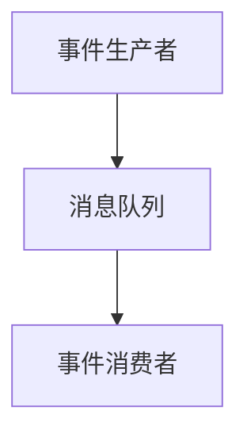

```markdown
# LangGraph与Deep Agents技术集成：架构、通信与工程实践


*图1：LangGraph多代理工作流程示意图*

## 引言
在LLM技术快速演进的背景下，LangGraph与Deep Agents的集成展现出显著的技术价值。LangGraph通过图结构支持复杂任务的动态协作，而Deep Agents基于LangChain工具链与LangSmith监控系统构建可扩展代理架构（图1）。二者通过共享技术生态形成互补：LangGraph实现任务分解与子代理协作，Deep Agents提供工具集成与监控能力，共同构建从任务分解到执行的完整技术链。

## 架构设计解析
### LangGraph多代理工作流程的核心模块组成
LangGraph通过`task`工具动态生成子代理，采用上下文隔离机制（如长期记忆存储）确保主代理逻辑简洁性。其核心模块包括：
- **任务生成器**：基于输入指令动态创建子代理
- **记忆存储层**：持久化关键状态信息
- **协作引擎**：管理代理间交互流程

### Deep Agents的组件化架构特点
依托LangChain工具链（如`ls`/`read_file`）实现功能解耦，通过`write_todos`任务分解机制与子代理分工实现模块化协作：
```python
# 示例代码片段（需补充完整）
from langchain import AgentExecutor
agent = AgentExecutor.from_agents([sub_agent1, sub_agent2])
```

### 双架构集成的协同设计原则
依赖LangChain生态的API层（如`task`工具）实现LangGraph与Deep Agents的协同集成，但需补充接口兼容性方案：
- **协议层**：定义统一的代理通信接口
- **数据层**：标准化状态共享格式
- **控制层**：实现任务路由策略


*图2：Deep Agents组件化架构示意图*

## 通信机制深度剖析
### 跨代理通信协议与消息传递机制
LangGraph推测依赖状态共享机制（如长期记忆）实现信息持久化，但需明确通信协议类型。建议采用：
- **结构化消息格式**：如JSON-LD
- **轻量级协议**：如gRPC或WebSockets

### 同步/异步处理模式的技术选型
需补充具体技术选型细节，推荐采用事件驱动架构：


### 状态共享与一致性维护方案
需补充分布式场景下的状态同步机制，建议：
- 采用分布式数据库（如Cassandra）
- 实现最终一致性模型
- 引入版本控制机制

## 集成实现方案
### API级集成接口设计
提供`deepagents`库的API参考（需补充核心代码片段）：
```python
# 示例接口定义
class LangGraphAPI:
    def generate_sub_agent(self, task: str) -> Agent:
        """动态生成子代理"""
        pass
```

### 任务编排与路由策略实现
需补充动态负载均衡实现方式，推荐：
- 基于任务复杂度的路由算法
- 实时监控系统负载的调度策略

### 异常处理与回退机制
需验证系统鲁棒性，建议：
- 实现自动恢复功能
- 设计多级回退策略
- 集成健康检查机制

## 实际应用案例
### 自动化运维场景的实施路径
需补充代理职责分配的具体实施路径，建议：
- **监控代理**：实时采集系统指标
- **分析代理**：识别异常模式
- **执行代理**：自动触发修复流程

### 复杂数据分析流程的集成实践
需明确跨代理数据依赖的处理机制，建议：
- 实现数据版本控制
- 建立依赖关系图谱
- 采用增量计算策略

### 性能优化与扩展性挑战
需补充实测数据，建议：
- 监控资源消耗指标（CPU/内存/网络）
- 测试横向扩展能力
- 评估延迟随规模增长的曲线


*图3：自动化运维场景架构示意图*

## 结论
LangGraph与Deep Agents的集成通过LangChain生态实现了复杂任务分解与子代理协作，但存在通信协议、分布式状态同步、动态负载均衡等完善方向。未来需：
1. 增强接口兼容性
2. 优化通信延迟
3. 验证工程化部署方案


*图4：技术整合全景架构示意图*
```