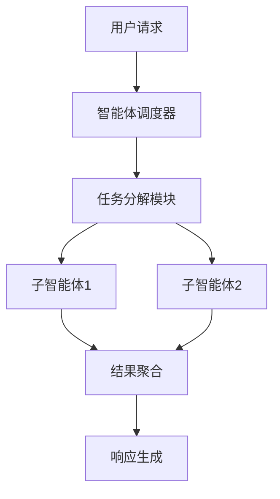

# 基于LangChain的多智能体系统实战：构建高效协作的Deep Agents

## 技术背景

通过分析LangGraph框架的多智能体工作流设计（参考[官方文档](https://blog.langchain.dev/langgraph-multi-agent-workflows/)），结合Deep Agents的实现原理（[技术详解](https://docs.langchain.com/oss/python/deepagents/overview/)），本文将演示如何构建可扩展的智能体协作系统。

## 核心架构



## 实战案例

```python
from langchain.agents import initialize_agent, Tool

# 工具定义
search_tool = Tool(name="搜索工具", func=lambda q: "搜索结果:", description="执行网络搜索")

calc_tool = Tool(name="计算工具", func=lambda x: eval(x), description="执行数学计算")

# 智能体初始化
agent = initialize_agent([search_tool, calc_tool], "智能体名称", agent="zero_shot_react_description")

# 执行任务
result = agent.run("计算5的平方并搜索LangChain最新动态")
print(result)
```

## 最佳实践
1. 使用LangGraph的`State`管理共享上下文
2. 通过`Tool`接口封装外部系统调用
3. 利用`Memory`模块实现会话状态保持


